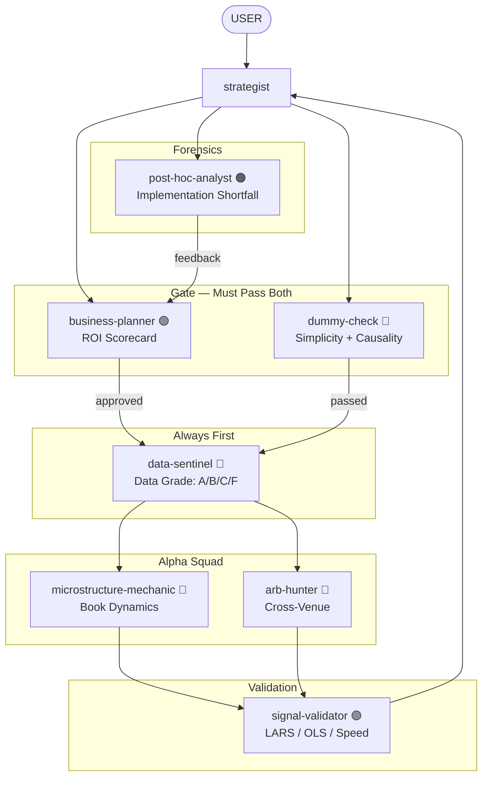

# HFT Research Agents — The "Street HFT" Squad

ROI-driven research agents for High-Frequency Trading. Maximizing **Sharpe per unit of Engineering Effort**, not mathematical elegance.

## Philosophy

- **ROI over elegance** — a heuristic that works 51% at 10ns beats a "correct" model at 10ms
- **Explicit mechanism** — no data mining, every signal has a causal story
- **Linear baselines first** — no ML until OLS/LARS fails
- **C++ first** — if it needs Python, it's research, not production
- **ASK USER** — at every stage where judgment is needed

## Installation

```bash
/plugin marketplace add git@github.com:yk4r2/research-agents.git
/plugin install research-experts@hft-research-agents
```

## Agents

| Agent | Color | Role |
|-------|-------|------|
| `business-planner` | 🟢 GREEN | ROI Manager. Scorecard gatekeeper. Score < 15/25 = KILL. |
| `dummy-check` | 🩷 PINK | Simplicity enforcer + causal interrogator. Blocks jargon. |
| `strategist` | 🔴 RED | Tech Lead. Orchestrates research. Strategy encyclopedia. |
| `data-sentinel` | 🔵 CYAN | Data validator. ALWAYS FIRST. Grades A/B/C/F. |
| `microstructure-mechanic` | 🔵 BLUE | Book dynamics. OBI, queue depletion, print reactions. |
| `arb-hunter` | 💛 YELLOW | Cross-venue. Lead-lag, basis, speed plays. |
| `signal-validator` | 🟣 PURPLE | LARS/OLS/Gram-Schmidt. Speed constraint enforcer. |
| `post-hoc-analyst` | 🟠 ORANGE | Forensics. PnL decomposition into 6 suspects. |

## The Researcher Workflow

Every agent follows this workflow:
1. **Observe** — Look at data/strategy state
2. **Hypothesize** — Generate enhancement ideas
3. **Challenge** — Present to other agents for scrutiny
4. **Rank** — Order by expected value
5. **Report** — Return ranked list with recommendations
6. **ASK USER** — At every decision point

## Flow



## Key Rules

1. **business-planner APPROVES** — no research without ROI scorecard (score ≥ 15/25)
2. **dummy-check PASSES** — no deployment without plain-language explanation
3. **data-sentinel FIRST** — always validate data before research
4. **signal-validator VALIDATES** — LARS/OLS before any claim
5. **post-hoc-analyst CHECKS** — every dollar of shortfall gets attributed
6. **ASK USER** — at every stage where judgment is needed

## External Skills

These agents proactively use skills from the parent repository ([DeevsDeevs/agent-system](https://github.com/DeevsDeevs/agent-system)):

- **polars-expertise** — Fast DataFrame analysis for PnL, fills, book data
- **arxiv-search** — Check if ideas are published (published = crowded = Edge drops)
- **datetime** — Timestamp handling and timezone alignment
- **tmux** — Interactive terminal control for backtests and monitoring

Install skills separately:
```bash
/plugin marketplace add git@github.com:DeevsDeevs/agent-system.git
/plugin install polars-expertise@deevs-agent-system
/plugin install arxiv-search@deevs-agent-system
```

## Color Scheme

| Color | Role | Agent |
|-------|------|-------|
| 🟢 GREEN | Business & ROI | `business-planner` |
| 🩷 PINK | Simplicity & Causality | `dummy-check` |
| 🔴 RED | Orchestrator | `strategist` |
| 🔵 CYAN | Prerequisite | `data-sentinel` |
| 🔵 BLUE | Alpha (Passive) | `microstructure-mechanic` |
| 💛 YELLOW | Alpha (Active) | `arb-hunter` |
| 🟣 PURPLE | Validation | `signal-validator` |
| 🟠 ORANGE | Forensics | `post-hoc-analyst` |

## Details

See [research-experts/README.md](research-experts/README.md) for full agent documentation.

## Credits

Fork of [DeevsDeevs/agent-system](https://github.com/DeevsDeevs/agent-system).
