# Alpha Squad

Five hypothesis generators attacking from complementary angles. Mechanism over fit. Counterparty over correlation. Every hypothesis must identify who loses money and why.

## Philosophy

- **Mechanism first** - no hypothesis without a causal diagram
- **Counterparty required** - who loses money? why are they forced?
- **Complementary angles** - value, flows, networks, microstructure, mechanisms
- **User decides** - agents advise and ask, never assume
- **Deep by default** - dig until you understand

## Shared Protocol

Every hypothesis must:
1. Identify the **counterparty** (who loses money)
2. Specify the **constraint** (why they're forced)
3. Estimate **decay** (when does this edge die)
4. Trace to Paleologo's five sources: risk preferences, liquidity, funding, predictable flows, information

## Agents

### fundamentalist - Accounting & Value Lens
Financial statements, earnings quality, capital efficiency. Finds mispricing by understanding what the market misreads in the accounting.

**Key trait**: Accruals revert. Cash flow persists.

---

### vulture - Flows & Constraints Lens
Forced sellers, index reconstitutions, 13F crowding, liquidation signatures. Finds alpha from someone else's mandate, not someone else's mistake.

**Key trait**: Every forced seller has a signature

---

### network-architect - Relationships & Propagation Lens
Customer-supplier networks, lead-lag structures, contagion paths. Models how information travels along network edges.

**Key trait**: Sector correlation is symptom. Supply chain is cause.

---

### book-physicist - Microstructure & Entropy Lens
Order book as physical system. Structural models (Kyle, Glosten-Milgrom, Hawkes), entropy decomposition of book state, order informativity factoring. Finds alpha where information enters the book.

**Key trait**: Entropy drop means someone knows something. The question is who.

---

### causal-detective - Mechanisms & Confounding Lens
Frisch-Waugh-Lovell orthogonalization, Double ML, placebo tests. Proves that the squad's hypotheses are causal, not confounded.

**Key trait**: Correlation is unobserved confounding until proven otherwise

---

## Flow

```mermaid
flowchart TD
    strat([strategist 🔴]) --> sentinel["data-sentinel 🔵<br/>ALWAYS FIRST"]

    sentinel --> squad

    subgraph squad [Alpha Squad]
        fund["fundamentalist 🔵<br/>Value"]
        vult["vulture 🔵<br/>Flows"]
        netarch["network-architect 🔵<br/>Networks"]
        bphys["book-physicist 🔵<br/>Entropy"]
        causal["causal-detective 🔵<br/>Mechanisms"]

        fund <-->|"value or flow?"| vult
        vult <-->|"mandate or informed?"| bphys
        netarch <-->|"real or spurious?"| causal
        bphys --> causal
        fund --> causal
        vult --> causal
    end

    squad -->|"hypothesis bundle"| validators["mft-research-experts<br/>Factor Geometer → Skeptic"]
    validators -->|"SHIP/KILL/ITERATE"| strat
```



**Squad Output** (every hypothesis):
- Mechanism diagram (DAG)
- Counterparty identification
- Constraint specification
- Decay estimate
- Paleologo source (risk preferences, liquidity, funding, predictable flows, information)
- Required data (to Data Sentinel)

## Venue Context

All agents read `EXCHANGE_CONTEXT.md` (in mft-research-experts) first and ask which venue mode applies.

## Key Rules

1. **Counterparty required** - no hypothesis without identifying who loses
2. **Mechanism required** - no hypothesis without a causal diagram
3. **All five angles** - squad debates across lenses before finalizing
4. **USER DECIDES** - agents present options, never assume

---

## Color Scheme

💚 CYAN = all squad members (researchers)

## Installation

```bash
/plugin marketplace add git@github.com:DeevsDeevs/agent-system.git
/plugin install alpha-squad@deevs-agent-system
```
