# MFT Research Experts

Orchestration, data validation, risk geometry, hypothesis execution, and forensic audit for quantitative research. The infrastructure that makes alpha-squad's hypotheses real - or kills them.

## Philosophy

- **Data Sentinel first** - always validate data before research
- **Geometry before validation** - need factor structure to test properly
- **Dual gauntlet** - causal mechanism AND statistical robustness required
- **Kill fast** - better to miss a real edge than trade a fake one
- **Audit everything** - assumptions fail silently, find them before they compound
- **User decides** - agents present verdicts, never auto-approve

## Agents

### mft-strategist - Obsessive Coordinator
The single brain that orchestrates hypothesis generation and destruction. Routes to Data Sentinel FIRST, always, no exceptions. Sequences Alpha Squad → Factor Geometer → Skeptic. Synthesizes SHIP/KILL/ITERATE.

**Invokes**: All agents across both alpha-squad and mft-research-experts
**Key trait**: Refuses to let any step proceed without understanding the full chain

---

### data-sentinel - Paranoid Gatekeeper
MUST BE INVOKED FIRST on any data. Trusts nothing. Every timestamp, every price, every identifier is lying until proven otherwise. Asks user before any filter/transform.

**Invoked by**: Strategist (always first), any agent needing data
**Key trait**: Point-in-time or point-in-lie

---

### factor-geometer - Risk Architect
Builds factor loadings, estimates covariance with proper shrinkage, computes alpha-orthogonal decomposition. Defines what "alpha" actually means. If your alpha is spanned by known factors, it's not alpha.

**Invoked by**: Strategist, Alpha Squad (exposure check), Skeptic
**Key trait**: Your alpha lives in my null space - or it's not alpha

---

### skeptic - Hypothesis Executioner
Unified causal + statistical validation engine. Proves mechanisms via DAGs and orthogonalization, then runs Rademacher haircuts, walk-forward OOS, subsample stability. No hypothesis survives without passing both gauntlets.

**Invoked by**: Strategist (after Factor Geometer)
**Key trait**: Your backtest is an adversarial game. I represent your future self.

---

### forensic-auditor - Post-Mortem Investigator
Finds what we believed wrong. Traces assumption failures through the full chain. Runs on schedule AND on crisis. Never trusts "it just stopped working."

**Invoked by**: Strategist (scheduled, crisis), any agent (anomaly)
**Key trait**: The first explanation is always wrong

---

## Flow

```mermaid
flowchart TD
    USER([USER]) --> strat[/"mft-strategist<br/>🔴 Obsessive Coordinator"/]

    subgraph datagate [Data Gate]
        sentinel[/"data-sentinel<br/>🔵 ALWAYS FIRST"/]
    end

    strat --> sentinel
    sentinel --> squad["alpha-squad<br/>(5 hypothesis generators)"]

    squad -->|"hypothesis bundle"| fgeom

    subgraph validation [Validation Pipeline]
        fgeom["factor-geometer 🔵<br/>Risk Geometry"]
        skep["skeptic 💛<br/>Dual Gauntlet"]
        fgeom -->|"B, Ω, α⊥"| skep
    end

    subgraph audit [Periodic + Crisis]
        auditor["forensic-auditor 💛<br/>Post-Mortem"]
    end

    skep -->|"SHIP"| ship["✅ To Production"]
    skep -->|"KILL"| kill["❌ Dead"]
    skep -->|"ITERATE"| iterate["🔄 Back to Alpha Squad"]

    auditor -.->|"periodic"| fgeom
    auditor -.->|"assumption audit"| skep
    auditor -.->|"lessons"| strat
    strat -.->|"periodic + crisis"| auditor
```



## Operating Modes

### Mode 1: Brainstorm & Formalize
```
USER → Strategist → Data Sentinel → Alpha Squad (parallel brainstorm)
  → Strategist synthesizes → Factor Geometer (exposure check)
  → Skeptic (causal check only) → ITERATE until mechanism solid
```

### Mode 2: Full Validation
```
Hypothesis Bundle → Data Sentinel (final data check)
  → Factor Geometer (α⊥, Ω) → Skeptic (full gauntlet)
  → SHIP / KILL / ITERATE
```

### Mode 3: Pipeline Scavenge
```
Strategist triggers → Forensic Auditor → All agents (parallel review)
  → Auditor synthesizes → Prioritized findings
  → Strategist assigns fixes
```

### Mode 4: Crisis Response
```
Anomaly detected → Forensic Auditor (lead)
  → Data Sentinel (data chain) → Factor Geometer (structure check)
  → Alpha Squad (mechanism review) → Root cause → Fix + Monitor
```

## Venue Context

All agents invoke `/venue-expert` skill first for venue-specific microstructure context (exchange mechanics, order books, auctions, feed protocols, etc.).

## Key Rules

1. **Data Sentinel FIRST** - always validate data before research
2. **Factor Geometer BEFORE Skeptic** - need geometry to validate properly
3. **Both gauntlets required** - causal AND statistical, no shortcuts
4. **Forensic Auditor on schedule** - monthly minimum, crisis on demand
5. **Strategist ASKS** - complementary questions every time
6. **USER DECIDES** - verdicts are recommendations, not orders

---

## Color Scheme

❤️ RED = `mft-strategist` (orchestrator)
💚 CYAN = `data-sentinel`, `factor-geometer` (researchers)
💛 YELLOW = `skeptic`, `forensic-auditor` (validators)

## Installation

```bash
/plugin marketplace add git@github.com:DeevsDeevs/agent-system.git
/plugin install mft-research-experts@deevs-agent-system
```
