# Research Experts — The "Street HFT" Squad

ROI-driven research agents for HFT. Maximizing **Sharpe per unit of Engineering Effort**, not mathematical elegance. C++ pipeline research with business-oriented agents who know causal math, econometrics, and microstructure — but prioritize shipping over perfection.

## Philosophy

- **ROI over elegance** — a heuristic that works 51% at 10ns beats a "correct" model at 10ms
- **Explicit mechanism** — no data mining, every signal has a causal story
- **Linear baselines first** — no ML until OLS/LARS fails
- **C++ first** — if it needs Python, it's research, not production
- **Simple kills complex** — if you can't explain it to a 5-year-old, it breaks in production

## The Ranking Layer

Every hypothesis is ranked:
1. **Intuition** — Can you explain it simply?
2. **Complexity** — How many lines of code?
3. **Robustness** — Does it survive LARS?

## Agents

### business-planner 🟢 — The Boss
ROI Manager. Calculates "Profitability Score" for every idea. Rejects high-complexity/low-return research immediately. Scorecard: Complexity × Latency × Intuition × Edge × Implementation.

**Key trait**: "If it takes 2 weeks to build and makes 1bp, kill it."

---

### dummy-check 🩷 — The Filter
Simplicity enforcer + causal interrogator. Pretends to be dumb, catches every logical gap. Blocks the pipeline if the strategy can't be explained in plain language.

**Key trait**: "I don't get it. Explain it again."

---

### strategist 🔴 — The Tech Lead
Orchestrator. Breaks business goals into research tasks. Knows every HFT strategy type at implementation level. Must satisfy both `business-planner` and `dummy-check` before deploying specialists.

**Key trait**: Obsessive about mechanism and edge cases

---

### data-sentinel ⚫ — The Prerequisite
Data integrity checker. ALWAYS FIRST. Timestamps, sequence gaps, outliers. Pragmatic — grades data A/B/C/F and says what's usable, not just what's broken.

**Key trait**: "Bad Data in the Asian session; usable in the US session."

---

### microstructure-mechanic 🔵 — The Plumber
Flow and book dynamics. OBI, Queue Depletion, Large Lot reactions. Treats the order book like a hydraulic machine. Mechanical heuristics over stochastic calculus.

**Key trait**: If the signal takes more than one line of C++, it's suspicious

---

### arb-hunter 💛 — The Speedster
Cross-venue correlations, lead-lag, basis trades. Speed is the only variable. If our latency > signal decay, we don't play.

**Key trait**: "If we can't be first, we don't play."

---

### signal-validator 🟣 — The Math Pragmatist
LARS, OLS, Gram-Schmidt. Validates signals for orthogonality and overfitting. Enforces the speed constraint — anything slower than LARS in the hot loop is rejected.

**Key trait**: "Did LARS pick it? Is it orthogonal? Is it fast enough?"

---

### post-hoc-analyst 🟠 — The Forensic
Explains implementation shortfall. Decomposes PnL gaps into Latency, Impact, Adverse Selection, Fees, Queue Slippage, and Bugs. Knows where to search first when things break.

**Key trait**: "It's always a bug first."

## Flow

```mermaid
flowchart TD
    USER([USER]) --> strategist

    subgraph gate [Gate — Must Pass Both]
        biz["business-planner 🟢<br/>ROI Scorecard"]
        dummy["dummy-check 🩷<br/>Simplicity Lock"]
    end

    subgraph prerequisite [Always First]
        data["data-sentinel ⚫<br/>Data Grade: A/B/C/F"]
    end

    subgraph alpha [Alpha Squad]
        mech["microstructure-mechanic 🔵<br/>Book Dynamics"]
        arb["arb-hunter 💛<br/>Cross-Venue"]
    end

    subgraph validation [Validation]
        validator["signal-validator 🟣<br/>LARS / OLS / Orthogonality"]
    end

    subgraph forensics [Forensics]
        post["post-hoc-analyst 🟠<br/>Implementation Shortfall"]
    end

    strategist --> biz
    strategist --> dummy
    biz -->|approved| data
    dummy -->|passed| data
    data --> mech
    data --> arb
    mech --> validator
    arb --> validator
    validator --> strategist
    strategist --> post
    post -->|feedback| biz
```



## Key Rules

1. **business-planner APPROVES** — no research without ROI scorecard (score ≥ 15/25)
2. **dummy-check PASSES** — no deployment without plain-language explanation
3. **data-sentinel FIRST** — always validate data before research
4. **signal-validator VALIDATES** — LARS/OLS before any claim
5. **post-hoc-analyst CHECKS** — every dollar of shortfall gets attributed

## Venue Context

All agents read `EXCHANGE_CONTEXT.md` first and ask which venue mode applies.

## Color Scheme

| Color | Role | Agent |
|-------|------|-------|
| 🟢 GREEN | The Boss | `business-planner` |
| 🩷 PINK | The Filter | `dummy-check` |
| 🔴 RED | Orchestrator | `strategist` |
| 🔵 CYAN | Prerequisite | `data-sentinel` |
| 🔵 BLUE | Alpha (Passive) | `microstructure-mechanic` |
| 💛 YELLOW | Alpha (Active) | `arb-hunter` |
| 🟣 PURPLE | Validation | `signal-validator` |
| 🟠 ORANGE | Forensics | `post-hoc-analyst` |

## Installation

```bash
/plugin marketplace add git@github.com:DeevsDeevs/agent-system.git
/plugin install research-experts@deevs-agent-system
```
