# Research Validators

Opinionated validation and audit agents for quantitative research. Prove it or kill it. Every hypothesis faces the geometry check, the causal gauntlet, the statistical gauntlet, and periodic forensic review.

## Philosophy

- **Geometry first** - if alpha is spanned by known factors, it's not alpha
- **Dual validation** - causal mechanism AND statistical robustness required
- **Kill fast** - better to miss a real edge than trade a fake one
- **Audit everything** - assumptions fail silently, find them before they compound
- **User decides** - agents present verdicts, never auto-approve

## Agents

### factor-geometer - Risk Architect
Builds the risk model infrastructure everyone depends on. Factor loadings, covariance estimation with proper shrinkage, alpha-orthogonal decomposition. Defines what "alpha" actually means.

**Invoked by**: Strategist, Alpha Squad (exposure check), Skeptic
**Key trait**: Your alpha lives in my null space - or it's not alpha

---

### skeptic - Hypothesis Executioner
Unified causal + statistical validation engine. Proves mechanisms via DAGs and orthogonalization, then runs Rademacher haircuts, walk-forward OOS, subsample stability. No hypothesis survives without passing both gauntlets.

**Invoked by**: Strategist (after Factor Geometer)
**Key trait**: Your backtest is an adversarial game. I represent your future self.

---

### forensic-auditor - Post-Mortem Investigator
Finds what we believed wrong. Traces assumption failures through the full chain. Runs on schedule AND on crisis. Never trusts "it just stopped working."

**Invoked by**: Strategist (scheduled, crisis), any agent (anomaly)
**Key trait**: The first explanation is always wrong

---

## Flow

```mermaid
flowchart TD
    subgraph input [From research-experts]
        hypothesis["Hypothesis Bundle<br/>(DAG + counterparty + mechanism)"]
    end

    subgraph geometry [Geometry Check]
        factor-geometer[/"factor-geometer<br/>🔵 Risk Architect"/]
    end

    subgraph validation [Dual Gauntlet]
        skeptic[/"skeptic<br/>💛 Hypothesis Executioner"/]
    end

    subgraph audit [Periodic + Crisis]
        forensic-auditor[/"forensic-auditor<br/>💛 Post-Mortem"/]
    end

    hypothesis --> factor-geometer
    factor-geometer -->|"B, Ω, α⊥"| skeptic

    skeptic -->|"SHIP"| ship["✅ To Production"]
    skeptic -->|"KILL"| kill["❌ Dead"]
    skeptic -->|"ITERATE"| iterate["🔄 Back to Alpha Squad"]

    forensic-auditor -.->|"periodic"| factor-geometer
    forensic-auditor -.->|"assumption audit"| skeptic
    forensic-auditor -.->|"lessons"| strategist["strategist 🔴"]
```



## Operating Modes

### Mode 1: Full Validation
```
Hypothesis Bundle → Data Sentinel (final data check)
  → Factor Geometer (α⊥, Ω) → Skeptic (full gauntlet)
  → SHIP / KILL / ITERATE
```

### Mode 2: Pipeline Scavenge
```
Strategist triggers → Forensic Auditor → All agents (parallel review)
  → Auditor synthesizes → Prioritized findings
  → Strategist assigns fixes
```

### Mode 3: Crisis Response
```
Anomaly detected → Forensic Auditor (lead)
  → Data Sentinel (data chain) → Factor Geometer (structure check)
  → Alpha Squad (mechanism review) → Root cause → Fix + Monitor
```

## Key Rules

1. **Factor Geometer BEFORE Skeptic** - need geometry to validate properly
2. **Both gauntlets required** - causal AND statistical, no shortcuts
3. **Forensic Auditor on schedule** - monthly minimum, crisis on demand
4. **USER DECIDES** - verdicts are recommendations, not orders

---

## Color Scheme

💚 CYAN = `factor-geometer` (risk architect)
💛 YELLOW = `skeptic`, `forensic-auditor` (validators)

## Installation

```bash
/plugin marketplace add git@github.com:DeevsDeevs/agent-system.git
/plugin install research-validators@deevs-agent-system
```
