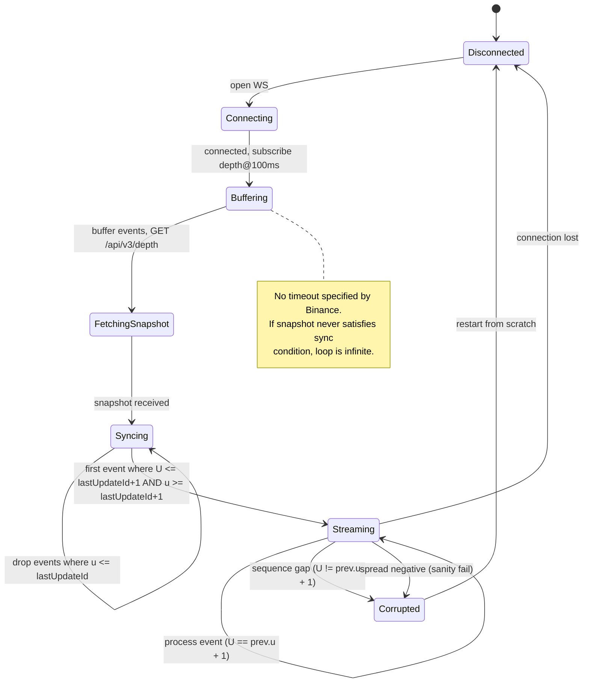
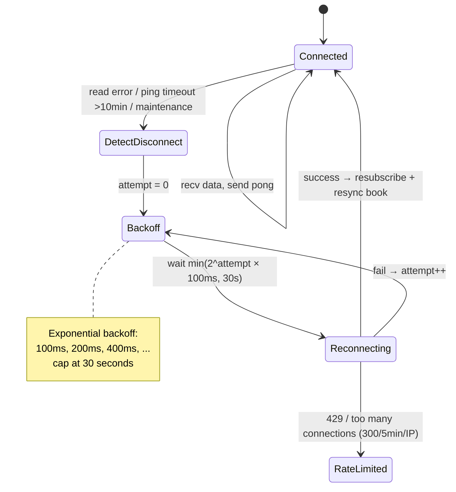
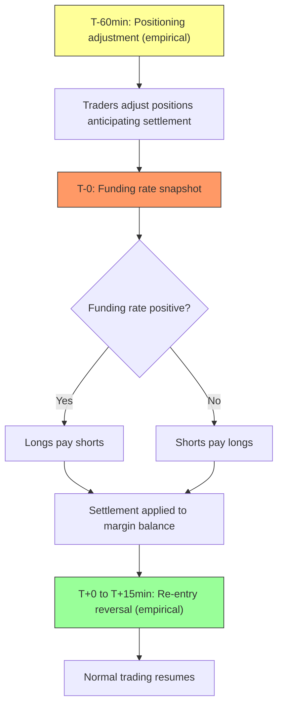
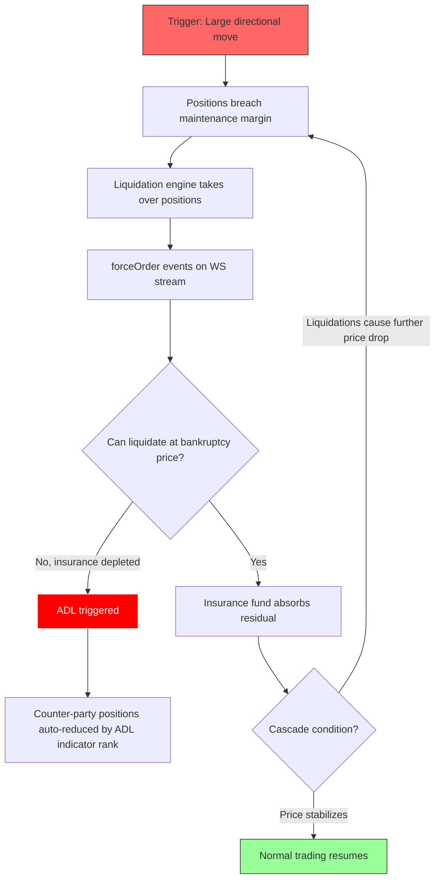
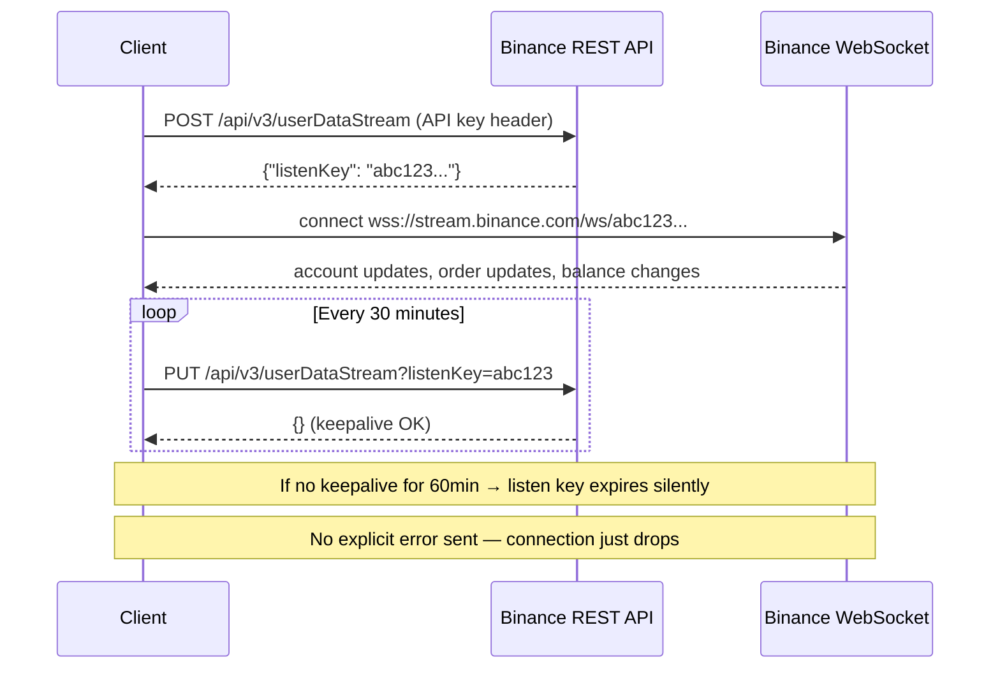

# Crypto Markets - Asset Class Fundamentals

## Overview

Cryptocurrency markets facilitate trading of digital assets on blockchain-based networks. Unlike traditional markets, crypto operates 24/7/365 across centralized exchanges (CEX) and decentralized protocols (DEX).

## Market Structure Types

### Centralized Exchanges (CEX)

Traditional order book model:
- Custodial - exchange holds assets
- Central limit order book (CLOB)
- Maker/taker fee structure
- KYC/AML requirements (most jurisdictions)

Examples: Binance, Coinbase, Kraken, OKX, Bybit

### Decentralized Exchanges (DEX)

On-chain trading mechanisms:
- Non-custodial - users control keys
- Automated Market Makers (AMM) - liquidity pools
- Order books (on-chain or hybrid)
- No KYC (pseudonymous)

Examples: Uniswap, dYdX, GMX, Curve

### Hybrid Models

Combining CEX speed with DEX custody:
- Off-chain matching, on-chain settlement
- Self-custody with central order book
- Layer 2 solutions for speed

## Common Market Structures

### Order Book (CEX)

Similar to traditional equity markets:
- Price-time priority (typically)
- Limit and market orders
- Iceberg/reserve orders
- Stop orders

### Automated Market Makers (DEX)

Algorithmic pricing via bonding curves:
- Constant product: x * y = k (Uniswap v2)
- Concentrated liquidity (Uniswap v3)
- Stable swap curves (Curve)
- Virtual AMM (perpetuals)

## Trading Sessions

**24/7 Operation:**
- No market open/close
- No circuit breakers (most venues)
- Maintenance windows (often unannounced)
- Funding rate settlements (derivatives, typically 8h)

## Instrument Types

| Type      | Description                                  |
|-----------|----------------------------------------------|
| Spot      | Direct asset exchange (BTC/USDT)             |
| Perpetual | Futures without expiry, funding rate mechanism |
| Futures   | Fixed expiry contracts                       |
| Options   | Calls/puts on crypto assets                  |
| Margin    | Leveraged spot trading                       |

## Quant Relevance

### Why Microstructure Matters

**Cross-exchange arbitrage** - Price discrepancies exploitable across venues. Latency and fee structure critical.

**Funding rate signals** - Perp funding rates indicate market sentiment and positioning.

**Liquidity fragmentation** - Volume spread across many venues. Aggregation necessary for execution.

**On-chain data** - Blockchain provides transparency unavailable in traditional markets (wallet flows, DEX trades).

### Key Metrics

| Metric        | Definition                                     |
|---------------|------------------------------------------------|
| Spread        | Ask minus bid (varies wildly by pair/venue)    |
| Depth         | Size at each level (often thin)                |
| Funding Rate  | Periodic payment between longs/shorts (perps)  |
| Open Interest | Total outstanding derivative positions         |
| Volume        | Often inflated by wash trading                 |

## Data Quality Concerns

**Universal issues:**
- Wash trading inflates volume
- Timestamp accuracy varies
- Exchange-reported vs calculated metrics differ
- API rate limits affect completeness

**CEX-specific:**
- WebSocket disconnections corrupt order book
- Sequence gaps require resync
- No built-in checksums (most exchanges)

**DEX-specific:**
- Block time affects "real-time" data
- MEV affects execution
- Gas costs affect small trades

## Known Gotchas

1. **Stablecoin depegs** - "USD" pairs aren't actually USD
2. **Liquidation cascades** - Self-reinforcing, extreme moves
3. **Exchange insolvency** - Counterparty risk (FTX, etc.)
4. **Regulatory actions** - Sudden delistings, geo-blocks
5. **Chain congestion** - Affects DEX execution and withdrawals
6. **Hard forks** - Asset duplication, replay attacks

## Global Landscape

**Major CEX by region:**
- Global: Binance, OKX, Bybit
- US: Coinbase, Kraken
- Asia: Upbit (Korea), bitFlyer (Japan)

**Major DEX by chain:**
- Ethereum: Uniswap, Curve
- Cosmos: dYdX (v4, own app-chain via Cosmos SDK)
- Solana: Jupiter, Raydium
- Arbitrum: GMX, Camelot

See category-specific files (CEX, DEX) for detailed coverage.

## Order Flow & Depth Imbalance Signals

### Trade Direction (`m` field)

On CEX WebSocket streams (aggTrade, trade), the `m` (is buyer market maker) field encodes trade direction:

| `m` value | Meaning | Interpretation |
|-----------|---------|----------------|
| `true` | Buyer is market maker | **Seller aggressed** — sell market order hit resting bid |
| `false` | Seller is market maker | **Buyer aggressed** — buy market order hit resting ask |

> **Common mistake:** `m=true` does NOT mean "buy trade". It means the buyer's order was already resting (limit), and the seller initiated the trade (market/taker).

### aggTrade vs trade Granularity

| Stream | Granularity | Use case |
|--------|------------|----------|
| `aggTrade` | One event per taker order at the same price level (aggregates fills at identical price) | Standard flow analysis, OBI construction |
| `trade` | One event per individual fill | Exposes order splitting via unique buyer/seller order IDs (`b`/`a` fields). Useful for iceberg detection |

**Iceberg detection pattern:** If multiple `trade` events share the same resting-side order ID but the visible book quantity was smaller, a hidden (iceberg) order is being filled.

### Order Book Imbalance (OBI)

**Trade OBI** — directional pressure from executed trades:
```
Trade_OBI = (Buy_Volume - Sell_Volume) / (Buy_Volume + Sell_Volume)
```
Where Buy_Volume = sum of `q` where `m=false`, Sell_Volume = sum of `q` where `m=true`.

**Book OBI** — directional pressure from resting liquidity:
```
Book_OBI = (Bid_Qty - Ask_Qty) / (Bid_Qty + Ask_Qty)
```
Computed from depth stream L1 (or top-N levels).

**Combined signal:** Trade_OBI measures realized flow, Book_OBI measures intention. Divergence (e.g., strong buy Trade_OBI but weak Book_OBI) may indicate momentum exhaustion.

### Pre-Computed Signals from Klines

Kline/candlestick streams include taker buy volume fields:
- `V` — Taker buy base asset volume
- `Q` — Taker buy quote asset volume

This is a pre-computed Trade_OBI numerator at candle resolution:
```
Kline_OBI ≈ (2 × V - v) / v
```
Where `v` = total base volume, `V` = taker buy volume. No need to consume aggTrade stream if candle-resolution is sufficient.

### Queue Depletion Signal

When L1 quantity on one side decreases without price change (visible in depth stream), it indicates resting orders are being consumed without new ones replacing them. This often precedes an imminent price move in the direction of depletion.

**Detection:** Track `depth` stream bid/ask quantities at best price. If quantity drops >50% within a short window without price change → potential breakout signal.

### bookTicker vs depth Race Condition

| Stream | Update frequency | Content |
|--------|-----------------|---------|
| `bookTicker` | Real-time (every BBO change) | Best bid/ask price + qty only |
| `depth` | Batched (100ms or 1000ms) | Full book delta |

**Warning:** BBO derived from `bookTicker` and BBO derived from `depth` stream will be **inconsistent** during fast markets. `bookTicker` updates faster, so the top-of-book from depth may be stale relative to bookTicker. This race condition is undocumented by Binance.

### Staleness Detection Limitations

**Spot** `bookTicker` responses lack `E` (event time) and `T` (trade time) fields that other streams provide. This means:
- Cannot measure data staleness (time from matching engine to client)
- Cannot detect frozen/stale feeds from timestamps alone
- Must use external heartbeat or cross-reference with other streams for liveness detection

> **Note:** Futures `bookTicker` (`fapi`) does include `E` (event time) and `T` (transaction time). This limitation is Spot-specific.

## Process Diagrams

### Order Book Reconstruction State Machine



### WebSocket Reconnection FSM



### Funding Settlement Flow (Perpetual Futures)



### Liquidation Cascade Flow



### Authentication Flow (User Data Stream)


