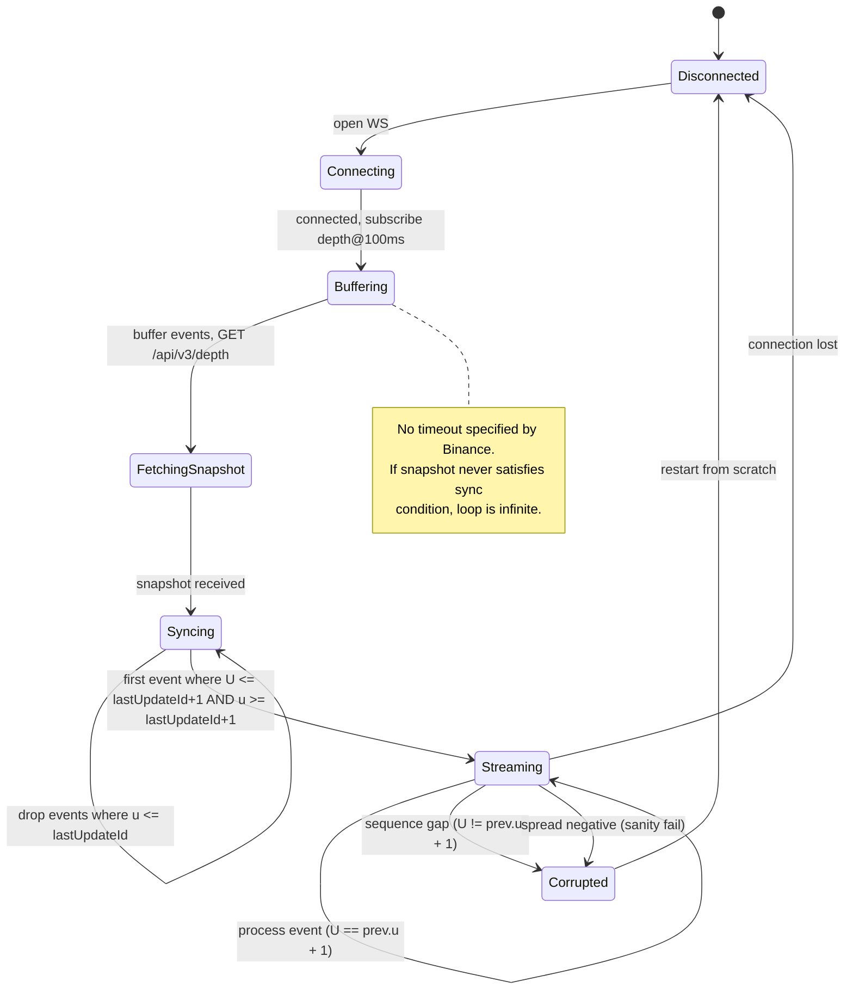
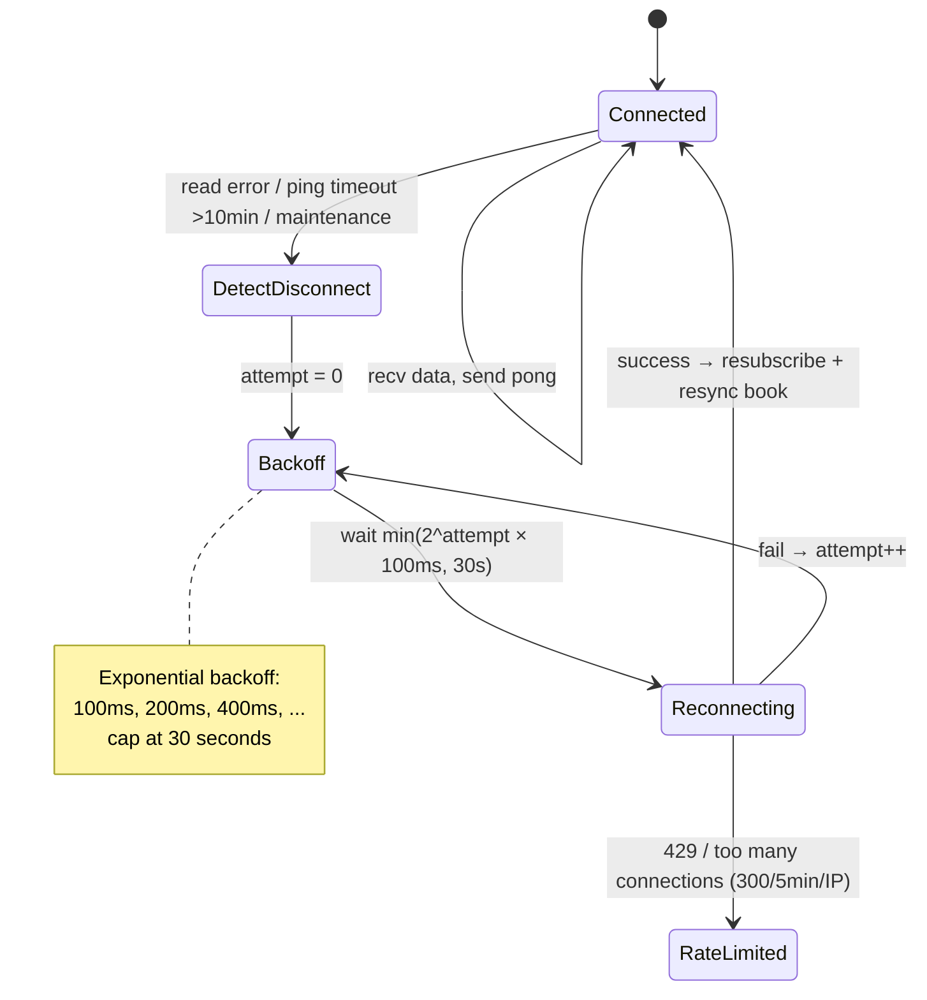
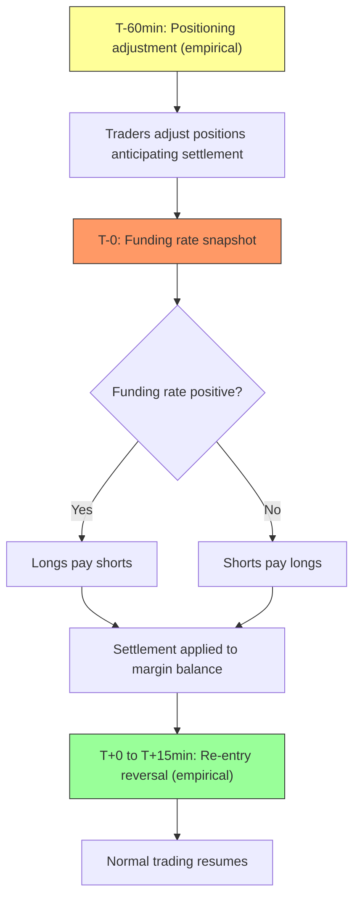
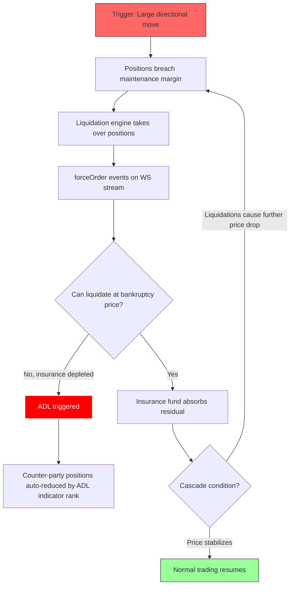
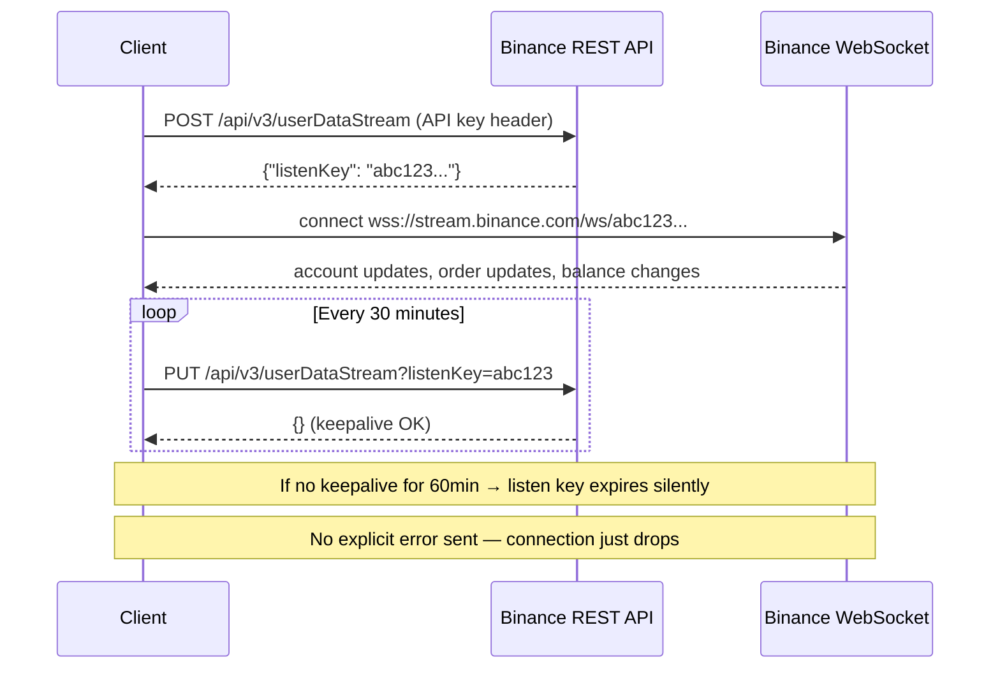

# Crypto Markets - Asset Class Fundamentals

## Overview

Cryptocurrency markets facilitate trading of digital assets on blockchain-based networks. Unlike traditional markets, crypto operates 24/7/365 across centralized exchanges (CEX) and decentralized protocols (DEX).

## Market Structure Types

### Centralized Exchanges (CEX)

Custodial platforms operating central limit order books (CLOB). Examples: Binance, Coinbase, Kraken, OKX, Bybit.

→ See `CEX/cex.md` for mechanics (order types, fees, data feeds, rate limiting).

### Decentralized Exchanges (DEX)

On-chain trading mechanisms:
- Non-custodial - users control keys
- Automated Market Makers (AMM) - liquidity pools
- Order books (on-chain or hybrid)
- No KYC (pseudonymous)

Examples: Uniswap, dYdX, GMX, Curve

### Hybrid Models

Combining CEX speed with DEX custody:
- Off-chain matching, on-chain settlement
- Self-custody with central order book
- Layer 2 solutions for speed

## Common Market Structures

### Order Book (CEX)

Standard CLOB with price-time priority. → See `CEX/cex.md` for order types and matching details.

### Automated Market Makers (DEX)

Algorithmic pricing via bonding curves:
- Constant product: x * y = k (Uniswap v2)
- Concentrated liquidity (Uniswap v3)
- Stable swap curves (Curve)
- Virtual AMM (perpetuals)

## Trading Sessions

Crypto markets operate 24/7/365 with no session boundaries or circuit breakers. → See `CEX/cex.md` for CEX-specific details (maintenance windows, funding settlements).

## Instrument Types

| Type      | Description                                  |
|-----------|----------------------------------------------|
| Spot      | Direct asset exchange (BTC/USDT)             |
| Perpetual | Futures without expiry, funding rate mechanism |
| Futures   | Fixed expiry contracts                       |
| Options   | Calls/puts on crypto assets                  |
| Margin    | Leveraged spot trading                       |

## Quant Relevance

### Why Microstructure Matters

**Cross-exchange arbitrage** - Price discrepancies exploitable across venues. Latency and fee structure critical.

**Funding rate signals** - Perp funding rates indicate market sentiment and positioning.

**Liquidity fragmentation** - Volume spread across many venues. Aggregation necessary for execution.

**On-chain data** - Blockchain provides transparency unavailable in traditional markets (wallet flows, DEX trades).

### Key Metrics

| Metric        | Definition                                     |
|---------------|------------------------------------------------|
| Spread        | Ask minus bid (varies wildly by pair/venue)    |
| Depth         | Size at each level (often thin)                |
| Funding Rate  | Periodic payment between longs/shorts (perps)  |
| Open Interest | Total outstanding derivative positions         |
| Volume        | Often inflated by wash trading                 |

## Data Quality Concerns

**Universal issues:**
- Wash trading inflates volume
- Timestamp accuracy varies
- Exchange-reported vs calculated metrics differ
- API rate limits affect completeness

**CEX-specific:**
- WebSocket disconnections corrupt order book
- Sequence gaps require resync
- No built-in checksums (most exchanges)

**DEX-specific:**
- Block time affects "real-time" data
- MEV affects execution
- Gas costs affect small trades

## Known Gotchas

1. **Stablecoin depegs** - "USD" pairs aren't actually USD
2. **Liquidation cascades** - Self-reinforcing, extreme moves
3. **Exchange insolvency** - Counterparty risk (FTX, etc.)
4. **Regulatory actions** - Sudden delistings, geo-blocks
5. **Chain congestion** - Affects DEX execution and withdrawals
6. **Hard forks** - Asset duplication, replay attacks

## Global Landscape

**Major CEX by region:**
- Global: Binance, OKX, Bybit
- US: Coinbase, Kraken
- Asia: Upbit (Korea), bitFlyer (Japan)

**Major DEX by chain:**
- Ethereum: Uniswap, Curve
- Cosmos: dYdX (v4, own app-chain via Cosmos SDK)
- Solana: Jupiter, Raydium
- Arbitrum: GMX, Camelot

See category-specific files (CEX, DEX) for detailed coverage.

## Order Flow & Depth Imbalance Signals

### Trade Direction (`m` field)

On CEX WebSocket streams (aggTrade, trade), the `m` (is buyer market maker) field encodes trade direction:

| `m` value | Meaning | Interpretation |
|-----------|---------|----------------|
| `true` | Buyer is market maker | **Seller aggressed** — sell market order hit resting bid |
| `false` | Seller is market maker | **Buyer aggressed** — buy market order hit resting ask |

> **Common mistake:** `m=true` does NOT mean "buy trade". It means the buyer's order was already resting (limit), and the seller initiated the trade (market/taker).

### aggTrade vs trade Granularity

| Stream | Granularity | Use case |
|--------|------------|----------|
| `aggTrade` | One event per taker order at the same price level (aggregates fills at identical price) | Standard flow analysis, OBI construction |
| `trade` | One event per individual fill | Exposes order splitting via unique buyer/seller order IDs (`b`/`a` fields). Useful for iceberg detection |

**Iceberg detection pattern:** If multiple `trade` events share the same resting-side order ID but the visible book quantity was smaller, a hidden (iceberg) order is being filled.

### Order Book Imbalance (OBI)

**Trade OBI** — directional pressure from executed trades:
```
Trade_OBI = (Buy_Volume - Sell_Volume) / (Buy_Volume + Sell_Volume)
```
Where Buy_Volume = sum of `q` where `m=false`, Sell_Volume = sum of `q` where `m=true`.

**Book OBI** — directional pressure from resting liquidity:
```
Book_OBI = (Bid_Qty - Ask_Qty) / (Bid_Qty + Ask_Qty)
```
Computed from depth stream L1 (or top-N levels).

**Combined signal:** Trade_OBI measures realized flow, Book_OBI measures intention. Divergence (e.g., strong buy Trade_OBI but weak Book_OBI) may indicate momentum exhaustion.

### Pre-Computed Signals from Klines

Kline/candlestick streams include taker buy volume fields:
- `V` — Taker buy base asset volume
- `Q` — Taker buy quote asset volume

This is a pre-computed Trade_OBI numerator at candle resolution:
```
Kline_OBI ≈ (2 × V - v) / v
```
Where `v` = total base volume, `V` = taker buy volume. No need to consume aggTrade stream if candle-resolution is sufficient.

### Queue Depletion Signal

When L1 quantity on one side decreases without price change (visible in depth stream), it indicates resting orders are being consumed without new ones replacing them. This often precedes an imminent price move in the direction of depletion.

**Detection:** Track `depth` stream bid/ask quantities at best price. If quantity drops >50% within a short window without price change → potential breakout signal.

### bookTicker vs depth Race Condition

| Stream | Update frequency | Content |
|--------|-----------------|---------|
| `bookTicker` | Real-time (every BBO change) | Best bid/ask price + qty only |
| `depth` | Batched (100ms or 1000ms) | Full book delta |

**Warning:** BBO derived from `bookTicker` and BBO derived from `depth` stream will be **inconsistent** during fast markets. `bookTicker` updates faster, so the top-of-book from depth may be stale relative to bookTicker. This race condition is undocumented by Binance.

### Staleness Detection Limitations

**Spot** `bookTicker` responses lack `E` (event time) and `T` (trade time) fields that other streams provide. This means:
- Cannot measure data staleness (time from matching engine to client)
- Cannot detect frozen/stale feeds from timestamps alone
- Must use external heartbeat or cross-reference with other streams for liveness detection

> **Note:** Futures `bookTicker` (`fapi`) does include `E` (event time) and `T` (transaction time). This limitation is Spot-specific.

## Process Diagrams

### Order Book Reconstruction State Machine



### WebSocket Reconnection FSM



### Funding Settlement Flow (Perpetual Futures)



### Liquidation Cascade Flow



### Authentication Flow (User Data Stream)



## Funding Rate Arbitrage

### Basis Calculation

```
Basis = (Perp_Price - Spot_Price) / Spot_Price
Annualized_Yield = Funding_Rate × Settlements_Per_Day × 365
```

For Binance perpetuals (8h settlement): `Annualized = 8h_rate × 3 × 365`.

Example: 0.03% per 8h = 32.85% annualized.

### Funding Rate Formula (Binance)

```
Funding_Rate = Premium_Index + clamp(Interest_Rate - Premium_Index, -0.05%, +0.05%)
```

- `Interest_Rate` = 0.01% per 8h (fixed, ~3.65% annual)
- While Premium Index is within [-0.04%, +0.06%], rate stays at 0.01%

### Historical Distribution (BTC)

| Period | Characteristics |
|--------|----------------|
| 2016-2018 | Regularly >±0.3% per 8h (~1000%+ annualized). Extremes sustained 6-8+ intervals |
| 2019-2023 | Extreme events declining (250→~130/year). Gradual maturation |
| 2024-2025 (post-ETF) | Mean: 0.0173%, max: 0.1308%. ~±10% annualized volatility |

Positive bias: ~71% of historical periods have positive rate (longs pay shorts).

Post-ETF (Jan 2024): mean funding rate increased ~69% (0.011% → 0.018%).

### Cash & Carry Mechanics

**Entry (positive funding — most common):**
1. Buy spot asset
2. Open equal-size short perpetual (delta-neutral)
3. Collect funding payments each settlement

**Entry (negative funding):**
1. Short spot via margin borrowing
2. Open long perpetual
3. Account for borrowing cost (may exceed funding)

### Risks

| Risk | Description |
|------|-------------|
| Funding reversal | Rate can flip sign; autocorrelation is high but not guaranteed |
| Leg liquidation | Sharp move can liquidate one leg before the other compensates |
| Execution slippage | Different fill prices on spot and perp legs |
| Borrowing cost | Margin interest on short spot may exceed funding income |
| Counterparty | Exchange insolvency (FTX precedent) |

### Premium Index TWAP

Binance samples Premium Index every **5 seconds** (5,760 data points per 8h interval).

**Averaging:**
- Funding intervals >1h: **time-weighted** average: `(1×P₁ + 2×P₂ + ... + n×Pₙ) / (1+2+...+n)`. Later samples weigh more.
- Funding intervals = 1h: **equal-weighted** average: `(P₁ + P₂ + ... + Pₙ) / n`.

**Impact Bid/Ask Price:** The premium uses "Impact" prices — the volume-weighted average price to fill a notional of 200 USDT on each side. This filters out outlier orders.

> The exact sampling implementation (jitter, edge cases at settlement boundary) is not documented.

### Crowding Indicators

- **Funding rate level:** Sustained high positive rate (>0.05% per 8h) = crowded long. Historically mean-reverts.
- **Long/Short account ratio:** `GET /futures/data/globalLongShortAccountRatio`. Extreme values (>2.0 or <0.5) are contrarian signals.
- **OI at highs + high funding:** The combination of record OI + elevated funding + price at resistance = maximum crowding risk. Precedes most large cascades.

### Execution Mechanics

**Leg sequencing:** Execute both legs as close to simultaneously as possible. In practice:
- Place the less liquid leg first (usually spot), then hedge immediately with perp
- Time between legs = basis risk exposure. Target <1 second between fills
- Use IOC orders to avoid partial fills creating unhedged exposure

**Mark-to-market vs realized PnL:**
- Unrealized PnL on the perp leg uses **mark price** (index-based), not last traded price
- Funding payments are realized (credited/debited to margin balance)
- A basis trade can show negative unrealized PnL (mark price diverges from entry) while generating positive realized PnL from funding
- This creates margin pressure: the unrealized loss consumes margin even though the trade is profitable in aggregate

### Cross-Exchange Opportunities

Funding rates differ across venues (Binance 8h, Hyperliquid 1h, others 4h). Cross-perp arb between venues yields 5-11% fixed APR in current conditions, with peaks >23%.

**Normalization required:** Compare rates on the same time basis (annualized) when spanning venues with different settlement intervals.

## Liquidation Cascade Playbook

### Detection via `forceOrder` Stream

Binance Futures: `<symbol>@forceOrder` or `!forceOrder@arr` (all symbols).

Key fields: `S` (side — `SELL` = long liquidated, `BUY` = short liquidated), `q` (quantity), `p` (price).

> **Sampling limitation:** Stream delivers max 1 liquidation per symbol per 1000ms. During cascades, actual liquidations far exceed reported events. Consistent 1/sec events = real rate is significantly higher.

### Cascade Onset Detection

| Signal | Baseline | Cascade Threshold |
|--------|----------|-------------------|
| `forceOrder` frequency | Sporadic | Sustained 1/sec per symbol (stream-saturated) |
| Direction ratio (5-min window) | ~50-60% one side | >80% one side |
| OI velocity | <1%/hour decline | >5%/hour decline |
| Bid-ask spread | Normal (0.01-0.02 bps for BTC) | >10× baseline |
| Order book depth | Normal | >50% collapse at best levels |

### Cascade Propagation

```
Price drop → Margin breach → Liquidation engine fires
    → forceOrder events → Liquidation orders hit book
    → Price drops further → More breaches (positive feedback)
    → Bid liquidity disappears → Spreads explode
    → Insurance fund absorbs losses → If depleted: ADL triggers
    → ADL force-closes profitable positions → Further selling
```

### Insurance Fund Monitoring

**Endpoint:** `GET /fapi/v1/insuranceFund`

When insurance fund balance declines rapidly, ADL risk increases. ADL ranks positions by: `Effective_Leverage = |Position_Notional| / (Wallet_Balance + Unrealized_PnL)`. Highest-leverage profitable positions are closed first.

### Differentiating Liquidation Flow from Organic Flow

| Characteristic | Organic selling | Liquidation cascade |
|----------------|----------------|---------------------|
| `forceOrder` frequency | Low/zero | Saturated (1/sec/symbol) |
| Direction | Mixed | Extreme one-sided (>80%) |
| OI behavior | Stable or gradual | Rapid collapse |
| Spread | Stable | Exponential widening |
| Recovery | Gradual | Often sharp reversal (squeeze) |

## Cross-Exchange Latency

### Matching Engine Locations (Inferred)

Exchanges do not officially publish matching engine locations. Below are inferred from latency measurements — treat as approximate.

| Exchange | Likely Region | Optimal AWS Zone | Colocation |
|----------|--------------|-----------------|------------|
| Binance | Tokyo/Osaka | ap-northeast-1/3 | None |
| Bybit | Singapore | ap-southeast-1 | None |
| OKX | Singapore/HK | ap-southeast-1 | None |
| Kraken | EU | EU data center | Available (sub-1ms) |
| Coinbase | US East | us-east-1 | None |

### Measured Latencies

| Exchange | Colocated RTT | Remote RTT |
|----------|--------------|------------|
| Binance (from Tokyo) | 5-12 ms, p99 <13 ms | 50-200+ ms |
| Bybit (from Singapore) | 6-14 ms | 50-150+ ms |
| OKX (from Singapore) | 6-14 ms | ~30 ms (other regions) |
| Kraken (colocation) | <1 ms | 10-50 ms |

### Arbitrage Implications

**Cross-venue price discrepancy during outages:** When a major venue goes down (Binance Mar 2023), prices diverge across venues. Arbitrageurs sell on live venues anticipating gap-down on reopening.

**During Oct 2025 cascade:** BTC price gaps of 5-10% between venues. Kraken BTC/USD was ~$10,000 above Coinbase (~9% gap). High gas fees on Ethereum (>100 gwei) slowed cross-chain transfers, extending arb opportunities.

**Latency advantage impact:** Multi-region infrastructure provides ~70ms latency reduction. In colocated environments, trader-to-trader latency difference compresses to <5ms.

### Withdrawal/Deposit Mechanics

Cross-venue arb requires moving funds between exchanges. Transfer time = on-chain confirmation + exchange processing.

| Network | Block Time | Confirmations (Binance) | Typical Credit | Withdrawal Fee (USDT) |
|---------|-----------|------------------------|----------------|----------------------|
| BTC | ~10 min | 1 | ~10 min | ~0.0001 BTC |
| ETH (ERC-20) | ~12 sec | 12 | ~2.5 min | ~3-5 USDT |
| BSC (BEP-20) | ~3 sec | 5 | ~15 sec | ~0.3 USDT |
| TRX (TRC-20) | ~3 sec | 10-19 | ~30-60 sec | ~1 USDT |
| SOL | ~0.4 sec | ~1 | ~5-10 sec | ~0.01 SOL |
| Arbitrum | ~0.25 sec | 12 | ~3 sec | ~0.5 USDT |

**Exchange processing delay:** Withdrawals above certain thresholds trigger manual review (5-30 min typical, hours during high load).

### Stablecoin Basis Risk

Cross-venue prices denominated in USDT assume USDT = $1. In stress, this assumption breaks.

| Stablecoin | Normal Basis | Stress Basis | Notable Incidents |
|------------|-------------|-------------|-------------------|
| USDT | 0-5 bps | 50-300 bps | LUNA crash May 2022: ~200 bps. FTX Nov 2022: ~300 bps ($0.97) |
| FDUSD | 0-10 bps | 500-1300 bps | Apr 2025: dropped to $0.87 after insolvency allegations. Recovered within hours |
| USDC | 0-3 bps | 50-100 bps | SVB Mar 2023: ~500 bps ($0.95). Normally tightest peg |

**Impact on arb:** A 100 bps stablecoin basis wipes out most cross-venue arb profits (typical spot arb spread: 5-50 bps). During stress periods, apparent price discrepancies between venues may partially reflect stablecoin basis, not true asset mispricing.

### Cross-Venue Fee Comparison

**Spot (base tier):**

| Exchange | Maker | Taker | Token Discount |
|----------|-------|-------|----------------|
| Binance | 0.10% | 0.10% | 25% with BNB |
| OKX | 0.08% | 0.10% | Discount with OKB |
| Bybit | 0.10% | 0.10% | — |
| Kraken | 0.25% | 0.40% | — |
| Coinbase | 0.40% | 0.60% | — |

**Perpetual (base tier):**

| Exchange | Maker | Taker |
|----------|-------|-------|
| Binance USDT-M | 0.02% | 0.04% |
| OKX | 0.02% | 0.05% |
| Bybit | 0.02% | 0.055% |

**Minimum viable arb:** For a round-trip (buy on A, sell on B), total fee = maker_A + taker_B (or vice versa). At Binance-OKX base tier spot: 0.10% + 0.10% = 0.20% minimum spread needed before profit. With BNB discount: ~0.15%.

## Tick Size and Queue Position

### BTC Perpetual Tick Sizes

| Instrument | Tick Size | Relative (at $95K) |
|------------|-----------|-------------------|
| BTCUSDT Spot | $0.01 | ~0.001 bps |
| BTCUSDT Perpetual | $0.10 | ~0.01 bps |

BTCUSDT perpetual tick was increased from $0.01 to $0.10 on 2022-02-15.

In relative terms, BTC is a **small-tick** asset — spread typically spans many ticks. This contrasts with assets like CRVUSDT (~38 bps tick) where spread = 1 tick >90% of the time (**large-tick** regime).

### Queue Position: Large-Tick vs Small-Tick

| Property | Large-tick (e.g., CRVUSDT) | Small-tick (e.g., BTCUSDT) |
|----------|---------------------------|---------------------------|
| Spread | = 1 tick most of the time | Multi-tick, variable |
| Queue position importance | Critical — time priority determines fills | Less important — can improve price |
| Maker strategy | Speed into queue, inventory management | Alpha signals, dynamic pricing |
| Fill probability | Depends on queue depth at price level | Depends on price level selection |

**Queryable via:** `GET /api/v3/exchangeInfo` → `filters` → `PRICE_FILTER` → `tickSize`. Check `exchangeInfo` before assumptions — tick sizes change.

### Queue Position: Unobservable

**Fundamental structural difference from equity markets.** Crypto exchanges do not provide individual order feeds.

| Property | Binance (CEX) | Nasdaq (ITCH) |
|----------|--------------|---------------|
| Feed type | Aggregated depth (100ms/1000ms batched) | Per-event individual orders |
| Order visibility | Total quantity at each price level | Each order: ID, size, time, add/cancel/execute |
| Queue position | **Unobservable** — cannot determine position in queue at a price level | Fully reconstructible from order-by-order feed |
| Update frequency | 100ms minimum (batched) | Microsecond-level (per event) |
| Queue inference | Only possible indirectly via fill rate relative to depth | Exact from message sequence |

**Implications for market making:**
- In equity markets, queue position is a primary alpha source (earlier queue = higher fill probability)
- In crypto, you cannot observe or meaningfully manage queue position
- Strategies must rely on price selection and cancellation speed, not queue priority
- Time-priority still exists at the matching engine level, but participants can't measure their position

### Fair Price Estimation

```
book_pressure = (best_bid × best_ask_qty + best_ask × best_bid_qty) / (best_bid_qty + best_ask_qty)
```

This is the quantity-weighted mid-price. Deviates from simple mid when book is imbalanced.

## Open Interest Analysis

### OI + Price Interpretation Matrix

| OI | Price | Interpretation | Signal Strength |
|----|-------|---------------|-----------------|
| ↑ | ↑ | New longs entering — fresh capital, bullish conviction | Strong trend |
| ↑ | ↓ | New shorts entering — aggressive selling, bearish conviction | Strong trend |
| ↓ | ↑ | Short covering (squeeze) — not new buyers; less sustainable | Weak / reversal risk |
| ↓ | ↓ | Long liquidation — forced selling, capitulation | Weak / capitulation |

Rising OI in either direction = new positioning = trend conviction. Falling OI = positions closing = potential exhaustion.

### OI as Positioning Indicator

**Endpoint:** `GET /fapi/v1/openInterest` (single symbol) or `GET /futures/data/openInterestHist` (historical).

**Velocity matters more than level:**
- Rapid OI drop + price drop = cascading long liquidations (see Liquidation Cascade Playbook above)
- Slow OI increase + price increase = organic accumulation

**Oct 2025 reference:** Total futures OI collapsed from $146.67B to ~$110B (-25%), with $19.2B destroyed in 40 minutes during the cascade peak.

### Options OI Concentration

**Max Pain:**
```
max_pain = argmin[Σ(OI_calls × max(0, K - P) + OI_puts × max(0, P - K))]
```

Price theoretically gravitates toward max pain as expiry approaches.

**Gamma Exposure (GEX):**

GEX is significant in equity markets but has **limited impact** in crypto. BTC options volume is ~6% of spot volume (vs ~140% for SPX). Aggregate GEX is <0.04% of daily options volume — treat gamma wall analysis with skepticism in crypto.

### Additional Positioning Endpoints

| Endpoint | Description | Limit |
|----------|-------------|-------|
| `GET /futures/data/topLongShortPositionRatio` | Top 20% traders by margin: net long vs short positions | 30 days history, max 500 |
| `GET /futures/data/topLongShortAccountRatio` | Top 20% traders by margin: long vs short account count | 30 days history, max 500 |
| `GET /futures/data/globalLongShortAccountRatio` | All accounts: long vs short ratio | 30 days history, max 500 |
| `GET /futures/data/takerlongshortRatio` | Taker buy vs sell volume ratio | 30 days history, max 500 |

All return time series with configurable periods: `5m`, `15m`, `30m`, `1h`, `2h`, `4h`, `6h`, `12h`, `1d`. Weight: 0 (no rate limit impact).

### Complementary Signals

| Signal | Source | Combines with OI to show |
|--------|--------|-------------------------|
| Funding rate | `GET /fapi/v1/premiumIndex` | Directional crowding (high positive rate + high OI = crowded long) |
| Long/Short ratio | `GET /futures/data/globalLongShortAccountRatio` | Retail positioning (contrarian at extremes) |
| Top trader positioning | `GET /futures/data/topLongShortPositionRatio` | Smart money direction (top 20% by margin) |
| Taker buy/sell ratio | `GET /futures/data/takerlongshortRatio` | Aggressive order flow direction |
| Liquidation flow | `!forceOrder@arr` stream | Forced vs organic deleveraging |
| Volume | Kline `v` field | Conviction behind OI changes (high volume + OI change = real; low volume = noise) |

## 100ms Resolution Constraints

### Data Loss at 100ms

At 100ms depth updates:

- **Active periods:** 500-2000+ trades/sec are aggregated into ~10 depth snapshots/sec
- **Book changes between snapshots:** Orders placed, modified, and cancelled within the same 100ms window are invisible — only the net result appears
- **aggTrade batching:** Multiple fills from a single taker order at the same price level appear as one event

### Minimum Viable Signal Horizon

- Below ~300ms, signals derived from depth data are unreliable (based on 1-3 snapshots)
- Practical minimum: 300ms-1s for depth-based signals, depending on noise tolerance
- Sub-100ms alpha requires raw feed access or colocated infrastructure — not available on Binance WebSocket

### bookTicker Speed Advantage

`bookTicker` updates on every BBO change (effectively real-time). `depth` is batched at 100ms minimum.

For L1-only signals (spread, BBO change direction), `bookTicker` is structurally faster. However, it lacks depth beyond L1 and (on Spot) lacks timestamps for staleness detection.

All WebSocket subscribers receive the same batched data at the same time. Latency advantage comes from geographic proximity (5-12ms colocated vs 50-200ms remote), processing speed, and cross-venue information — not from faster data.

## Adverse Selection

### Futures Lead Spot

Academic evidence shows sub-second lead-lag relationships between futures and spot markets, with the direction varying by period and pair. Neither market consistently leads the other (bidirectional predictability). The commonly cited "futures lead spot by 50-200ms" is a simplification — the lead is intermittent and pair-dependent.

**Measurable effect:** Research using millions of market orders on Binance and Bybit (Albers et al., 2025) found consistent disadvantage to taker orders, correlated with volatility, latency, and order book liquidity — a clear adverse selection effect.

### Toxic Flow Indicators

| Indicator | Signal | Interpretation |
|-----------|--------|---------------|
| Large `aggTrade` quantity | Single fill >> average | Informed trader or liquidation — likely to move price further |
| Cluster of same-direction `aggTrade` | Multiple aggressive orders in sequence | Directional pressure building |
| Price movement before your fill | Slippage between order send and `executionReport` `L` field | Adverse selection — price moved against you during transit |
| Cross-venue price lead | Other venue moved first | Your venue's flow is informed by the leading venue |

### Latency Disparity

- Colocated market makers: 5-12ms RTT to Binance matching engine
- Retail via WebSocket: 50-200ms RTT depending on geography
- This 10-50ms disparity means colocated participants can react to the same market event and update their quotes before retail orders arrive
- For market makers: quotes are stale for ~10-50ms relative to colocated competitors, creating adverse fill risk

## DEX-CEX Arbitrage

The largest persistent arbitrage source in crypto. AMMs reprice discretely (per block), while CEX reprice continuously — creating structural lag.

### AMM Pricing

**Constant product (Uniswap v2):**
```
x × y = k
Price = y / x
Price_Impact = trade_size / reserve_size
```

After a trade of Δx: `new_price = y_new / x_new = (k / (x + Δx)) / (x + Δx)`

**Concentrated liquidity (Uniswap v3):** Liquidity concentrated in price ranges. More capital-efficient but same discrete repricing per block.

### Block Time as Latency Floor

| Chain | Block Time | Implication |
|-------|-----------|-------------|
| Ethereum L1 | ~12 sec | AMM prices stale for up to 12 sec between blocks |
| Arbitrum | ~0.25 sec | Near-real-time, but still discrete |
| Solana | ~0.4 sec | Fast but subject to slot timing variance |
| Base | ~2 sec | Moderate lag |

CEX prices update continuously (sub-second). DEX prices update once per block. This structural difference creates predictable arbitrage when CEX price moves significantly within a block interval.

### MEV and Front-Running

**Maximal Extractable Value (MEV):** Block builders/validators can reorder transactions within a block. An arb transaction can be:
- **Front-run:** Someone sees your pending arb tx and inserts their own before it
- **Sandwiched:** Attacker trades before and after your trade, extracting value from the price impact

**Mitigation:** Private transaction pools (Flashbots Protect on Ethereum, Jito on Solana) submit transactions directly to block builders, bypassing the public mempool.

### Profitability

**Cost components:**
```
Arb_PnL = Price_Diff × Size - Gas_Cost - CEX_Fee - Slippage
```

- Gas cost: Uniswap v3 swap ~150K gas. At 22 gwei + $3000 ETH ≈ $10 per swap
- Gas spikes during volatility (>100 gwei = $45+ per swap), compressing margins
- CEX fee: 0.04-0.10% (taker)
- Minimum viable spread: gas + CEX fee, typically 10-50 bps depending on chain and gas conditions
