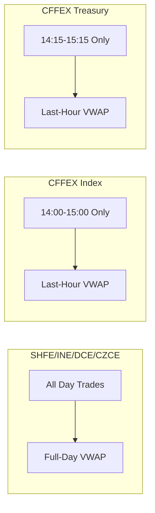

# CFFEX - China Financial Futures Exchange (中国金融期货交易所)

Stock index futures, treasury bond futures. Assumes familiarity with `futures_china.md`.

## 1. Identity & Products

| Attribute | Value |
|-----------|-------|
| Timezone | **CST (UTC+8)** |
| Focus | Financial derivatives |
| Night session | **No** |
| Settlement | **Last-hour VWAP** (not full-day) |
| Close time | 15:00 (index), 15:15 (treasury) |
| Restrictions | Position limits, high intraday fees |
| QFI access | **Hedging only** |
| Ownership | Company-based (公司制) |

### Products

| Code | Product | Launch | Multiplier | Tick | Close |
|------|---------|--------|------------|------|-------|
| IF | CSI 300 Index | 2010-04-16 | 300 CNY | 0.2 pt | 15:00 |
| IH | SSE 50 Index | 2015-04-16 | 300 CNY | 0.2 pt | 15:00 |
| IC | CSI 500 Index | 2015-04-16 | 200 CNY | 0.2 pt | 15:00 |
| IM | CSI 1000 Index | **2022-07-22** | 200 CNY | 0.2 pt | 15:00 |
| T | 10Y Treasury | 2015-03-20 | 10,000 CNY | 0.005 pt | 15:15 |
| TF | 5Y Treasury | 2013-09-06 | 10,000 CNY | 0.005 pt | 15:15 |
| TS | 2Y Treasury | 2018-08-17 | 20,000 CNY | 0.005 pt | 15:15 |
| TL | 30Y Treasury | **2023-04-21** | 10,000 CNY | 0.01 pt | 15:15 |

> IM and TL are the two newest products, launched under the registration-based listing system post-Futures Law.

### Contract format

UPPERCASE + YYMM (e.g., `IF2501`, `T2503`).

---

## 2. Data Characteristics

| Field | Behavior |
|-------|----------|
| UpdateMillisec | **0 or 500** (binary pattern, same as SHFE/INE) |
| AveragePrice | **× Multiplier** (divide by multiplier before use) |
| ActionDay | Correct (no night session, no date ambiguity) |
| TradingDay | Correct (no night session complexity) |
| L1 snapshot rate | 500ms via CTP |
| L2 depth | 5 levels, **500ms**, paid, via 上海金融衍生品研究院 |
| L2 availability | ~2010 (earliest among all exchanges) |

> CFFEX L2 remains at 500ms while DCE/CZCE upgraded to 250ms. CFFEX L2 requires paid license.

---

## 3. Data Validation Checklist

| Check | Rule | Severity |
|-------|------|----------|
| UpdateMillisec | Must be exactly 0 or 500 | Hard reject if other values |
| AveragePrice | Divide by contract multiplier to get meaningful price | Data corruption if raw |
| ActionDay | Must equal calendar date (no night session) | Hard reject if mismatch |
| TradingDay | Must equal ActionDay (no night session) | Hard reject if mismatch |
| No night ticks | Reject any tick outside 09:00-15:15 window | Stale/spurious data |
| Contract code | UPPERCASE, YYMM format | Reject lowercase |
| Price limits | Index ±10%, treasury ±2% (varies) | Flag if exceeded |

---

## 4. Order Book Mechanics

### No Night Session

```mermaid
gantt
    title CFFEX Trading Hours (No Night)
    dateFormat HH:mm
    axisFormat %H:%M

    section Index Futures
    Opening Auction :09:25, 5m
    Morning :09:30, 2h
    Afternoon :13:00, 2h

    section Treasury Futures
    Opening Auction :09:10, 5m
    Morning :09:15, 2h15m
    Afternoon :13:00, 2h15m
```

No night session means no overnight position changes from Asian/European markets.

### Call Auction

| Feature | Index Futures | Treasury Futures |
|---------|--------------|-----------------|
| Opening auction | **09:25-09:30** | **09:10-09:15** |
| Closing call auction | **Options only: 14:57-15:00** | No |
| Market orders in auction | **Auto-cancelled** | **Auto-cancelled** |

CFFEX is the **only exchange with a closing call auction** (applicable to stock index options). The closing auction price determines the options settlement price.

Auction times differ from all commodity exchanges (which use 08:55-09:00 / 20:55-21:00).

### Self-Trade Prevention (STP)

Since **January 2024**, CFFEX supports self-trade prevention for treasury futures institutional clients:
- Netting of treasury futures across accounts
- Reduced margin requirements
- Must apply for STP eligibility

### Last-Hour VWAP Settlement

**Implication:** EOD price manipulation targets the last hour, not the close.

---

## 5. Transaction Costs

### Current Fee Structure

| Product | Open | Close Today | Ratio |
|---------|------|-------------|-------|
| IF | 0.23/10000 | **2.3/10000** | **10x** |
| IH | 0.23/10000 | **2.3/10000** | **10x** |
| IC | 0.23/10000 | **2.3/10000** | **10x** |
| IM | 0.23/10000 | **2.3/10000** | **10x** |
| T/TF/TS/TL | 3 CNY | **0 CNY** | Free close |

### CFFEX Index Futures Fee History

The most dramatic fee changes in Chinese futures history. Close-today fees went from ~0 to 万分之23 (100x) after the 2015 crash, then took 8 years to partially normalize.

| Date | Close-Today Fee | Multiplier vs Normal | Daily Open Limit | Event |
|------|----------------|---------------------|-----------------|-------|
| Pre-2015 | ~万分之0.23 | 1x | Unrestricted | Normal operations |
| **2015-08-26** | **万分之1.15** | **5x** | 600/product | First tightening |
| **2015-09-07** | **万分之23** | **100x** | 10/product | Maximum restriction |
| 2017-02-17 | 万分之9.2 | 40x | 20/product | 1st relaxation |
| 2017-09-18 | 万分之6.9 | 30x | 20/product | 2nd relaxation |
| 2018-12-03 | 万分之4.6 | 20x | 50/contract | 3rd relaxation |
| 2019-04-22 | 万分之3.45 | 15x | 500/contract | 4th relaxation |
| **2023-03-20** | **万分之2.3** | **10x** | 500/contract | **Current rate** |

> Treasury futures: 3元/手, close-today free. No fee history drama.

### Index Arbitrage Constraints

Index futures vs cash index arbitrage faces structural frictions:

| Friction | Impact |
|----------|--------|
| T+1 stocks vs T+0 futures | Cannot quickly adjust stock leg |
| Position limits (1,200) | Caps arbitrage scale |
| 10x intraday fees | Discourages day arb |
| ETF creation/redemption | Delays in cash settlement |

**Result:** Persistent basis (often discount to fair value).

---

## 6. Position Limits & Margin

### Static Speculative Position Limits

| Product | Speculative Limit | Notes |
|---------|-------------------|-------|
| IF | **5,000 contracts** | Per single contract, single direction |
| IH/IC/IM | **1,200 contracts** each | Per single contract, single direction |
| T/TF/TS | 2,000 (non-delivery) | 600 in delivery month |
| TL | 1,000 (non-delivery) | 300 in delivery month |

**QFI restriction:** Foreign investors (QFI) may only trade index futures **for hedging purposes** with approved quota.

### CFFEX Index Futures Daily Open Limit History

| Date | Daily Open Limit | Unit | Event |
|------|-----------------|------|-------|
| Pre-2015 | Unrestricted | — | Normal operations |
| 2015-08-25 | **600** | per product | First restriction |
| 2015-08-28 | **100** | per product | Rapid escalation |
| **2015-09-07** | **10** | per product | **Peak restriction** |
| 2017-02-17 | **20** | per product | 1st relaxation |
| 2017-09-18 | 20 | per product | 2nd relaxation |
| **2018-12-03** | **50** | **per contract** | 3rd relaxation; **unit changed from per-product to per-contract** |
| **2019-04-22** | **500** | per contract | 4th relaxation (10x increase) |
| 2023-03-20 | 500 | per contract | Current (no change) |

> The per-product to per-contract shift (2018-12-03) is a subtle but critical regime change — it allowed far more total daily activity since the limit applied per individual contract month rather than across all months of IF collectively.

### CFFEX Index Futures Margin History

| Date | IF/IH Margin | IC Margin | IM Margin | Event |
|------|-------------|-----------|-----------|-------|
| Pre-2015 | 10% | 10% | — | Normal |
| **2015-09-07** | **40%** | **40%** | — | Peak restriction |
| 2017-02-17 | 20% | 30% | — | 1st relaxation |
| 2017-09-18 | 15% | 30% | — | 2nd relaxation |
| 2018-12-03 | **10%** | 15% | — | Near-normalization |
| **2019-04-22** | **10%** | **12%** | — | Current levels set |
| 2022-07-22 | 10% | 12% | **12%** | IM launched |
| Current | **10%** | **12%** | **12%** | No further change through 2025 |

---

## 7. Regulatory Framework

### Abnormal Trading Thresholds

| Metric | CFFEX Index Futures | CFFEX Treasury Futures | Other Exchanges |
|--------|--------------------|-----------------------|-----------------|
| Frequent cancels | **≥400 cancels/contract/day** | ≥500 cancels/contract/day | ≥500/contract/day |
| Large cancels | **≥100 large cancels ≥80% max size** | Per published rules | ≥50 large cancels |
| Self-trades | ≥5/contract/day | ≥5/contract/day | ≥5/contract/day |

CFFEX index futures have **stricter thresholds** than all other exchanges (400 vs 500 cancel limit).

### Enforcement

CFFEX applies restrictions **from the first violation** for stock index futures — reflecting post-2015 crash sensitivity. Other exchanges follow a three-step escalation (phone warning → priority monitoring → position-opening restriction ≥1 month).

### FOK/FAK Exemptions

FOK and FAK order auto-cancellations do **not** count toward thresholds. Market orders, stop-loss orders, spread orders, hedging trades, and designated market maker activity are all exempt.

### Programmatic Trading Rules

Since 国办发47号 (2024-09-30): HFT fee rebates cancelled, mandatory programmatic trading reporting. CSRC Programmatic Trading Management Rules effective **October 9, 2025**. Programme trading defined as ≥5 instances of placing ≥5 orders within 1 second on the same trading day.

---

## 8. Regime Change Database

| Date | Event | Category | Impact |
|------|-------|----------|--------|
| **2015-08-25** | First restriction: 600/product, 12% margin, 万分之1.15 close-today | restriction | Market cooling begins |
| **2015-08-28** | Escalation: 100/product, 20% margin | restriction | Rapid tightening |
| **2015-09-07** | **Peak restriction: 10/product, 40% margin, 万分之23 fee** | restriction | **Market effectively frozen** |
| 2017-02-17 | 1st relaxation: 20/product, 20%/30% margin, 万分之9.2 | relaxation | Slow thaw begins |
| 2017-09-18 | 2nd relaxation: 15%/30% margin, 万分之6.9 | relaxation | Incremental |
| **2018-12-03** | 3rd relaxation: 50/contract (unit change), 10%/15% margin, 万分之4.6 | relaxation | Per-product → per-contract |
| **2019-04-22** | 4th relaxation: 500/contract, 10%/12% margin, 万分之3.45 | relaxation | Most impactful — 10x daily limit increase |
| **2022-07-22** | **IM (CSI 1000) + options launched**; IH options launched | product | New tickers; cross-hedging models need update |
| 2022-09-02 | QFI access launched: 41 futures/options opened | access | Foreign order flow enters |
| 2022-12-19 | Formal codification in notice [2022]73 | regulation | No parameter change |
| **2023-03-20** | **Close-today fee reduced: 万分之2.3 (current)** | fee | Latest fee change |
| **2023-04-21** | **TL (30Y Treasury) launched** | product | Completes 2Y/5Y/10Y/30Y yield curve |
| **2024-01** | **Self-trade prevention (STP) launched for treasury futures** | structure | Institutional netting, reduced margin |
| **2024-07** | **~30μs latency added via fiber extension** | structure | CFFEX-specific; minimal vs SHFE ~300μs |
| **2024-09-24** | **"924 Rally"**: stock market surge, CFFEX volumes spike | structure | Volume/liquidity regime change |
| 2024-09-30 | State Council 国办发47号: HFT fee rebates cancelled | regulation | Programmatic trading reporting mandatory |
| **2024-12-27** | Delivery/exercise fees halved for 2025 (HFT excluded) | fee | Fee parameter change effective Jan 1, 2025 |

> Pre-2015-09 vs post-2019-04 are effectively **different markets**. Any backtest spanning this period must account for the regime discontinuity.

---

## 9. Failure Modes & Gotchas

| Gotcha | Detail |
|--------|--------|
| 10x intraday fee | Close-today fee is 万分之2.3 vs 万分之0.23 open. Forgetting this 10x multiplier destroys PnL calculations |
| Pre-2015 vs post-2019 | Different markets. Liquidity, participation, cost structure all fundamentally changed |
| Last-hour VWAP manipulation | Settlement price computed from last hour only — manipulation targets 14:00-15:00, not close |
| T+1 stocks vs T+0 futures | Cash-futures arbitrage is structurally impaired; persistent basis discount |
| Closing call auction (options only) | Options have 14:57-15:00 closing auction; futures do not. Do not expect closing auction behavior in futures |
| 400 cancel limit (index) | Stricter than all other exchanges (500). First violation triggers restrictions |
| QFI hedging only | Foreign investors cannot speculate on index futures. Hedging quota required |
| No night session | Overnight gap risk absorbs all Asian/European/US session moves into opening auction |
| IM margin = IC margin | IM launched at 12% despite being a newer, smaller-cap product — same as IC |

---

## 10. Market Maker Programs

### Program Structure

| Attribute | Value |
|-----------|-------|
| Rules published | 2018/12 (revised 2020/11) |
| Treasury futures coverage | 4 products: TS, TF, T, TL |
| Options coverage | 3 products: IO (CSI 300), MO (CSI 1000), HO (SSE 50) |
| Disclosed market makers | **16 for CSI 300 index options** at launch (Dec 2019) |
| Named participants | Zhaoshan, CITIC, Guotai Junan, Haitong Securities |
| Quoting mode | Continuous + response quoting |
| Exemptions | Fee discounts, position limit exemptions, abnormal trading designation exemption |

> Since January 2024, STP for treasury futures market makers. Other exchanges rarely disclose participant lists.

---

## 11. Empirical Parameters

### Spread Estimates

| Product | Tick Size | Median Spread (ticks) | Median Half-Spread (bps) | Confidence | Source |
|---------|-----------|----------------------|--------------------------|------------|--------|
| IF (CSI 300) | 0.2 pts | 1-3 | ~0.3-0.8 | Medium | arXiv:2501.03171 |
| T (10Y bond) | 0.005 CNY | 1-3 | ~0.2-0.7 | Low | Estimate |

### Queue Depth and Fill Time

| Product | Typical L1 Queue (lots) | L1 Queue (CNY notional) | Trade Freq (trades/sec) | Est. Queue Half-Life (sec) |
|---------|------------------------|------------------------|------------------------|---------------------------|
| IF | 10-50 | 10.5-60M | 1-3 | 3-10 |

### Weibull Fill Time Parameter

| Product | Estimated k | Rationale |
|---------|-------------|-----------|
| IF | **0.70-0.85** | Restricted market, institutional, clustered flow |

Sub-exponential (k < 1) reflects order flow clustering.

### Matching Engine Latency

| Metric | Value | Source |
|--------|-------|--------|
| Matching latency | **Sub-millisecond** | Direct measurement |
| Fiber extension (Jul 2024) | **+30μs** added | 界面新闻 practitioner report |
| Co-location order-to-ack | ~500μs baseline | Pre-Jul 2024 |
| Market data (L1 and L2) | 500ms snapshots | No 250ms upgrade (unlike DCE/CZCE) |

> CFFEX's +30μs fiber extension was the smallest among all exchanges (SHFE added ~300μs).

---

## 12. Primary Sources

- Rules: https://www.cffex.com.cn/fgfz/
- Products: https://www.cffex.com.cn/
- Abnormal trading monitoring: https://www.cffex.com.cn/jcbz/
- Fee schedule: https://www.cffex.com.cn/jsxf/
- Position limits: https://www.cffex.com.cn/ccxe/
