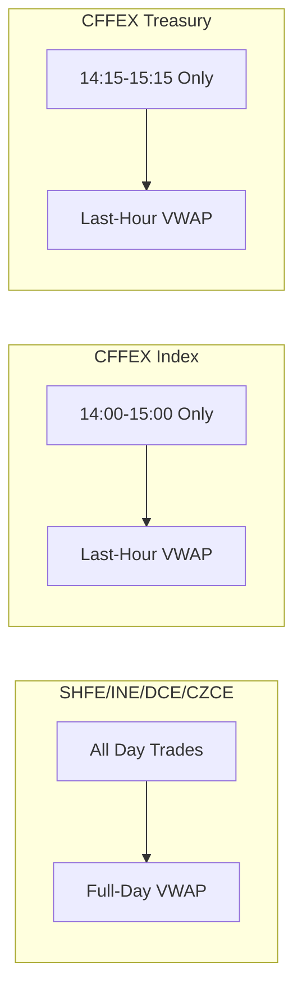
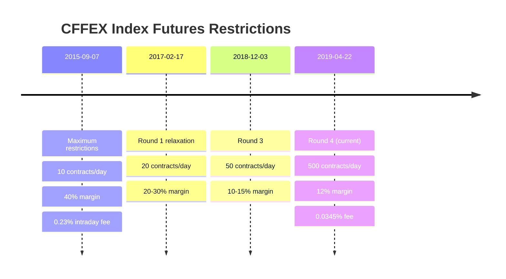

# CFFEX - China Financial Futures Exchange (中国金融期货交易所)

Stock index futures, treasury bond futures. Assumes familiarity with `futures_china.md`.

## Key Characteristics

| Attribute | Value |
|-----------|-------|
| Timezone | **CST (UTC+8)** |
| Focus | Financial derivatives |
| Night session | **No** |
| Settlement | **Last-hour VWAP** (not full-day) |
| Close time | 15:00 (index), 15:15 (treasury) |
| Restrictions | Position limits, high intraday fees |
| QFI access | **Hedging only** |

## Products

| Code | Product | Multiplier | Tick | Close |
|------|---------|------------|------|-------|
| IF | CSI 300 Index | 300 CNY | 0.2 pt | 15:00 |
| IH | SSE 50 Index | 300 CNY | 0.2 pt | 15:00 |
| IC | CSI 500 Index | 200 CNY | 0.2 pt | 15:00 |
| IM | CSI 1000 Index | 200 CNY | 0.2 pt | 15:00 |
| T | 10Y Treasury | 10,000 CNY | 0.005 pt | 15:15 |
| TF | 5Y Treasury | 10,000 CNY | 0.005 pt | 15:15 |
| TS | 2Y Treasury | 20,000 CNY | 0.005 pt | 15:15 |
| TL | 30Y Treasury | 10,000 CNY | 0.01 pt | 15:15 |

## Last-Hour VWAP Settlement

**Critical difference from commodity exchanges:**

**Implication:** EOD price manipulation targets the last hour, not the close.

## Position Limits

**Strict limits on speculative positions:**

| Product | Speculative Limit | Notes |
|---------|-------------------|-------|
| IF/IH/IC/IM | **1,200 contracts** | All months combined, per client |
| T/TF/TS | 2,000 (non-delivery) | 600 in delivery month |
| TL | 1,000 (non-delivery) | 300 in delivery month |

**QFI restriction:** Foreign investors (QFI) may only trade index futures **for hedging purposes** with approved quota.

## Fee Structure (Anti-Speculation)

| Product | Open | Close Today | Ratio |
|---------|------|-------------|-------|
| IF | 0.23/10000 | **2.3/10000** | **10x** |
| IH | 0.23/10000 | **2.3/10000** | **10x** |
| IC | 0.23/10000 | **2.3/10000** | **10x** |
| IM | 0.23/10000 | **2.3/10000** | **10x** |
| T/TF/TS/TL | 3 CNY | 0 CNY | Free close |

**Purpose:** Discourage day trading in index futures after 2015 market volatility.

## Restriction History

**Backtesting implication:** Pre-2015-09 vs post-2019-04 are effectively **different markets**.

## STP (Single Treasury Pool)

Since January 2024, CFFEX supports STP for institutional clients:
- Netting of treasury futures across accounts
- Reduced margin requirements
- Must apply for STP eligibility

## No Night Session

```mermaid
gantt
    title CFFEX Trading Hours (No Night)
    dateFormat HH:mm
    axisFormat %H:%M

    section Index Futures
    Opening Auction :08:55, 5m
    Morning 1 :09:00, 1h15m
    Morning 2 :10:30, 1h
    Afternoon :13:00, 2h

    section Treasury Futures
    Opening Auction :09:10, 5m
    Morning :09:15, 2h15m
    Afternoon :13:00, 2h15m
```

No night session means no overnight position changes from Asian/European markets.

## Index Arbitrage Constraints

Index futures vs cash index arbitrage faces frictions:

| Friction | Impact |
|----------|--------|
| T+1 stocks vs T+0 futures | Cannot quickly adjust stock leg |
| Position limits (1,200) | Caps arbitrage scale |
| 10x intraday fees | Discourages day arb |
| ETF creation/redemption | Delays in cash settlement |

**Result:** Persistent basis (often discount to fair value).

## Data Quirks

| Field | Behavior |
|-------|----------|
| UpdateMillisec | 0 or 500 |
| AveragePrice | × Multiplier |
| ActionDay | Correct |
| Contract format | UPPERCASE + YYMM (e.g., `IF2501`) |

## Primary Source

- Rules: https://www.cffex.com.cn/fgfz/
- Products: https://www.cffex.com.cn/
