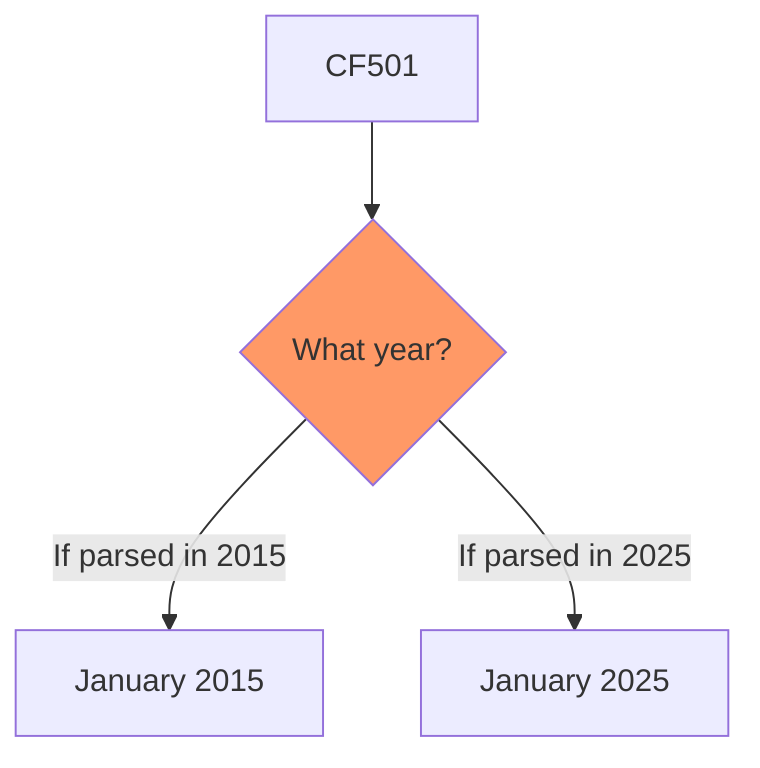

# CZCE - Zhengzhou Commodity Exchange (郑州商品交易所)

Agricultural products, chemicals. Assumes familiarity with `futures_china.md`.

## 1. Identity & Products

| Attribute | Value |
|-----------|-------|
| Timezone | **CST (UTC+8)** |
| Focus | Agricultural (cotton, sugar), chemicals (PTA, methanol) |
| Night session | Yes (21:00-23:00 end) |
| Contract format | **3-digit year (YMM)** - ambiguous across decades |
| UpdateMillisec | **Always 0** - no sub-second ordering |
| AveragePrice | **Direct** (not scaled by multiplier) |

### Products

| Code | Product | Multiplier | Tick | Night |
|------|---------|------------|------|-------|
| CF | Cotton (棉花) | 5 t | 5 CNY | 23:00 |
| SR | Sugar (白糖) | 10 t | 1 CNY | 23:00 |
| TA | PTA | 5 t | 2 CNY | 23:00 |
| MA | Methanol (甲醇) | 10 t | 1 CNY | 23:00 |
| FG | Glass (玻璃) | 20 t | 1 CNY | 23:00 |
| OI | Rapeseed Oil (菜籽油) | 10 t | 1 CNY | 23:00 |
| RM | Rapeseed Meal (菜籽粕) | 10 t | 1 CNY | 23:00 |
| ZC | Thermal Coal (动力煤) | 100 t | 0.2 CNY | 23:00 |
| SA | Soda Ash (纯碱) | 20 t | 1 CNY | 23:00 |
| UR | Urea | 20 t | 1 CNY | 23:00 |
| AP | Apple | 10 t | 1 CNY | None |
| CJ | Jujube | 5 t | 5 CNY | None |
| PK | Peanut | 5 t | 2 CNY | None |
| SF | Silicon Ferro | 5 t | 2 CNY | 23:00 |
| SM | Silicon Manganese | 5 t | 2 CNY | 23:00 |
| PF | Staple Fiber | 5 t | 2 CNY | 23:00 |
| PX | PX (对二甲苯) | 5 t | 2 CNY | 23:00 |
| SH | Caustic Soda (烧碱) | 30 t | 1 CNY | 23:00 |
| PET | PET Chip (聚酯瓶片) | 5 t | 2 CNY | 23:00 |

### Night Session Rollout


| Code | Product | Night session start | Hours at launch | Current hours |
|------|---------|-------------------|-----------------|---------------|
| SR | 白糖 Sugar | **2014-12-12** | 21:00-23:30 | 21:00-23:00 |
| CF | 棉花 Cotton | **2014-12-12** | 21:00-23:30 | 21:00-23:00 |
| RM | 菜籽粕 Rapeseed Meal | **2014-12-12** | 21:00-23:30 | 21:00-23:00 |
| MA | 甲醇 Methanol | **2014-12-12** | 21:00-23:30 | 21:00-23:00 |
| TA | PTA | **2014-12-12** | 21:00-23:30 | 21:00-23:00 |
| OI | 菜籽油 Rapeseed Oil | **~2015-06-11** | 21:00-23:30 | 21:00-23:00 |
| FG | 玻璃 Glass | **~2015-06-11** | 21:00-23:30 | 21:00-23:00 |
| ZC | 动力煤 Thermal Coal | **~2015-06-11** | 21:00-23:30 | 21:00-23:00 |
| SA | 纯碱 Soda Ash | **2019-12-06** | 21:00-23:00 | 21:00-23:00 |

Hours shortened from **23:30 to 23:00** around 2019.

## 2. Data Characteristics

### Contract Code Ambiguity

**Critical:** CZCE uses 3-digit year codes (YMM), creating decade ambiguity.



**Resolution:** Use trading calendar context - if contract is listed/active, disambiguate by current date. Contracts list at most ~12-18 months ahead, so CF501 can only mean January 2025 during 2024-2025.

### Format Comparison Across Exchanges


| Exchange | Format | Example | Case |
|----------|--------|---------|------|
| SHFE | Code + YYMM | rb2501 | lowercase |
| DCE | Code + YYMM | m2501 | lowercase |
| CFFEX | Code + YYMM | IF2501 | UPPERCASE |
| INE | Code + YYMM | sc2501 | lowercase |
| GFEX | Code + YYMM | si2501 | lowercase |
| **CZCE** | **Code + YMM** | **CF501** | **UPPERCASE** |

### Vendor Handling


| Platform | CZCE format | Example | Notes |
|----------|-------------|---------|-------|
| CTP (native) | 3-digit | CF501 | Exchange passthrough |
| VNPY | 3-digit | TA910.CZCE | Uses CTP directly |
| TqSdk | 3-digit | CZCE.SR901 | Follows exchange convention |
| Wind (万得) | **4-digit** | CF2501.CZC | **Normalizes** for consistency |
| Sina Finance | **4-digit** | MA2109 | **Normalizes** in API |
| RQData (米筐) | **4-digit** | CF2501 | **Normalizes** for consistency |
| SimNow | 3-digit | Same as CTP | Mirrors live behavior |

CTP-native tools preserve 3-digit format; data vendors normalize to 4-digit for cross-exchange consistency and decade disambiguation.

### UpdateMillisec Always Zero

CZCE does not populate sub-second timestamps:

| Exchange | UpdateMillisec |
|----------|----------------|
| SHFE/INE | 0 or 500 |
| DCE | 0-999 |
| CFFEX | 0 or 500 |
| **CZCE** | **Always 0** |

**Implication:** Cannot determine ordering within same second.

### AveragePrice Not Scaled

| Exchange | AveragePrice Meaning |
|----------|---------------------|
| SHFE/INE/DCE/CFFEX | VWAP x Multiplier |
| **CZCE** | **True VWAP** (no scaling) |

```python
def get_vwap(tick, exchange):
    if exchange == "CZCE":
        return tick.AveragePrice  # Direct
    else:
        return tick.AveragePrice / get_multiplier(tick.InstrumentID)
```

### Level-2 Data


| Attribute | Value |
|-----------|-------|
| Available since | ~2018-2020 |
| Update rate | **250ms** (4/sec) |
| Depth | 5 levels |
| Provider | 易盛 Esunny |
| Cost | Free on 易盛极星; **paid** elsewhere (~¥300-600/yr) |

DCE and CZCE L2 at 250ms provides 2x temporal resolution vs SHFE/CFFEX at 500ms. Developers must use 易盛 proprietary DataFeed API rather than CTP for L2.

## 3. Data Validation Checklist

| Field | Behavior | Action |
|-------|----------|--------|
| UpdateMillisec | **Always 0** | Interpolate: 000/500/750/875 (halving intervals) |
| AveragePrice | **True VWAP** | Use directly (no divide by multiplier) |
| ActionDay | **Correct** | Use as-is |
| TradingDay (night) | **WRONG** - shows current date, not next trading day | Derive from ActionDay + time; or use SHFE TradingDay as reference |
| Contract format | **UPPERCASE + YMM** (3-digit) | Disambiguate decade from trading calendar context |

**CZCE TradingDay bug at night:** On Friday Jan 30, 2015 at 21:02 night session, CZCE TA505 shows ActionDay=20150130 (correct), TradingDay=20150130 (wrong, should be 20150202 Monday). Never trust TradingDay from CZCE during night sessions.

## 4. Order Book Mechanics

### Call Auction

| Feature | CZCE |
|---------|------|
| Night product opening auction | 20:55-21:00 |
| Day-only product opening auction | 08:55-09:00 |
| Day-session auction for night products | **No** (cancel-only 08:55-08:59) |
| Closing call auction | No |
| Market orders in auction | Explicitly excluded |
| FOK orders | **Not supported** |


### Cancel-Only Window (08:55-08:59)

Unique CZCE rule for overnight orders:

```mermaid
gantt
    title CZCE Day Session Opening
    dateFormat HH:mm
    axisFormat %H:%M

    section Night Carryover
    Cancel-only window :crit, 08:55, 4m

    section Auction
    Day opening auction :08:59, 1m

    section Continuous
    Trading begins :09:00, 15m
```



During 08:55-08:59, you can **only cancel** unmatched overnight orders, not submit new ones.

**Critical difference from peers:** SHFE, DCE, INE, and GFEX all added full day-session call auctions for night-session products in **May 2023**. CZCE did not. This means no price discovery/re-matching opportunity for CZCE night products between 08:55-09:00 -- only cancellations.

## 5. Transaction Costs

### Exchange-Level Fees


| Code | Product | Fee type | Open/Close | Close-today | Notes |
|------|---------|----------|-----------|-------------|-------|
| TA | PTA | Per-lot | 3元/手 | **0元** | Close-today free |
| MA | 甲醇 | Per-lot | 2元/手 | Varies (0-6元) | Contract-month dependent |
| SR | 白糖 | Per-lot | 3元/手 | **0元** | Close-today free |
| CF | 棉花 | Per-lot | 4.3元/手 | **0元** | Close-today free |
| SA | 纯碱 | Per-turnover | 万分之2 | Up to 万分之4 | Close-today can be 2x open |

### Daily Trading Limits (交易限额)


| Product | Daily opening limit |
|---------|-------------------|
| TA (PTA) | 30,000 lots/day |
| MA (Methanol) | 25,000 lots/day |
| CF (Cotton) | 10,000 lots/day |

Per contract, per account. Hedging and market maker exempt.

### Order Submission Fees (申报费)


Since **May 2024**, CZCE implemented 申报费 with OTR-tiered pricing, creating economic disincentives for excessive quoting beyond hard cancel limits. All Chinese exchanges implemented similar fees simultaneously.

## 6. Position Limits & Margin

### Position Limits (Representative)


| Product | General Month | Near-Delivery | Delivery Month |
|---------|--------------|---------------|----------------|
| TA PTA (OI < 500K) | 50,000 | 10,000 | 5,000 |
| CF Cotton (OI < 200K) | 20,000 | 4,000 | 800 |
| MA Methanol (OI < 300K) | 30,000 | 3,000 | 1,000 |

For TA: when OI >= 500K, general month limit is 15% of OI. Similar OI-threshold logic applies to CF and MA.

### Margin System

CZCE uses a **three-period margin escalation system** varying by product. Unlike SHFE's standard four-tier pattern, CZCE periods and rates are product-specific.

| Period | Typical Margin |
|--------|---------------|
| General month | Contract minimum (4-8%) |
| Pre-delivery (D-month minus ~15th of prior month) | Elevated (varies) |
| Delivery month | Further elevated |

SA (Soda Ash) runs **12-17%** effective margin due to extreme volatility. Holiday margin escalation applies -- Spring Festival typically +5-10% across the board.

## 7. Regulatory Framework

### Abnormal Trading Thresholds


| Rule | Threshold |
|------|-----------|
| Frequent cancellation | >= 500 cancels/contract/day |
| Large cancellation | >= 50 large cancels (>= 800 lots each) |
| Self-trades | >= 5/contract/day |

**Exemptions:** FOK/FAK auto-cancellations, market orders, stop-loss orders, spread orders, hedging, designated market maker activity.

**Enforcement escalation:** First violation = phone warning to FCM CRO; second = priority monitoring list; third = position-opening restrictions >= 1 month.

### Programme Trading Definition

Since June 2025 CSRC rules: >= 5 instances of placing >= 5 orders within 1 second on the same trading day.

### State Council 国办发47号 (Sep 30, 2024)

HFT fee rebates cancelled (取消手续费减收), mandatory programmatic trading reporting, enhanced surveillance of pattern-similar accounts. Implementation via CSRC Programmatic Trading Management Rules effective **October 9, 2025**.

## 8. Regime Change Database

| Date | Event | Impact |
|------|-------|--------|
| **2014-12-12** | Night session launched: SR/CF/RM/MA/TA (21:00-23:30) | First CZCE night products |
| ~2015-06-11 | Night session added: OI/FG/ZC | Second batch |
| ~2019 | Night hours shortened 23:30 -> 23:00 | All CZCE night products affected |
| 2019-12-06 | SA (Soda Ash) launched with night session 21:00-23:00 | New product |
| 2020-02-03 to 2020-05-06 | COVID: all night sessions suspended | All exchanges |
| **2023-05** | SHFE/DCE/INE/GFEX add day-session auctions for night products | CZCE did NOT follow |
| **2023-09-15** | PX (对二甲苯) + Caustic Soda (烧碱, SH) launched | Night 21:00-23:00; PX-PTA spread enabled |
| 2023-11 | Daily trading limits introduced (TA 30K, MA 25K, CF 10K) | Per-contract daily caps |
| **2024-05** | 申报费 (order submission fees) with OTR-tiered pricing | All exchanges simultaneously |
| **2024-08-30** | PET Chip (聚酯瓶片) launched | Night 21:00-23:00 |
| 2024-09-30 | State Council 国办发47号 | HFT fee rebates cancelled; mandatory reporting |

## 9. Failure Modes & Gotchas

| Issue | Detail | Mitigation |
|-------|--------|------------|
| **3-digit code ambiguity** | CF501 = Jan 2015 or Jan 2025 (decade problem) | Disambiguate from trading calendar; only ~12-18 months listed ahead |
| **TradingDay wrong at night** | Shows current date instead of next trading day | Use SHFE TradingDay as reference; derive from ActionDay + time |
| **Cancel-only window 08:55-08:59** | No day-session auction for night products (unlike SHFE/DCE/INE/GFEX since May 2023) | Do not submit new orders during this window |
| **UpdateMillisec = 0** | No sub-second ordering possible | Interpolate: 000/500/750/875 |
| **AveragePrice direct** | Not scaled by multiplier (unlike all other exchanges) | Do not divide by multiplier |
| **No FOK support** | FOK order type unavailable | Use GFD or IOC alternatives |
| **SA close-today fee 2x** | Soda Ash close-today can be 万分之4 vs 万分之2 open | Factor into intraday cost models |

## 10. Market Maker Programs


| Attribute | Value |
|-----------|-------|
| Rules published | 2019/1 (rev. 2024/4) |
| Futures MM products | **20+** (TA, MA, SR, CF, SA, FG, UR, AP, etc.) |
| Options MM products | **20+** (SR, CF, TA, MA, RM, SA, etc.) |
| Net asset requirement | Per bilateral agreement |

CZCE has the **broadest product coverage** of any Chinese exchange for market making. Key features:

- Continuous + response quoting obligations
- Fee discounts and position limit exemptions
- Exempt from abnormal trading designation for frequent quote/cancel
- Tiered management system
- "Active contract continuity" (活跃合约连续化) policy -- MM programs credited with reducing bid-ask spreads on non-main-month contracts

## 11. Empirical Parameters


### Quoted Half-Spreads

| Product | Tick Size | Typical Price (CNY) | Median Spread (ticks) | Median Half-Spread (bps) | Confidence |
|---------|-----------|--------------------|-----------------------|--------------------------|------------|
| TA (PTA) | 2 CNY/ton | 5,500 | 1 | ~1.8 | Medium |
| SR (Sugar) | 1 CNY/ton | 6,500 | 1 | ~0.8 | Medium |
| CF (Cotton) | 5 CNY/ton | 14,000 | 1 | ~1.8 | Low |
| MA (Methanol) | 1 CNY/ton | 2,500 | 1-2 | ~2-4 | Low |

Most liquid CZCE products trade at median 1-tick spread during active sessions (large-tick regime where queue priority dominates).

### Queue Depth

| Product | Typical L1 Queue (lots) | L1 Queue (CNY notional, approx.) | Queue Half-Life (sec) |
|---------|------------------------|--------------------------------|----------------------|
| TA | 50-200 | ¥0.25-1.2M | 5-15 |

### Session Effects

Night sessions show spreads ~10-30% wider than daytime due to lower participation. Night volume is 30-60% lower than day sessions, with queue depths ~50-70% of daytime levels. Opening windows (20:55-21:05, 09:00-09:15) show elevated activity.

## 12. Primary Sources

- Rules: https://www.czce.com.cn/cn/flfg/
- Products: https://www.czce.com.cn/cn/jysj/
- Fee schedules: https://www.czce.com.cn/cn/jysj/jscs/
- Market maker rules: https://www.czce.com.cn/cn/flfg/ (做市商管理办法)
- Abnormal trading rules: https://www.czce.com.cn/cn/flfg/ (异常交易管理办法)
