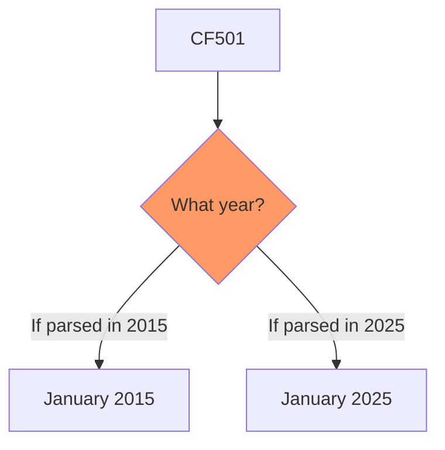

# CZCE - Zhengzhou Commodity Exchange (郑州商品交易所)

Agricultural products, chemicals. Assumes familiarity with `futures_china.md`.

## Key Characteristics

| Attribute | Value |
|-----------|-------|
| Timezone | **CST (UTC+8)** |
| Focus | Agricultural (cotton, sugar), chemicals (PTA, methanol) |
| Night session | Yes (23:00-23:30 end) |
| Contract format | **3-digit year (YMM)** - ambiguous across decades |
| UpdateMillisec | **Always 0** - no sub-second ordering |
| AveragePrice | **Direct** (not scaled by multiplier) |

## Products

| Code | Product | Multiplier | Tick | Night |
|------|---------|------------|------|-------|
| CF | Cotton | 5 t | 5 CNY | 23:00 |
| SR | Sugar | 10 t | 1 CNY | 23:00 |
| TA | PTA | 5 t | 2 CNY | 23:00 |
| MA | Methanol | 10 t | 1 CNY | 23:00 |
| FG | Glass | 20 t | 1 CNY | 23:00 |
| OI | Rapeseed Oil | 10 t | 1 CNY | 23:00 |
| RM | Rapeseed Meal | 10 t | 1 CNY | 23:00 |
| ZC | Thermal Coal | 100 t | 0.2 CNY | 23:00 |
| SA | Soda Ash | 20 t | 1 CNY | 23:00 |
| UR | Urea | 20 t | 1 CNY | 23:00 |
| AP | Apple | 10 t | 1 CNY | None |
| CJ | Jujube | 5 t | 5 CNY | None |
| PK | Peanut | 5 t | 2 CNY | None |
| SF | Silicon Ferro | 5 t | 2 CNY | 23:00 |
| SM | Silicon Manganese | 5 t | 2 CNY | 23:00 |
| PF | Staple Fiber | 5 t | 2 CNY | 23:00 |

## Contract Code Ambiguity

**Critical:** CZCE uses 3-digit year codes (YMM), creating decade ambiguity:



**Resolution:** Use trading calendar context - if contract is listed/active, disambiguate by current date.

## UpdateMillisec Always Zero

CZCE does not populate sub-second timestamps:

| Exchange | UpdateMillisec |
|----------|----------------|
| SHFE/INE | 0 or 500 |
| DCE | 0-999 |
| CFFEX | 0 or 500 |
| **CZCE** | **Always 0** |

**Implication:** Cannot determine ordering within same second. For time-series analysis, interpolate:
- First tick of second: 0ms
- Second tick: 500ms
- Pattern: 000, 500, 750, 875, ... (halving intervals)

## AveragePrice Not Scaled

**Critical difference from other exchanges:**

| Exchange | AveragePrice Meaning |
|----------|---------------------|
| SHFE/INE/DCE/CFFEX | VWAP × Multiplier |
| **CZCE** | **True VWAP** (no scaling) |

```python
def get_vwap(tick, exchange):
    if exchange == "CZCE":
        return tick.AveragePrice  # Direct
    else:
        return tick.AveragePrice / get_multiplier(tick.InstrumentID)
```

## Cancel Window (08:55-08:59)

Unique CZCE rule for overnight orders:

```mermaid
gantt
    title CZCE Day Session Opening
    dateFormat HH:mm
    axisFormat %H:%M

    section Night Carryover
    Cancel-only window :crit, 08:55, 4m

    section Auction
    Day opening auction :08:59, 1m

    section Continuous
    Trading begins :09:00, 15m
```



During 08:55-08:59, you can **only cancel** unmatched overnight orders, not submit new ones.

## Position Limits (Representative)

| Product | General | Near-Delivery | Delivery Month |
|---------|---------|---------------|----------------|
| PTA | 100K (or 15% if OI≤1M) | 20,000 | 5,000 |
| Cotton | 20K (or 10% if OI≤200K) | 6,000 | 2,000 |
| Methanol | 50K | 10,000 | 5,000 |

## Data Quirks Summary

| Field | Behavior | Action |
|-------|----------|--------|
| UpdateMillisec | **Always 0** | Interpolate for ordering |
| AveragePrice | **True VWAP** | Use directly (no divide) |
| ActionDay | Correct | Use as-is |
| Contract format | **UPPERCASE + YMM** | Disambiguate decade |

## Primary Source

- Rules: https://www.czce.com.cn/cn/flfg/
- Products: https://www.czce.com.cn/cn/jysj/
