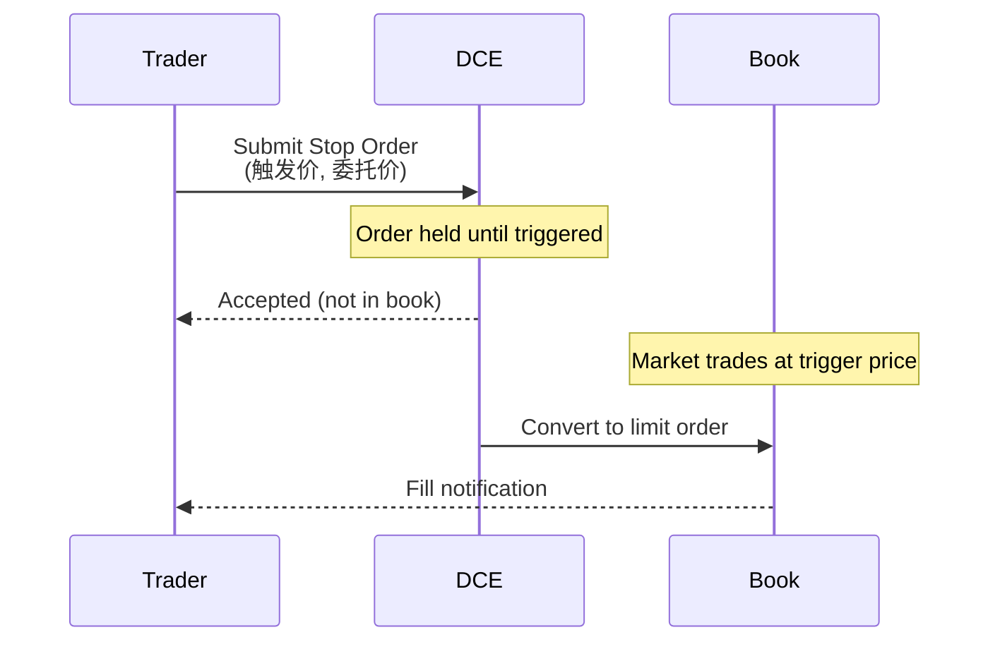
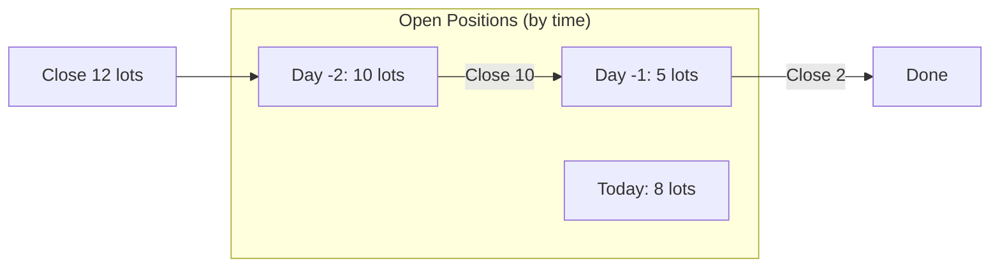
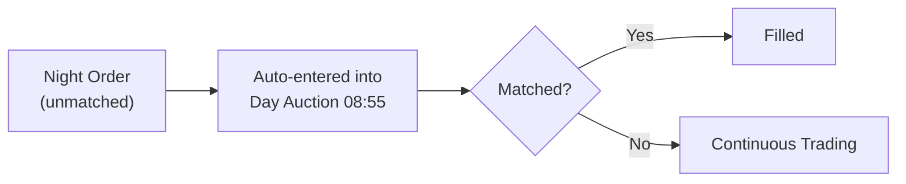

# DCE - Dalian Commodity Exchange (大连商品交易所)

Ferrous metals, agricultural products. Assumes familiarity with `futures_china.md`.

## 1. Identity & Products

| Attribute | Value |
|-----------|-------|
| Timezone | **CST (UTC+8)** |
| Focus | Ferrous (iron ore, coke), agricultural (soybeans, palm) |
| Night session | Yes (21:00-23:00) |
| Stop orders | **Only exchange with native stop orders** |
| Close position | FIFO (先开先平) default |
| ActionDay quirk | **Wrong during night session** |

Night session rollout proceeded in three waves. DCE was not a first mover — SHFE launched night trading Jul 2013; DCE followed Jul 2014. Hours shortened twice: **02:30 -> 23:30** (2015-05-08), then **23:30 -> 23:00** (2019-03-29).

| Code | Product | Multiplier | Tick | Night | Night Start |
|------|---------|------------|------|-------|-------------|
| p | Palm Oil | 10 t | 2 CNY | 23:00 | **2014-07-04** |
| j | Coke | 100 t | 0.5 CNY | 23:00 | **2014-07-04** |
| m | Soybean Meal | 10 t | 1 CNY | 23:00 | 2014-12-26 |
| y | Soybean Oil | 10 t | 2 CNY | 23:00 | 2014-12-26 |
| jm | Coking Coal | 60 t | 0.5 CNY | 23:00 | 2014-12-26 |
| i | Iron Ore | 100 t | 0.5 CNY | 23:00 | 2014-12-26 |
| a | Soybean No.1 | 10 t | 1 CNY | 23:00 | — |
| b | Soybean No.2 | 10 t | 1 CNY | 23:00 | — |
| c | Corn | 10 t | 1 CNY | 23:00 | 2019-03-29 |
| cs | Corn Starch | 10 t | 1 CNY | 23:00 | 2019-03-29 |
| l | LLDPE | 5 t | 5 CNY | 23:00 | 2019-03-29 |
| v | PVC | 5 t | 5 CNY | 23:00 | 2019-03-29 |
| pp | Polypropylene | 5 t | 1 CNY | 23:00 | 2019-03-29 |
| eg | Ethylene Glycol | 10 t | 1 CNY | 23:00 | 2019-03-29 |
| eb | Styrene | 5 t | 1 CNY | 23:00 | — |
| pg | LPG | 20 t | 1 CNY | 23:00 | **2020-03-30** |
| jd | Eggs | 10 t | 1 CNY | None | — |
| lh | Live Hog | 16 t | 5 CNY | None | — |

Contract format: lowercase + YYMM (e.g., `i2501`).

## 2. Data Characteristics

| Field | Behavior | Notes |
|-------|----------|-------|
| UpdateMillisec | **Full 0-999 range** | Real ms from matching engine (unique among exchanges) |
| AveragePrice | × Multiplier | Divide by contract multiplier to get true VWAP |
| ActionDay | **Wrong during night** | Shows next biz day (see §9) |
| Contract format | Lowercase + YYMM | e.g., `i2501` |
| L2 depth | 5 levels, 250ms | Earliest L2 adopter among commodity exchanges (~2006) |
| L2 provider | 飞创 DFIT | **Paid** ~¥600-1800/yr (display tier) |
| L2 access | Requires DFIT DataFeed API | Not available via CTP; CTP only provides L1 at 500ms |

DCE provides variable real millisecond timestamps from its matching engine — SHFE/INE/CFFEX only produce 0 or 500, CZCE always 0. This makes DCE the highest-resolution CTP timestamp source.

## 3. Data Validation Checklist

| Check | Rule | Severity |
|-------|------|----------|
| ActionDay night session | ActionDay == TradingDay during night (WRONG) — use UpdateTime | Critical |
| AveragePrice | Divide by contract multiplier before use | High |
| DBL_MAX sentinel | Check for DBL_MAX (1.7976931348623158e+308) in price fields | High |
| UpdateMillisec range | Valid 0-999; values outside range indicate data corruption | Medium |
| TradingDay consistency | TradingDay = next business day during night session (correct) | Info |

## 4. Order Book Mechanics

### Stop Orders (Unique to DCE)



**Stop order fields:**
- `StopPrice`: Trigger price (触发价)
- `Price`: Limit price after trigger (委托价)

DCE is the only Chinese futures exchange supporting native exchange-held stop orders. All other exchanges require client-side stop logic.

### FIFO Close Position

DCE uses automatic FIFO (先开先平):



No need to specify CloseToday/CloseYesterday — system auto-selects oldest first.

### Overnight Order Participation

Unmatched night session orders **automatically participate** in day session auction:



No action required — orders carry over by default.

### Call Auction

| Session | Time | Notes |
|---------|------|-------|
| Night session opening | 20:55-21:00 | Standard for all night products |
| Day session (night products) | 08:55-09:00 | **Added May 2023** — full auction, not cancel-only (unlike CZCE) |
| Day session (day-only products) | 08:55-09:00 | Standard |

Day-session auction for night products was added simultaneously at SHFE, DCE, INE, and GFEX in May 2023. CZCE remains cancel-only during this window. Market orders excluded from all auctions.

## 5. Transaction Costs

| Code | Product | Fee Type | Open/Close | Close-Today | Notes |
|------|---------|----------|-----------|-------------|-------|
| i | Iron Ore | Per-turnover | 万分之1 | 万分之1 | Same rate open/close |
| j | Coke | Per-turnover | 万分之1 | **万分之1.4** | Close-today premium |
| jm | Coking Coal | Per-turnover | 万分之1 | **万分之1.4** | Close-today premium |
| m | Soybean Meal | Per-lot | 1.5元/手 | 1.5元/手 | Flat rate |
| y | Soybean Oil | Per-lot | 2.5元/手 | 2.5元/手 | Flat rate |
| c | Corn | Per-lot | 1.2元/手 | 1.2元/手 | Flat rate |

Fees are exchange-level minimums. Brokers add surcharges (typically +0.01-1元/手 or +万分之0.1-0.5). DCE actively adjusts fees on specific contract months to manage speculation — check exchange notices before backtesting.

## 6. Position Limits & Margin

### Position Limits (Representative)

| Product | General | Near-Delivery | Delivery Month |
|---------|---------|---------------|----------------|
| Iron Ore (i) | 15,000 (->7,500 from i2512) | 10K->6K->4K | 2,000 |
| Soybean Meal (m, OI<=400K) | 40,000 | 7,500 | 2,500 |
| Soybean Meal (m, OI>400K) | 20% of OI | 7,500 | 2,500 |
| Coke (j, OI<=50K) | 5K (or 10% if OI<=50K) | 300 | 100 |
| Palm Oil (p, OI<=100K) | 10,000 | 1,500 | 500 |

DCE is **tightening** limits on i/m/p starting from 2025/2026 contracts. Iron ore general month drops from 15,000 to 7,500 for i2512 onward.

### Effective Margin Rates

| Product | Contract Min | Current Effective | Notes |
|---------|-------------|-------------------|-------|
| i (Iron Ore) | 5% | **13-15%** | Frequently elevated |
| j (Coke) | 5% | **20%** | Highly elevated (coal policy sensitivity) |
| jm (Coking Coal) | 5% | **15-18%** | Highly elevated |
| m (Soybean Meal) | 5% | 7-10% | Standard |

Margins escalate in delivery month: 10% at D-month minus 15 trading days, 20% in delivery month. Holiday margin hikes typical (+5-10% before Spring Festival).

### New Product Types

DCE launched **monthly average price futures** (月均价期货) for LLDPE/PVC/PP in 2024 Q1. Novel settlement mechanism — requires adjusted backtesting logic.

## 7. Regulatory Framework

### Abnormal Trading Thresholds

| Metric | Threshold | Notes |
|--------|-----------|-------|
| Frequent cancels | >= 500 cancels/contract/day | Per single contract |
| Large cancels | >= 50 large cancels/day | Large = >= 80% of max order size |
| Self-trades | >= 5 self-trades/contract/day | Across own accounts |

FOK/FAK auto-cancellations do **not** count. Market maker activity exempt. Enforcement: 1st violation = phone warning to FCM CRO; 2nd = priority monitoring list; 3rd = position-opening restriction >= 1 month.

### ActionDay Anomaly Origin

The ActionDay bug is **exchange-side behavior**, not a CTP bug. CTP faithfully relays what DCE sends. Confirmed by per-exchange field analysis — SHFE sends correct ActionDay, CZCE sends correct ActionDay, DCE sends wrong ActionDay (= TradingDay). This has persisted across all CTP versions through 6.7.11.

## 8. Regime Change Database

### Night Session Rollout

| Date | Event |
|------|-------|
| **2014-07-04** | Night sessions launch: p (palm oil), j (coke). Hours 21:00-02:30 |
| 2014-12-26 | Expansion: m, y, jm, i. Hours 21:00-02:30 |
| **2015-05-08** | Night hours shortened: **02:30 -> 23:30** |
| **2019-03-29** | Night hours shortened: **23:30 -> 23:00**. New night products: l, v, pp, eg, c, cs |
| 2020-03-30 | pg (LPG) added with night session 21:00-23:00 |


### COVID Suspension

All night sessions suspended **~Feb 3 to May 6, 2020** across all Chinese exchanges.

### Auction Changes

| Date | Event |
|------|-------|
| **May 2023** | Day-session call auction added for night products (08:55-09:00, full auction) |


### New Products (2024)

| Date | Product | Notes |
|------|---------|-------|
| 2024 Q1 | Monthly average price futures (LLDPE/PVC/PP) | Novel settlement mechanism |
| 2024 Q4 | Log futures (原木, LG) + options | New data feeds required |
| 2024 Q4 | Egg/corn starch/live hog options | Additional options chains |


## 9. Failure Modes & Gotchas

### ActionDay Bug

**Critical:** During night session, ActionDay shows next business day, not actual calendar date.

| Time | TradingDay | ActionDay | Actual Date |
|------|------------|-----------|-------------|
| Mon 21:30 | Tuesday | **Tuesday** (WRONG) | Monday |
| Tue 10:00 | Tuesday | Tuesday | Tuesday |
| Fri 21:30 | Monday | **Monday** (WRONG) | Friday |

Use `UpdateTime` for actual timestamp, not `ActionDay`.

### Concrete Example (Fri Jan 30, 2015, 21:02)

| Exchange | Product | ActionDay | Correct? |
|----------|---------|-----------|----------|
| SHFE | rb1505 | 20150130 (Fri) | Correct |
| DCE | p1505 | **20150202 (Mon)** | WRONG |
| CZCE | TA505 | 20150130 (Fri) | Correct |

### VNPY Handling

VNPY ignores ActionDay for DCE and substitutes `datetime.now()`:

```python
if not data["ActionDay"] or contract.exchange == Exchange.DCE:
    date_str = self.current_date  # Local system date
else:
    date_str = data["ActionDay"]
```

Known limitation: midnight boundary risk if tick arrives after local clock crosses midnight. TqSdk normalizes server-side before reaching clients.

### SimNow Does Not Reproduce

SimNow uses SHFE convention for all exchanges — the ActionDay bug does **not** appear in simulation. Developers must test against live feeds or recorded DCE data to encounter this.

## 10. Market Maker Programs

| Attribute | Value |
|-----------|-------|
| Rules published | 2018/12 (rev. 2020/12) |
| Futures MM products | ~15+ (m, i, c, pg, l, v, pp, eg, eb, etc.) |
| Options MM products | ~10+ (i, l, v, pp, m, c, p, etc.) |
| Net asset requirement | >= RMB 50M |
| Quoting mode | Continuous + response quoting |

Benefits: fee discounts, position limit exemptions, exemption from abnormal trading designation for frequent quote/cancel, tiered management. DCE expanded market maker coverage to all new options products launched in 2023-2024.

## 11. Empirical Parameters

### Spread Estimates

| Product | Median Spread (ticks) | Median Half-Spread (bps) | Confidence | Source |
|---------|----------------------|--------------------------|------------|--------|
| i (Iron Ore) | 1-2 | ~3-6 | High | Indriawan et al. 2019 |
| m (Soybean Meal) | 1 | ~1.6 | Medium | Estimate, very liquid |
| j (Coke) | 1-2 | ~1.3-2.5 | Low | Estimate |
| jm (Coking Coal) | 1-2 | ~2-4 | Low | Estimate |
| p (Palm Oil) | 1 | ~1.2 | Medium | Xiong & Li 2024 |
| eg (Ethylene Glycol) | 1-2 | ~1.1-2.2 | Low | Estimate |


### Queue and Arrival Parameters

| Product | Typical L1 Queue (lots) | Trade Freq (trades/sec) | Est. Queue Half-Life (sec) |
|---------|------------------------|------------------------|---------------------------|
| i (Iron Ore) | 50-300 | 1.5-5 | 5-15 |


### Weibull Fill Time k Parameter

| Product | Estimated k | Rationale |
|---------|-------------|-----------|
| i (Iron Ore) | 0.75-0.85 | High retail, wide spread regime |
| j (Coke) | 0.75-0.85 | Similar to i (estimated) |
| m (Soybean Meal) | 0.75-0.85 | Very liquid, retail-heavy, clustered flow |

Sub-exponential (k < 1) reflects order flow clustering. No Chinese futures-specific calibration exists — values scaled from international LOB literature.

## 12. Primary Sources

- Rules: https://www.dce.com.cn/dalianshangpin/fgfz/
- Products: https://www.dce.com.cn/dalianshangpin/sspz/
- Fee schedule: https://www.dce.com.cn/dalianshangpin/ywfw/jysfw/sxfsb/
- Abnormal trading rules: https://www.dce.com.cn/dalianshangpin/fgfz/6145685/index.html
- Market maker rules: https://www.dce.com.cn/dalianshangpin/fgfz/ (做市商管理办法)
