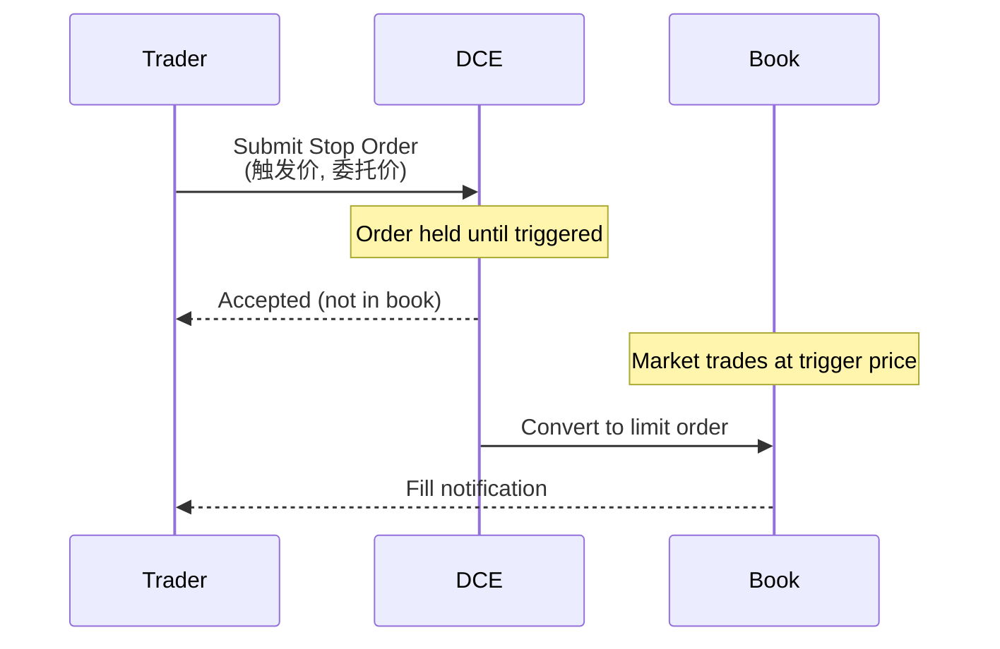
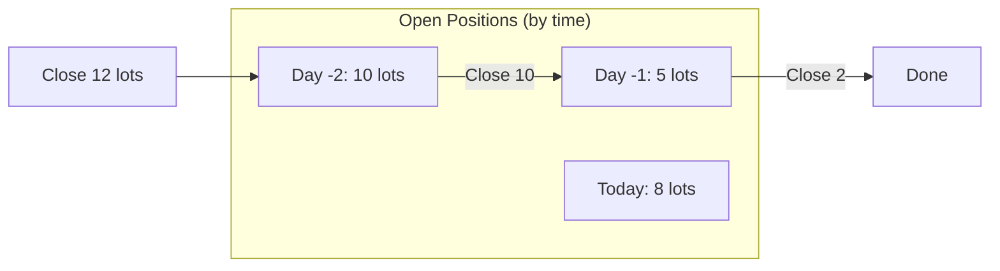
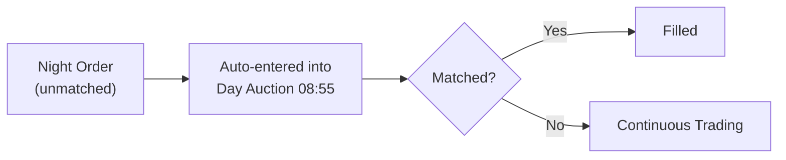

# DCE - Dalian Commodity Exchange (大连商品交易所)

Ferrous metals, agricultural products. Assumes familiarity with `futures_china.md`.

## Key Characteristics

| Attribute | Value |
|-----------|-------|
| Timezone | **CST (UTC+8)** |
| Focus | Ferrous (iron ore, coke), agricultural (soybeans, palm) |
| Night session | Yes (23:00 end) |
| Stop orders | **Only exchange with native stop orders** |
| Close position | FIFO (先开先平) default |
| ActionDay quirk | **Wrong during night session** |

## Products

| Code | Product | Multiplier | Tick | Night |
|------|---------|------------|------|-------|
| i | Iron Ore | 100 t | 0.5 CNY | 23:00 |
| j | Coke | 100 t | 0.5 CNY | 23:00 |
| jm | Coking Coal | 60 t | 0.5 CNY | 23:00 |
| m | Soybean Meal | 10 t | 1 CNY | 23:00 |
| y | Soybean Oil | 10 t | 2 CNY | 23:00 |
| p | Palm Oil | 10 t | 2 CNY | 23:00 |
| a | Soybean No.1 | 10 t | 1 CNY | 23:00 |
| b | Soybean No.2 | 10 t | 1 CNY | 23:00 |
| c | Corn | 10 t | 1 CNY | 23:00 |
| cs | Corn Starch | 10 t | 1 CNY | 23:00 |
| jd | Eggs | 10 t | 1 CNY | None |
| lh | Live Hog | 16 t | 5 CNY | None |
| l | LLDPE | 5 t | 5 CNY | 23:00 |
| v | PVC | 5 t | 5 CNY | 23:00 |
| pp | Polypropylene | 5 t | 1 CNY | 23:00 |
| eg | Ethylene Glycol | 10 t | 1 CNY | 23:00 |
| eb | Styrene | 5 t | 1 CNY | 23:00 |
| pg | LPG | 20 t | 1 CNY | 23:00 |

## Stop Orders (Unique to DCE)

**Stop order fields:**
- `StopPrice`: Trigger price (触发价)
- `Price`: Limit price after trigger (委托价)

## FIFO Close Position

DCE uses automatic FIFO (先开先平):

No need to specify CloseToday/CloseYesterday - system auto-selects oldest first.

## ActionDay Bug

**Critical:** During night session, ActionDay shows next business day, not actual calendar date.

| Time | TradingDay | ActionDay | Actual Date |
|------|------------|-----------|-------------|
| Mon 21:30 | Tuesday | **Tuesday** ❌ | Monday |
| Tue 10:00 | Tuesday | Tuesday ✓ | Tuesday |

Use `UpdateTime` for actual timestamp, not `ActionDay`.

## Position Limits (Representative)

| Product | General | Near-Delivery | Delivery Month |
|---------|---------|---------------|----------------|
| Iron Ore | 15,000 | 10K→6K→4K | 2,000 |
| Soybean Meal | 80K (or 20% if OI≤400K) | 7,500 | 2,500 |
| Coke | 5K (or 10% if OI≤50K) | 300 | 100 |

## Overnight Order Participation

Unmatched night session orders **automatically participate** in day session auction:

No action required - orders carry over by default.

## Data Quirks

| Field | Behavior |
|-------|----------|
| UpdateMillisec | Full 0-999 range |
| AveragePrice | × Multiplier (divide to get true VWAP) |
| ActionDay | **Wrong during night** (shows next biz day) |
| Contract format | Lowercase + YYMM (e.g., `i2501`) |

## Primary Source

- Rules: https://www.dce.com.cn/dalianshangpin/fgfz/
- Products: https://www.dce.com.cn/dalianshangpin/sspz/
