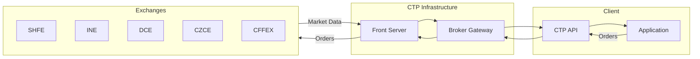
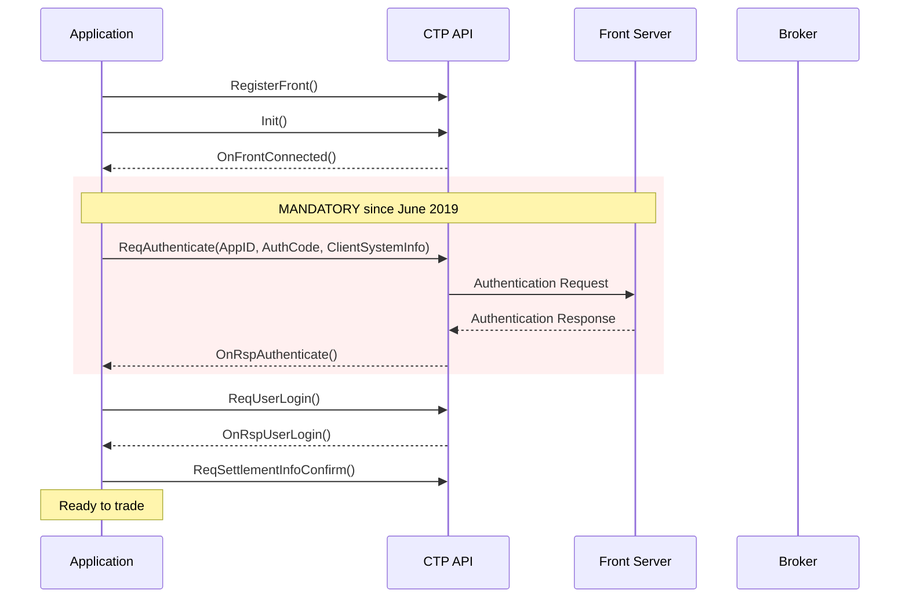
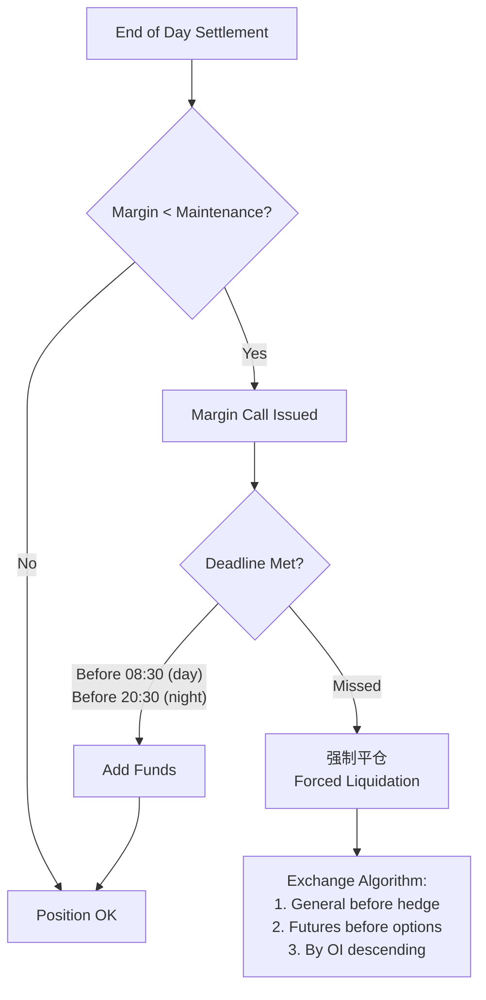
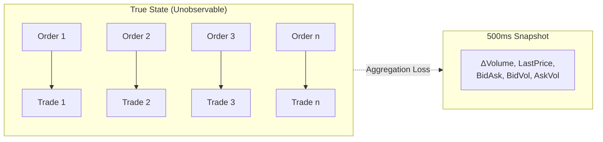
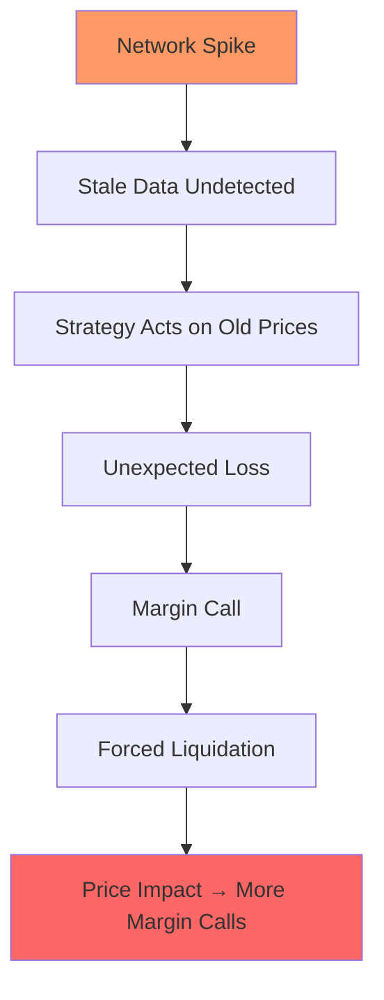
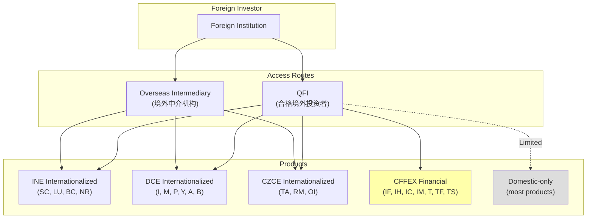

# Chinese Futures Market Structure

Chinese futures operate via CTP (综合交易平台) across five exchanges. Assumes familiarity with futures fundamentals from `futures.md` and APAC context from `futures_apac.md`.

## Overview

### The Five Exchanges

| Exchange | Chinese Name | Focus | Night Session |
|----------|--------------|-------|---------------|
| SHFE | 上海期货交易所 | Metals, energy, rubber | Yes (varies by product) |
| INE | 上海国际能源交易中心 | Internationalized products | Yes |
| DCE | 大连商品交易所 | Ferrous, agricultural | Yes |
| CZCE | 郑州商品交易所 | Agricultural, chemicals | Yes |
| CFFEX | 中国金融期货交易所 | Index futures, treasury | No |

### Critical Constraints

| Constraint | Value | Implication |
|------------|-------|-------------|
| Data frequency | 500ms snapshots | Not tick-by-tick; probabilistic inference required |
| Depth levels | 5 (L2 paid) | Cannot observe full queue |
| Trade direction | Not provided | Must infer via Lee-Ready |
| Message-level feed | Does not exist | Order lifecycle untrackable |
| Order modification | Cancel-replace only | All changes lose queue priority |

## CTP Architecture

### Data Flow



**Developer:** SFIT (上海期货信息技术有限公司), SHFE subsidiary
**Current version:** v6.3.15+ (看穿式监管 support required)

### Core Market Data Structure

`CThostFtdcDepthMarketDataField` (44 fields, 440 bytes):

| Category | Key Fields |
|----------|------------|
| Price | LastPrice, OHLC, UpperLimit, LowerLimit, Settlement |
| Volume | Volume (cumulative), Turnover, OpenInterest |
| Depth | BidPrice1-5, AskPrice1-5, BidVolume1-5, AskVolume1-5 |
| Time | UpdateTime, UpdateMillisec, TradingDay, ActionDay |

**Invalid value sentinel:** `DBL_MAX` (1.7976931348623157e+308), not zero.

See `references/specs/ctp_market_data.md` for full specification.

## Trading Sessions

### TradingDay Semantics

```mermaid
gantt
    title One TradingDay (e.g., Monday)
    dateFormat HH:mm
    axisFormat %H:%M

    section Sunday Night
    Night Auction     :21:00, 5m
    Night Trading     :21:05, 5h

    section Monday Day
    Day Auction       :08:55, 5m
    Morning 1         :09:00, 1h15m
    Break             :crit, 10:15, 15m
    Morning 2         :10:30, 1h
    Lunch             :crit, 11:30, 2h
    Afternoon         :13:30, 1h30m
```



**Key:** Night 21:00 (T-1) + Day 09:00-15:00 (T) = ONE TradingDay
Position limits reset at 21:00 Shanghai time (13:00 UTC)
Friday 21:00: TradingDay = Monday (or next business day)

### Session Schedule (Commodities)

| Time | Session |
|------|---------|
| 20:55-21:00 | Night opening auction |
| 21:00-varies | Night continuous (23:00/01:00/02:30) |
| 08:55-09:00 | Day opening auction |
| 09:00-10:15 | Morning 1 |
| 10:15-10:30 | Break |
| 10:30-11:30 | Morning 2 |
| 11:30-13:30 | Lunch |
| 13:30-15:00 | Afternoon |

### Night Session End Times

| Time | Products |
|------|----------|
| 23:00 | Rubber, iron ore, soybean products, PTA, sugar |
| 23:30 | CZCE most products |
| 01:00 | Base metals (Cu, Al, Zn, Ni) |
| 02:30 | Precious metals (Au, Ag), crude oil |

## Order Book Mechanics

### Matching Rules

All exchanges: **Price-time priority (价格优先、时间优先)**

### Order Types

| Type | SHFE | INE | DCE | CZCE | CFFEX |
|------|:----:|:---:|:---:|:----:|:-----:|
| Limit | ✓ | ✓ | ✓ | ✓ | ✓ |
| FAK | ✓ | ✓ | ✓ | ✓ | ✓ |
| FOK | ✓ | ✓ | ✓ | ✗ | ✓ |
| Stop | ✗ | ✗ | ✓ | ✗ | ✗ |
| GTC | ✗ | ✗ | ✗ | ✗ | ✗ |

**Critical:** No in-place modification. All changes = cancel + new order = **lose queue priority**.

### SHFE/INE Close Position Requirement

Must specify:
- `'3'` (CloseToday 平今) for positions opened today
- `'4'` (CloseYesterday 平昨) for positions opened before today

DCE/CZCE use FIFO (先开先平) by default.

## Regulatory Framework

### Key Regulations

| Regulation | Effective | Impact |
|------------|-----------|--------|
| 2022 Futures and Derivatives Law | Aug 2022 | Manipulation definitions, penalties |
| 看穿式监管 (look-through) | June 2019 | AppID/AuthCode mandatory |
| Position limits | Ongoing | Per-exchange, per-product |

### 看穿式监管 Authentication Flow



Required fields:
- **AppID**: `vendor_softwarename_version`
- **AuthCode**: 16-character code from broker
- **ClientSystemInfo**: Hardware fingerprint (physical machine required, VM fails)

### Abnormal Trading Thresholds

| Behavior | Threshold | Consequence |
|----------|-----------|-------------|
| Frequent cancellation | ≥500/day/contract | Review → restriction |
| Self-trades | ≥5/day/contract | Review → restriction |
| HFT classification | ≥300 orders+cancels/sec | Higher fees, reporting |

See `references/regulatory/` for detailed rules.

## Settlement and Margin

### Settlement Price

| Exchange | Method |
|----------|--------|
| SHFE/INE/DCE/CZCE | Full-day VWAP |
| CFFEX | Last-hour VWAP (14:00-15:00 / 14:15-15:15) |

### Margin Call Flow



Failure to meet margin → Forced liquidation (强制平仓)

### Intraday Fee Structures

| Product | Open | Close Today (平今) |
|---------|------|-------------------|
| Gold (SHFE) | 10 CNY | **Free** |
| Silver (SHFE) | 0.01% | **0.25%** (25x) |
| Stock Index (CFFEX) | 0.023% | **0.231%** (10x) |

## Data Quality

### Pre-Analysis Validation Checklist

1. **DBL_MAX check** - All price fields (1.7976931348623157e+308 → NaN)
2. **CZCE millisec** - UpdateMillisec always 0; interpolate if needed
3. **Volume monotonicity** - Cumulative; decreases only at session boundaries
4. **TradingDay vs ActionDay** - Night session semantics vary by exchange
5. **AveragePrice scaling** - Divide by multiplier (except CZCE)
6. **Night replay filtering** - Compare tick time to wall clock

See `references/specs/data_quality_checklist.md` for complete checklist.

### Exchange-Specific Quirks

| Exchange | Millisec | ActionDay (Night) | AveragePrice | Contract Format |
|----------|----------|-------------------|--------------|-----------------|
| SHFE | 0/500 | Correct | × Multiplier | lowercase+YYMM |
| INE | 0/500 | Correct | × Multiplier | lowercase+YYMM |
| DCE | 0-999 | **Wrong** | × Multiplier | lowercase+YYMM |
| CZCE | **Always 0** | Correct | Direct | UPPERCASE+**YMM** |
| CFFEX | 0/500 | Correct | × Multiplier | UPPERCASE+YYMM |

## Queue Position Estimation

### The 500ms Challenge



### Approach

With 500ms snapshots and ~5% cancellation rate (vs 30% US), use:

```
V(n+1) = max(V(n) + p(n) × ΔQ(n), 0)

p(x) = f(V) / [f(V) + f(Q - S - V)]
```

Where f(x) = log(1+x) (conservative) or identity.

**Key insight:** Low cancellation rate + FIFO = simpler models viable than US markets.

See `references/models/queue_position.md` for detailed models.

### Trade Direction Inference

```python
def infer_direction(tick):
    if tick.LastPrice >= tick.AskPrice1:
        return 'BUY'   # 外盘
    elif tick.LastPrice <= tick.BidPrice1:
        return 'SELL'  # 内盘
    else:
        mid = (tick.BidPrice1 + tick.AskPrice1) / 2
        return 'BUY' if tick.LastPrice > mid else 'SELL'
```

See `references/models/trade_direction.md` for OI-based decomposition.

## Regime Changes

### Critical Backtesting Boundaries

| Product | Don't Use Data Before | Reason |
|---------|----------------------|--------|
| CFFEX index | 2019-04-22 | Post-restriction regime only |
| SHFE metals | Mid-2014 | After night session |
| INE crude | 2018-03-26 | Product launch |

### Key Historical Events

| Date | Event |
|------|-------|
| 2013-07-05 | First night session (Gold, Silver) |
| 2015-09-07 | CFFEX max restrictions (10 contracts/day) |
| 2016-01-08 | Circuit breaker suspended (4 days total) |
| 2019-04-22 | CFFEX restrictions relaxed (500 contracts) |
| 2019-06-14 | 看穿式监管 enforced |
| 2022-08-01 | Futures Law effective |

See `references/regime_changes.md` for complete timeline.

## Failure Modes

### Cascading Failure Example



### Critical Failures

| Failure | Detection | Impact |
|---------|-----------|--------|
| Auth failure | ErrorID 63 | **Total trading halt** |
| Reconnection gap | Volume/time jump | **Permanent data loss** (no replay) |
| Stale data | Tick time vs wall clock | Strategy on bad data |
| Limit-locked | LastPrice = Limit + one-sided | Cannot exit position |

See `references/specs/failure_modes.md` for complete catalog.

## Research Agent Guidance

### data-sentinel
- DBL_MAX check mandatory before any analysis
- CZCE timestamp interpolation: 000, 500, 750, 875ms pattern
- Night replay deduplication: key by (InstrumentID, UpdateTime, UpdateMillisec, Volume)

### microstructure-analyst
- 5% cancellation rate (not 30% like US) - adjust queue models
- No in-place modification - cancel-replace loses all priority
- Weibull arrivals (not Poisson) per PBFJ 2025

### cross-venue-analyst
- No cross-venue arbitrage (single venue per product)
- Cross-product: SC vs Brent, BC vs CU, RB vs I+J
- Night session lead-lag analysis valuable

### causal-analyst
- 500ms aggregation = fundamental identification problem
- VWAP settlement ≠ close price - different EOD dynamics
- Forced liquidation cascades violate independence

See `references/models/causal_analysis.md` for identification framework.

### post-hoc-analyst
- Always check regime change boundaries
- Pre-2015 vs post-2019 CFFEX are different markets
- Night session introduction = structural break

### crisis-hunter
- 强制减仓 (forced reduction) algorithm undocumented
- Reconnection gaps expected - no replay exists
- 看穿式监管 auth = single point of failure

## Chinese Search Terms

| Topic | Terms |
|-------|-------|
| Rules | 交易规则, 结算细则, 风险控制管理办法 |
| Position limits | 持仓限额, 投机限额, 套保额度 |
| Margin | 保证金比例, 保证金调整 |
| Price limits | 涨跌停板, 涨跌幅限制 |
| Night session | 夜盘, 夜间交易 |
| Settlement | 结算价, 结算时间 |
| Order types | 委托类型, FAK, FOK, 限价单 |
| Transparency | 看穿式监管, 穿透式监管 |

## File Index

### Exchange Files
- `shfe/shfe.md` - SHFE specifics
- `dce/dce.md` - DCE specifics
- `czce/czce.md` - CZCE specifics
- `cffex/cffex.md` - CFFEX specifics
- `ine/ine.md` - INE specifics

### Reference Files

**Specifications:**
- `references/specs/ctp_market_data.md` - CTP struct specification
- `references/specs/ctp_order_entry.md` - Order entry protocol
- `references/specs/data_quality_checklist.md` - Validation checklist
- `references/specs/failure_modes.md` - Failure mode catalog

**Regulatory:**
- `references/regulatory/futures_law_2022.md` - Futures Law
- `references/regulatory/kanchuan_supervision.md` - 看穿式监管
- `references/regulatory/position_limits.md` - Position limits
- `references/regulatory/abnormal_trading.md` - Abnormal trading rules

**Models:**
- `references/models/queue_position.md` - Queue estimation
- `references/models/trade_direction.md` - Trade direction inference
- `references/models/causal_analysis.md` - Causal identification
- `references/models/cross_product_analysis.md` - Cross-product patterns

**Historical:**
- `references/regime_changes.md` - Regime change database

## Foreign Access

### Access Routes



### Overseas Intermediary Route (No License Required)

| Aspect | Details |
|--------|---------|
| Products | 15 "internationalized" contracts only |
| Funding | USD/CNH accepted |
| Tax | **Tax-free** trading profits |
| Repatriation | Guaranteed |
| Setup time | 1-4 weeks |
| CFFEX access | **No** |

**Available products:**
- INE: Crude (SC), LSFO (LU), Bonded Copper (BC), TSR Rubber (NR)
- DCE: Iron Ore (I), Palm Oil (P), Soybean products (M, Y, A, B)
- CZCE: PTA (TA), Rapeseed products (RM, OI)

### QFI Route (Qualified Foreign Investor)

| Aspect | Details |
|--------|---------|
| Products | 91+ products (expanding to 100 in Oct 2025) |
| Funding | CNY onshore account required |
| Tax | 10% withholding on capital gains |
| Setup time | 1-3 months (officially 10 working days) |
| CFFEX access | **Yes, but hedging only** |

**CFFEX restriction:** QFIs may trade index futures/options **for hedging purposes only**. Must submit hedging plan with documentation for CFFEX quota approval.

### RQFII vs QFI

RQFII (RMB Qualified Foreign Institutional Investor) was merged into unified QFI scheme in November 2020. Legacy RQFII quotas remain valid.

| Feature | Old RQFII | Current QFI |
|---------|-----------|-------------|
| Currency | Offshore RMB only | Any currency |
| Quota | Pre-approved amount | No quota limit |
| Scope | Securities focus | Broader (incl. futures) |

### Recommendation

| Use Case | Recommended Route |
|----------|-------------------|
| Commodities only | Overseas Intermediary (faster, tax-free) |
| CFFEX index hedging | QFI (only option) |
| Broad access | QFI |

## Gotchas

### Data Gotchas

| Gotcha | Impact | Mitigation |
|--------|--------|------------|
| DBL_MAX as invalid | Crashes calculations, corrupts analytics | Filter 1.7976931348623157e+308 → NaN before any math |
| CZCE UpdateMillisec=0 | Cannot order events within same second | Interpolate: 000, 500, 750, 875ms... |
| DCE ActionDay wrong at night | Date calculations off by 1 day | Use UpdateTime for actual timestamp |
| Volume is cumulative | Delta calculations wrong if forgotten | Always compute Volume[t] - Volume[t-1] |
| AveragePrice scaling | VWAP off by multiplier (10-1000x) | Divide by multiplier (except CZCE) |
| Night replay on reconnect | Duplicate/old data pollutes stream | Filter by comparing tick time to wall clock |
| CZCE 3-digit year codes | CF501 = 2015 or 2025? | Disambiguate using trading calendar context |

### Trading Gotchas

| Gotcha | Impact | Mitigation |
|--------|--------|------------|
| No order modification | Queue priority lost on any change | Model cancel-replace cost into execution |
| SHFE/INE CloseToday required | Wrong flag = order rejected | Track intraday vs overnight positions |
| 500 cancel threshold | Restriction after breach | Monitor cancel rate per contract |
| 5 self-trade threshold | Review/restriction | Implement self-trade prevention |
| No GTC orders | Orders expire at session end | Resubmit daily if needed |
| Margin call deadline tight | Forced liquidation if missed | Monitor margin ratio, pre-fund |
| 平今 fees can be 25x | Intraday strategy costs explode | Check fee schedule before strategy |

### Session Gotchas

| Gotcha | Impact | Mitigation |
|--------|--------|------------|
| 10:15-10:30 break | No data, gap in time series | Mark explicitly, don't interpolate |
| TradingDay ≠ calendar day | Position/PnL attribution wrong | Night 21:00 belongs to NEXT TradingDay |
| Friday night = Monday | Weekend positions attributed wrong | Friday 21:00 TradingDay = Monday |
| Holiday make-up trading | Saturday trading (rare) | Check exchange calendar |
| Night session end varies | Miss data if assume wrong time | Check per-product: 23:00/01:00/02:30 |

### Infrastructure Gotchas

| Gotcha | Impact | Mitigation |
|--------|--------|------------|
| CTP has NO replay | Reconnection gaps permanent | Accept data loss, log gaps |
| Auth failure = total halt | Single point of failure | Track AuthCode expiry, backup machines |
| Physical machine required | VM/cloud fails ClientSystemInfo | Use physical servers |
| CTP version requirement | Old versions cannot connect | Require v6.3.15+ |
| Subscription not preserved | After reconnect, no data | Re-subscribe all instruments after login |

### Regulatory Gotchas

| Gotcha | Impact | Mitigation |
|--------|--------|------------|
| Position limits by phase | Limits tighten near delivery | Track contract phase, reduce early |
| Hedging quota required | Cannot exceed without approval | Apply for 套保额度 in advance |
| QFI hedging-only for CFFEX | Cannot speculate on index futures | Document hedging purpose |
| 20-year data retention | Must store ClientSystemInfo | Archive encrypted, plan storage |
| Natural persons: no delivery | Must close before delivery month | Exit positions early |

## Primary Sources

| Source | URL | Content |
|--------|-----|---------|
| CSRC | csrc.gov.cn | Laws, regulations |
| SHFE | shfe.com.cn/regulation/ | SHFE rules |
| DCE | dce.com.cn/dalianshangpin/fgfz/ | DCE rules |
| CZCE | czce.com.cn/cn/flfg/ | CZCE rules |
| CFFEX | cffex.com.cn/fgfz/ | CFFEX rules |
| INE | ine.cn/bourseService/rules/ | INE rules |
| SFIT | sfit.com.cn | CTP downloads |
| SimNow | simnow.com.cn | Test environment |
