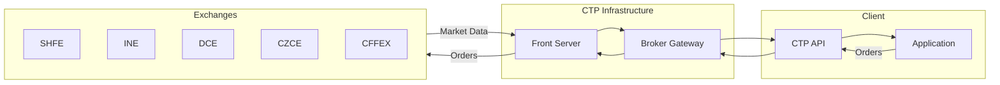
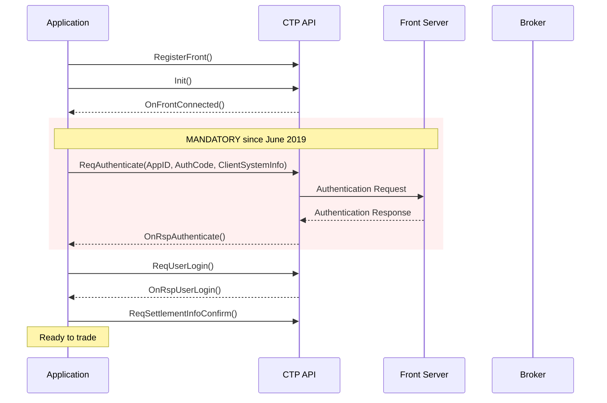
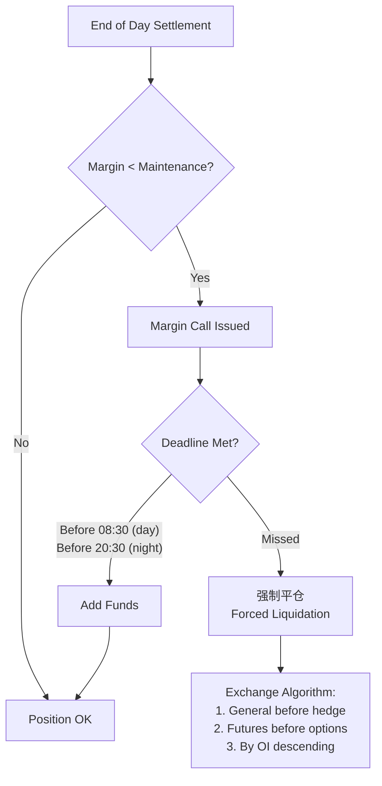
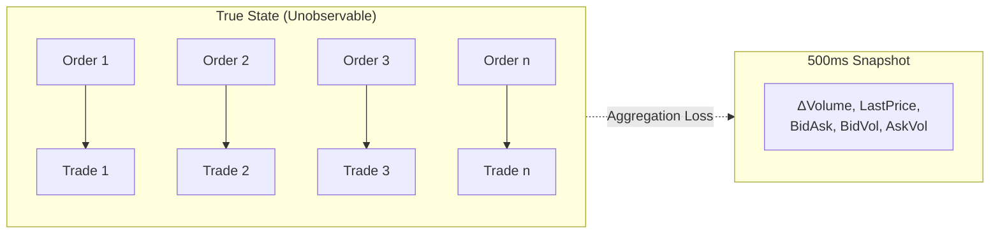
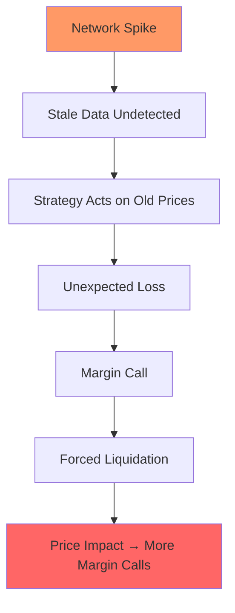
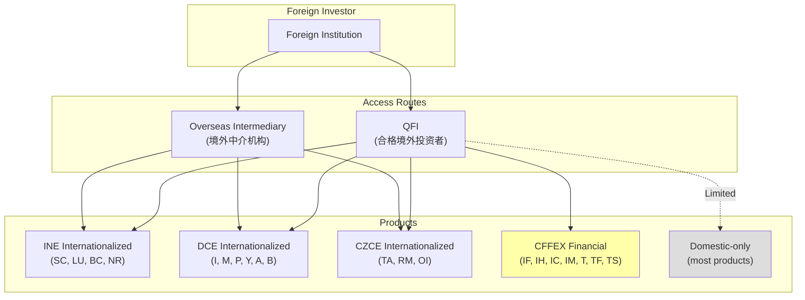

# Chinese Futures Market Structure

Chinese futures operate via CTP (综合交易平台) across six exchanges. Assumes familiarity with futures fundamentals from `futures.md` and APAC context from `futures_apac.md`.

## Overview

### The Six Exchanges

| Exchange | Chinese Name | Focus | Night Session | Timezone |
|----------|--------------|-------|---------------|----------|
| SHFE | 上海期货交易所 | Metals, energy, rubber | Yes (varies by product) | CST (UTC+8) |
| INE | 上海国际能源交易中心 | Internationalized products | Yes | CST (UTC+8) |
| DCE | 大连商品交易所 | Ferrous, agricultural | Yes | CST (UTC+8) |
| CZCE | 郑州商品交易所 | Agricultural, chemicals | Yes | CST (UTC+8) |
| CFFEX | 中国金融期货交易所 | Index futures, treasury | No | CST (UTC+8) |
| GFEX | 广州期货交易所 | Industrial silicon, lithium | No | CST (UTC+8) |

### Critical Constraints

| Constraint | Value | Implication |
|------------|-------|-------------|
| Data frequency | 500ms snapshots | Not tick-by-tick; probabilistic inference required |
| Depth levels | 5 (L2 paid) | Cannot observe full queue |
| Trade direction | Not provided | Must infer via Lee-Ready |
| Message-level feed | Does not exist | Order lifecycle untrackable |
| Order modification | Cancel-replace only | All changes lose queue priority |

## CTP Architecture

### Data Flow


```mermaid
flowchart LR
    subgraph Exchanges
        SHFE
        INE
        DCE
        CZCE
        CFFEX
    end

    subgraph CTP["CTP Infrastructure"]
        FS[Front Server]
        BG[Broker Gateway]
    end

    subgraph Client
        API[CTP API]
        APP[Application]
    end

    Exchanges -->|Market Data| FS
    FS --> BG
    BG --> API
    API --> APP

    APP -->|Orders| API
    API --> BG
    BG --> FS
    FS -->|Orders| Exchanges
```

**Developer:** SFIT (上海期货信息技术有限公司), SHFE subsidiary
**Current version:** v6.3.15+ (看穿式监管 support required)

### Core Market Data Structure

`CThostFtdcDepthMarketDataField` (44 fields, 440 bytes):

| Category | Key Fields |
|----------|------------|
| Price | LastPrice, OHLC, UpperLimit, LowerLimit, Settlement |
| Volume | Volume (cumulative), Turnover, OpenInterest |
| Depth | BidPrice1-5, AskPrice1-5, BidVolume1-5, AskVolume1-5 |
| Time | UpdateTime, UpdateMillisec, TradingDay, ActionDay |

**Invalid value sentinel:** `DBL_MAX` (1.7976931348623157e+308), not zero.

See `references/specs/ctp_market_data.md` [[futures/apac/china/references/specs/ctp_market_data.md|ctp_market_data.md]] for full specification.

### CTP Timestamp Provenance

UpdateTime and UpdateMillisec are **exchange-generated** — CTP relays without modification. The data path: Exchange Matching Engine → Exchange Front → 报盘 → FIB Bus → 行情前置 → Client API.

| Exchange | UpdateMillisec Pattern | Interpretation |
|----------|-----------------------|----------------|
| SHFE | 0 or 500 only | Binary snapshots at 0ms/500ms marks |
| INE | 0 or 500 only | Same platform as SHFE |
| CFFEX | 0 or 500 only | Same binary pattern |
| DCE | Variable 0–999 | Actual ms from matching engine |
| CZCE | Always 0 | Exchange lacks ms resolution |

If CTP generated timestamps, values would show continuous ms regardless of exchange. The per-exchange patterns **definitively prove** exchange origination. All brokers receive identical timestamps for the same snapshot — CTP is a multi-broker shared system. What differs across brokers is local receipt time.


See `references/specs/ctp_versions.md` [[futures/apac/china/references/specs/ctp_versions.md|ctp_versions.md]] for SDK version history.

## Trading Sessions

### TradingDay Semantics


```mermaid
gantt
    title One TradingDay (e.g., Monday)
    dateFormat HH:mm
    axisFormat %H:%M

    section Sunday Night
    Night Auction     :21:00, 5m
    Night Trading     :21:05, 5h

    section Monday Day
    Day Auction       :08:55, 5m
    Morning 1         :09:00, 1h15m
    Break             :crit, 10:15, 15m
    Morning 2         :10:30, 1h
    Lunch             :crit, 11:30, 2h
    Afternoon         :13:30, 1h30m
```

**Key:** Night 21:00 (T-1) + Day 09:00-15:00 (T) = ONE TradingDay
Position limits reset at 21:00 Shanghai time (13:00 UTC)
Friday 21:00: TradingDay = Monday (or next business day)

### Session Schedule (Commodities)

| Time | Session |
|------|---------|
| 20:55-21:00 | Night opening auction |
| 21:00-varies | Night continuous (23:00/01:00/02:30) |
| 08:55-09:00 | Day opening auction |
| 09:00-10:15 | Morning 1 |
| 10:15-10:30 | Break |
| 10:30-11:30 | Morning 2 |
| 11:30-13:30 | Lunch |
| 13:30-15:00 | Afternoon |

### Night Session End Times

| Time | Products |
|------|----------|
| 23:00 | Rubber, iron ore, soybean products, PTA, sugar |
| 23:30 | CZCE most products |
| 01:00 | Base metals (Cu, Al, Zn, Ni) |
| 02:30 | Precious metals (Au, Ag), crude oil |

## Order Book Mechanics

### Matching Rules

All exchanges: **Price-time priority (价格优先、时间优先)**

### Order Types

| Type | SHFE | INE | DCE | CZCE | CFFEX |
|------|:----:|:---:|:---:|:----:|:-----:|
| Limit | ✓ | ✓ | ✓ | ✓ | ✓ |
| FAK | ✓ | ✓ | ✓ | ✓ | ✓ |
| FOK | ✓ | ✓ | ✓ | ✗ | ✓ |
| Stop | ✗ | ✗ | ✓ | ✗ | ✗ |
| GTC | ✗ | ✗ | ✗ | ✗ | ✗ |

**Critical:** No in-place modification. All changes = cancel + new order = **lose queue priority**.

## Auction Algorithm Comparison

All exchanges use the **Maximum Volume Principle (最大成交量原则)** for call auction price determination. Tie-breaking: closest to previous trading day's settlement price. Core algorithm identical; operational details diverge.

### Algorithm Steps

1. Accumulate all limit orders; sort buys high-to-low, sells low-to-high
2. For each candidate price P, compute matchable volume = min(cumulative buys >= P, cumulative sells <= P)
3. Select P* maximizing matchable volume
4. Three conditions: maximum volume; all buys above P* fully filled; all sells below P* fully filled; at P*, at least one side fully fills
5. Tie-breaking: closest to previous settlement price (all exchanges)

### Inter-Exchange Differences

| Feature | SHFE/INE | DCE | CZCE | CFFEX | GFEX |
|---------|----------|-----|------|-------|------|
| Opening auction (night products) | 20:55-21:00 | 20:55-21:00 | 20:55-21:00 | N/A (no night) | 20:55-21:00 |
| Opening auction (day-only products) | 08:55-09:00 | 08:55-09:00 | 08:55-09:00 | **09:25-09:30** | 08:55-09:00 |
| Day-session auction for night products | Full auction (since May 2023) | Full auction (since May 2023) | **Cancel-only (08:55-08:59)** | N/A | Full auction (since May 2023) |
| Closing call auction | No | No | No | **Yes (options only, 14:57-15:00)** | No |
| Market orders in auction | Not supported | Excluded | Explicitly excluded | Auto-cancelled | Excluded |

**CZCE unique limitation:** No day-session call auction for night-session products. 08:55-08:59 allows only cancellation of unfilled night-session orders — no new orders, no re-matching. SHFE, DCE, INE, GFEX all added full day-session auctions in May 2023.

**CFFEX unique features:** Auction at 09:25-09:30 (not 08:55). Only exchange with closing call auction — stock index options (14:57-15:00), where closing auction price determines settlement price.

### CTP Behavior During Auction (集合竞价)

During order-entry phase, bid/ask prices in `CThostFtdcDepthMarketDataField` are **not updated**. At transition to continuous trading, a single tick appears with auction-determined opening price and matched volume. Time priority does not apply for price determination within auction, but applies for allocation at the auction price when one side has excess orders.


### SHFE/INE Close Position Requirement

Must specify:
- `'3'` (CloseToday 平今) for positions opened today
- `'4'` (CloseYesterday 平昨) for positions opened before today

DCE/CZCE use FIFO (先开先平) by default.

## Regulatory Framework

### Key Regulations

| Regulation | Effective | Impact |
|------------|-----------|--------|
| 2022 Futures and Derivatives Law | Aug 2022 | Manipulation definitions, penalties |
| 看穿式监管 (look-through) | June 2019 | AppID/AuthCode mandatory |
| Position limits | Ongoing | Per-exchange, per-product |

### 看穿式监管 Authentication Flow


```mermaid
sequenceDiagram
    participant App as Application
    participant CTP as CTP API
    participant Front as Front Server
    participant Broker as Broker

    App->>CTP: RegisterFront()
    App->>CTP: Init()
    CTP-->>App: OnFrontConnected()

    rect rgb(255, 240, 240)
        Note over App,Front: MANDATORY since June 2019
        App->>CTP: ReqAuthenticate(AppID, AuthCode, ClientSystemInfo)
        CTP->>Front: Authentication Request
        Front-->>CTP: Authentication Response
        CTP-->>App: OnRspAuthenticate()
    end

    App->>CTP: ReqUserLogin()
    CTP-->>App: OnRspUserLogin()
    App->>CTP: ReqSettlementInfoConfirm()
    Note over App: Ready to trade
```

Required fields:
- **AppID**: `vendor_softwarename_version`
- **AuthCode**: 16-character code from broker
- **ClientSystemInfo**: Hardware fingerprint (physical machine required, VM fails)

### Abnormal Trading Thresholds

| Behavior | Threshold | Consequence |
|----------|-----------|-------------|
| Frequent cancellation | ≥500/day/contract | Review → restriction |
| Self-trades | ≥5/day/contract | Review → restriction |
| HFT classification | ≥300 orders+cancels/sec | Higher fees, reporting |

See per-exchange docs (shfe.md, dce.md, etc.) for detailed regulatory thresholds.

## Settlement and Margin

### Settlement Price

| Exchange | Method |
|----------|--------|
| SHFE/INE/DCE/CZCE | Full-day VWAP |
| CFFEX | Last-hour VWAP (14:00-15:00 / 14:15-15:15) |

### Margin Call Flow


```mermaid
flowchart TD
    EOD[End of Day Settlement] --> MC{Margin < Maintenance?}
    MC -->|No| OK[Position OK]
    MC -->|Yes| CALL[Margin Call Issued]
    CALL --> DL{Deadline Met?}
    DL -->|"Before 08:30 (day)<br/>Before 20:30 (night)"| ADD[Add Funds]
    ADD --> OK
    DL -->|Missed| FL[强制平仓<br/>Forced Liquidation]
    FL --> ALGO[Exchange Algorithm:<br/>1. General before hedge<br/>2. Futures before options<br/>3. By OI descending]
```

Failure to meet margin → Forced liquidation (强制平仓)

## Forced Position Reduction (强制减仓)

Market-wide mechanism that matches losing traders' unfilled limit-price closing orders against profitable counterparties on a pro-rata basis at the limit price, after market close during consecutive limit-move days. Distinct from forced liquidation (强制平仓) which targets individual rule violators.

### Cross-Exchange Comparison

| Feature | CFFEX | SHFE | DCE | CZCE |
|---------|-------|------|-----|------|
| Trigger | **2** consecutive limit days | ~5 days (escalation system) | Multiple consecutive | **3** consecutive, then D4 suspended |
| Loss threshold | >=10% (stock index) | >=R1% (per product) | >=5% | >= minimum margin standard |
| Spec/hedge priority | **No distinction** | **Yes** — all spec before hedge | **Yes** — all spec before hedge | **Yes** — all spec (incl. arb) before hedge |
| Profit tiers | 3 tiers (10%/6%/0%) | 4 tiers (R1-based) | 4 tiers (6%/3%/0%/7%) | 4 tiers (price limit multiples) |
| Execution price | Limit price | Limit price | Limit price | Limit price |

**Allocation:** Proportional within each tier, sequential tier-by-tier. If Tier 1 profitable positions exceed requested closing volume, allocation occurs proportionally within Tier 1. If insufficient, cascades to Tier 2 and beyond.

**Commodity exchanges (SHFE, DCE, CZCE)** exhaust all profitable speculative positions before touching any hedging positions. CFFEX makes no formal spec/hedge distinction.

### Forced Reduction vs Forced Liquidation

| Mechanism | 强制减仓 (Forced Reduction) | 强制平仓 (Forced Liquidation) |
|-----------|---------------------------|------------------------------|
| Target | Entire market (profitable side) | Individual rule violators |
| Trigger | Consecutive limit-move days | Margin shortfall, position limit breach |
| Counterparty | Profitable traders forced to close | Exchange/broker executes close |
| Price | Limit price | Market/limit price |

### CFFEX Profit Tiers (Stock Index Futures)

| Tier | Condition | Priority |
|------|-----------|----------|
| Tier 1 | Profit >= 10% of contract value | First to be reduced |
| Tier 2 | Profit >= 6% but < 10% | Second |
| Tier 3 | Profit >= 0% but < 6% | Last |

### DCE Profit Tiers

| Tier | Condition | Priority |
|------|-----------|----------|
| Tier 1 | Profit >= 6% of contract value | First |
| Tier 2 | Profit >= 3% but < 6% | Second |
| Tier 3 | Profit >= 0% but < 3% | Third |
| Tier 4 | Profit >= 7% (arb positions) | After spec, before hedge |

### Historical Invocations

**Rarely invoked.** During 2015 stock crash, CFFEX did **not** formally trigger forced reduction — cumulative 20% threshold (two consecutive 10% limit days) rarely met after CFFEX narrowed limits to +/-7%. Used margin hikes (40%), volume restrictions (10 lots/day), and punitive fees instead.

Mechanism originated from the **1996 plywood 9607 incident** at Shanghai Commodity Exchange. Notable non-invocation: 2003 CZCE hard wheat incident where exchange controversially chose alternative measures.


### Intraday Fee Structures

| Product | Open | Close Today (平今) |
|---------|------|-------------------|
| Gold (SHFE) | 10 CNY | **Free** |
| Silver (SHFE) | 0.01% | **0.25%** (25x) |
| Stock Index (CFFEX) | 0.023% | **0.231%** (10x) |

## Data Quality

### Pre-Analysis Validation Checklist

1. **DBL_MAX check** - All price fields (1.7976931348623157e+308 → NaN)
2. **CZCE millisec** - UpdateMillisec always 0; interpolate if needed
3. **Volume monotonicity** - Cumulative; decreases only at session boundaries
4. **TradingDay vs ActionDay** - Night session semantics vary by exchange
5. **AveragePrice scaling** - Divide by multiplier (except CZCE)
6. **Night replay filtering** - Compare tick time to wall clock

See `references/specs/data_quality_checklist.md` [[futures/apac/china/references/specs/data_quality_checklist.md|data_quality_checklist.md]] for complete checklist.

### Exchange-Specific Quirks

| Exchange | Millisec | ActionDay (Night) | AveragePrice | Contract Format |
|----------|----------|-------------------|--------------|-----------------|
| SHFE | 0/500 | Correct | × Multiplier | lowercase+YYMM |
| INE | 0/500 | Correct | × Multiplier | lowercase+YYMM |
| DCE | 0-999 | **Wrong** | × Multiplier | lowercase+YYMM |
| CZCE | **Always 0** | Correct | Direct | UPPERCASE+**YMM** |
| CFFEX | 0/500 | Correct | × Multiplier | UPPERCASE+YYMM |

## L2 Data Architecture

Standard CTP provides **1-level depth at 500ms** (2 snapshots/sec) to all users via TCP, free. L2 (5-depth) requires exchange-specific feeds or co-location with higher update rates.

### L2 Availability by Exchange

| Exchange | L2 Start | Update Rate | Depth | Cost | Provider |
|----------|----------|-------------|-------|------|----------|
| SHFE/INE | ~2018-19; **250ms since Jan 2024** | **250ms** (4/sec) | 5 levels | **Free** at co-location | SHFE direct (UDP multicast) |
| DCE | ~2006 (early adopter) | **250ms** (4/sec) | 5 levels | **Paid** (~CNY 600-1800/yr display) | 飞创 DFIT |
| CZCE | ~2018-2020 | **250ms** (4/sec) | 5 levels | Free on 易盛极星; **paid** elsewhere (~CNY 300-600/yr) | 易盛 Esunny |
| CFFEX | ~2010 | **500ms** (2/sec) | 5 levels | **Paid** (licensed) | 上海金融衍生品研究院 |
| GFEX | Since 2022 launch | **~250ms** (estimated) | 5 levels | **Paid** (~CNY 600/yr) | GFEX direct |

SHFE's January 2024 upgrade from 500ms to 250ms 5-depth made SHFE/INE the fastest free L2 feed. DCE is the longest-running L2 provider among commodity exchanges.

### CTP vs Direct Feed Comparison

| Feature | CTP Standard (TCP) | CTP Multicast (co-lo) | Exchange Direct Feed |
|---------|--------------------|-----------------------|---------------------|
| Depth | **1 level** | **5 levels** (SHFE/INE only) | **5 levels** |
| Update rate | 500ms | 250ms (SHFE/INE) | 250ms (varies) |
| Access | Remote (internet) | Co-location only | Co-location + authorization |
| Cost | Free | Free (SHFE/INE) | Varies by exchange |

CTP multicast (二代组播行情) config: `bIsUsingUdp=true, bIsMulticast=true` in API. Requires co-location facility.

For DCE and CZCE L2, must use exchange proprietary DataFeed API (飞创 or 易盛) — not available through CTP.

### Data Flow Architecture

```
Exchange Matching Engine (撮合引擎) — continuous, microsecond-scale
    | individual order events processed immediately
    v
Market Data Snapshot Generator (行情切片系统) — samples at 250ms or 500ms
    | produces best bid/ask, last price, volume snapshot
    v
Market Data Dissemination (行情分发系统) — UDP multicast (组播)
    |
    v
CTP Front-End (CTP前置) — relays snapshots to clients
    |
    v
Client (客户端/策略服务器)
```

The 500ms aggregation occurs at the exchange's snapshot generator layer, not at CTP. No order-by-order or trade-by-trade data exists from Chinese futures exchanges — contrasts with CME (full depth-of-market updates) and Shenzhen Stock Exchange (real-time order-by-order L2).


## Queue Position Estimation

### The 500ms Challenge


```mermaid
flowchart LR
    subgraph Reality["True State (Unobservable)"]
        O1[Order 1] --> T1[Trade 1]
        O2[Order 2] --> T2[Trade 2]
        O3[Order 3] --> T3[Trade 3]
        On[Order n] --> Tn[Trade n]
    end

    subgraph Observed["500ms Snapshot"]
        SNAP["ΔVolume, LastPrice,<br/>BidAsk, BidVol, AskVol"]
    end

    Reality -.->|"Aggregation Loss"| Observed
```

### Approach

With 500ms snapshots and ~20-40% cancellation rate, use:

```
V(n+1) = max(V(n) + p(n) × ΔQ(n), 0)

p(x) = f(V) / [f(V) + f(Q - S - V)]
```

Where f(x) = log(1+x) (conservative) or identity.

**Key insight:** FIFO matching + no native modify (cancel-replace) = cancellation rate inflated but queue dynamics simpler than pro-rata US products.

See `references/models/queue_position.md` [[futures/apac/china/references/models/queue_position.md|queue_position.md]] for detailed models.

### Trade Direction Inference

```python
def infer_direction(tick):
    if tick.LastPrice >= tick.AskPrice1:
        return 'BUY'   # 外盘
    elif tick.LastPrice <= tick.BidPrice1:
        return 'SELL'  # 内盘
    else:
        mid = (tick.BidPrice1 + tick.AskPrice1) / 2
        return 'BUY' if tick.LastPrice > mid else 'SELL'
```

See `references/models/trade_direction.md` [[futures/apac/china/references/models/trade_direction.md|trade_direction.md]] for OI-based decomposition.

## Regime Changes

### Critical Backtesting Boundaries

| Product | Don't Use Data Before | Reason |
|---------|----------------------|--------|
| CFFEX index | 2019-04-22 | Post-restriction regime only |
| SHFE metals | Mid-2014 | After night session |
| INE crude | 2018-03-26 | Product launch |

### Key Historical Events

| Date | Event |
|------|-------|
| 2013-07-05 | First night session (Gold, Silver) |
| 2015-09-07 | CFFEX max restrictions (10 contracts/day) |
| 2016-01-08 | Circuit breaker suspended (4 days total) |
| 2019-04-22 | CFFEX restrictions relaxed (500 contracts) |
| 2019-06-14 | 看穿式监管 enforced |
| 2022-08-01 | Futures and Derivatives Law (期货和衍生品法) effective |
| 2022-07-22 | IM (CSI 1000) futures + options launch at CFFEX |
| 2022-09-02 | QFI access launched — 41 futures/options opened to QFII/RQFII |
| 2022-12-22 | GFEX launches Industrial Silicon (SI) — 6th exchange operational |
| 2023-03-20 | CFFEX reduces 平今 fee to 万分之2.3 (from 万分之3.45) |
| 2023-04-21 | 30Y treasury bond futures (TL) launch — completes 2Y/5Y/10Y/30Y curve |
| 2023-07-21 | GFEX Lithium Carbonate (LC) futures — global first physical lithium |
| 2023-08-18 | INE Shipping Index Europe (EC) — China's first cash-settled commodity futures |
| 2024-09-30 | State Council 国办发47号: HFT fee rebates cancelled, mandatory algo reporting |
| 2025-Q1 | QFI expansion to ~91+ products (from original 41) |
| 2025-Q1 | CSRC Programmatic Trading Rules (期货市场程序化交易管理规定, effective Oct 9, 2025) |


### 国办发47号 — Most Important Regime Change for Quant Firms

The September 30, 2024 State Council document explicitly targets HFT:

| Measure | Detail |
|---------|--------|
| Fee rebates cancelled | 取消高频交易手续费减收 |
| Mandatory algo reporting | Programme trading must be registered and reported |
| Account surveillance | Enhanced monitoring of 交易行为趋同账户 (converging behavior accounts) |
| Co-location tightened | Seat and colocation management strengthened |

Implementation via CSRC Programmatic Trading Management Rules takes effect **October 9, 2025**. Programme trading defined as >=5 instances of placing >=5 orders within 1 second on the same trading day.

### Product Launch Acceleration Post-Futures Law

Registration-based listing (注册制) replaced slow approval process. Result:

| Year | New Products | Notable |
|------|-------------|---------|
| Pre-2022 | 2-4/year typical | Slow approval-based |
| 2023 | ~21 products | TL, LC, EC, AO, BR, PX, SH |
| 2024 | ~15 products | Monthly avg price futures, PS, PET chip |
| Total by end-2024 | ~150 listed | Across all 6 exchanges |

See `references/regime_changes.md` [[futures/apac/china/references/regime_changes.md|regime_changes.md]] for complete timeline.

## Failure Modes

### Cascading Failure Example


```mermaid
flowchart TD
    NET[Network Spike] --> STALE[Stale Data Undetected]
    STALE --> BAD[Strategy Acts on Old Prices]
    BAD --> LOSS[Unexpected Loss]
    LOSS --> MC[Margin Call]
    MC --> FL[Forced Liquidation]
    FL --> CASCADE[Price Impact → More Margin Calls]

    style NET fill:#f96
    style CASCADE fill:#f66
```

### Critical Failures

| Failure | Detection | Impact |
|---------|-----------|--------|
| Auth failure | ErrorID 63 | **Total trading halt** |
| Reconnection gap | Volume/time jump | **Permanent data loss** (no replay) |
| Stale data | Tick time vs wall clock | Strategy on bad data |
| Limit-locked | LastPrice = Limit + one-sided | Cannot exit position |

See `references/specs/failure_modes.md` [[futures/apac/china/references/specs/failure_modes.md|failure_modes.md]] for complete catalog.

## Research Agent Guidance

### data-sentinel
- DBL_MAX check mandatory before any analysis
- CZCE timestamp interpolation: 000, 500, 750, 875ms pattern
- Night replay deduplication: key by (InstrumentID, UpdateTime, UpdateMillisec, Volume)

### microstructure-analyst
- 5% cancellation rate (not 30% like US) - adjust queue models
- No in-place modification - cancel-replace loses all priority
- Weibull arrivals (not Poisson) per PBFJ 2025

### cross-venue-analyst
- No cross-venue arbitrage (single venue per product)
- Cross-product: SC vs Brent, BC vs CU, RB vs I+J
- Night session lead-lag analysis valuable

### causal-analyst
- 500ms aggregation = fundamental identification problem
- VWAP settlement ≠ close price - different EOD dynamics
- Forced liquidation cascades violate independence

See `references/models/causal_analysis.md` [[futures/apac/china/references/models/causal_analysis.md|causal_analysis.md]] for identification framework.

### post-hoc-analyst
- Always check regime change boundaries
- Pre-2015 vs post-2019 CFFEX are different markets
- Night session introduction = structural break

### crisis-hunter
- 强制减仓 (forced reduction) algorithm undocumented
- Reconnection gaps expected - no replay exists
- 看穿式监管 auth = single point of failure

## Chinese Search Terms

| Topic | Terms |
|-------|-------|
| Rules | 交易规则, 结算细则, 风险控制管理办法 |
| Position limits | 持仓限额, 投机限额, 套保额度 |
| Margin | 保证金比例, 保证金调整 |
| Price limits | 涨跌停板, 涨跌幅限制 |
| Night session | 夜盘, 夜间交易 |
| Settlement | 结算价, 结算时间 |
| Order types | 委托类型, FAK, FOK, 限价单 |
| Transparency | 看穿式监管, 穿透式监管 |

## File Index

### Exchange Files
- `shfe.md` - SHFE specifics
- `dce.md` - DCE specifics
- `czce.md` - CZCE specifics
- `cffex.md` - CFFEX specifics
- `ine.md` - INE specifics

### Reference Files

**Specifications:**
- `references/specs/ctp_market_data.md` - CTP struct specification
- `references/specs/ctp_order_entry.md` - Order entry protocol
- `references/specs/data_quality_checklist.md` - Validation checklist
- `references/specs/failure_modes.md` - Failure mode catalog

**Regulatory:**
- `references/regulatory/futures_law_2022.md` - Futures Law
- `references/regulatory/kanchuan_supervision.md` - 看穿式监管
- `references/regulatory/position_limits.md` - Position limits
- `references/regulatory/abnormal_trading.md` - Abnormal trading rules

**Models:**
- `references/models/queue_position.md` - Queue estimation
- `references/models/trade_direction.md` - Trade direction inference
- `references/models/causal_analysis.md` - Causal identification
- `references/models/cross_product_analysis.md` - Cross-product patterns

**Historical:**
- `references/regime_changes.md` - Regime change database

## Foreign Access

### Access Routes


```mermaid
flowchart TD
    subgraph Foreign["Foreign Investor"]
        FI[Foreign Institution]
    end

    subgraph Routes["Access Routes"]
        OI["Overseas Intermediary<br/>(境外中介机构)"]
        QFI["QFI<br/>(合格境外投资者)"]
    end

    subgraph Products
        INE_P["INE Internationalized<br/>(SC, LU, BC, NR)"]
        DCE_P["DCE Internationalized<br/>(I, M, P, Y, A, B)"]
        CZCE_P["CZCE Internationalized<br/>(TA, RM, OI)"]
        CFFEX_P["CFFEX Financial<br/>(IF, IH, IC, IM, T, TF, TS)"]
        DOM["Domestic-only<br/>(most products)"]
    end

    FI --> OI
    FI --> QFI

    OI --> INE_P
    OI --> DCE_P
    OI --> CZCE_P

    QFI --> INE_P
    QFI --> DCE_P
    QFI --> CZCE_P
    QFI --> CFFEX_P
    QFI -.->|"Limited"| DOM

    style CFFEX_P fill:#ffa
    style DOM fill:#ddd
```

### Overseas Intermediary Route (No License Required)

| Aspect | Details |
|--------|---------|
| Products | 15 "internationalized" contracts only |
| Funding | USD/CNH accepted |
| Tax | **Tax-free** trading profits |
| Repatriation | Guaranteed |
| Setup time | 1-4 weeks |
| CFFEX access | **No** |

**Available products:**
- INE: Crude (SC), LSFO (LU), Bonded Copper (BC), TSR Rubber (NR)
- DCE: Iron Ore (I), Palm Oil (P), Soybean products (M, Y, A, B)
- CZCE: PTA (TA), Rapeseed products (RM, OI)

### QFI Route (Qualified Foreign Investor)

| Aspect | Details |
|--------|---------|
| Products | 91+ products (expanding to 100 in Oct 2025) |
| Funding | CNY onshore account required |
| Tax | 10% withholding on capital gains |
| Setup time | 1-3 months (officially 10 working days) |
| CFFEX access | **Yes, but hedging only** |

**CFFEX restriction:** QFIs may trade index futures/options **for hedging purposes only**. Must submit hedging plan with documentation for CFFEX quota approval.

### RQFII vs QFI

RQFII (RMB Qualified Foreign Institutional Investor) was merged into unified QFI scheme in November 2020. Legacy RQFII quotas remain valid.

| Feature | Old RQFII | Current QFI |
|---------|-----------|-------------|
| Currency | Offshore RMB only | Any currency |
| Quota | Pre-approved amount | No quota limit |
| Scope | Securities focus | Broader (incl. futures) |

### Recommendation

| Use Case | Recommended Route |
|----------|-------------------|
| Commodities only | Overseas Intermediary (faster, tax-free) |
| CFFEX index hedging | QFI (only option) |
| Broad access | QFI |

## Empirical Parameters

### Half-Spread Estimates

Most liquid products trade at median quoted spread of 1 tick — "large-tick" assets where queue priority dominates.

| Product | Exchange | Tick Size | Typical Price (CNY) | Median Spread (ticks) | Median Half-Spread (bps) | Confidence | Source |
|---------|----------|-----------|--------------------|-----------------------|--------------------------|------------|--------|
| rb (rebar) | SHFE | 1 CNY/ton | 3,500 | 1 | ~1.4 | High | Indriawan et al. 2019 |
| cu (copper) | SHFE | 10 CNY/ton | 75,000 | 1 | ~0.7 | High | Indriawan et al. 2019 |
| al (aluminum) | SHFE | 5 CNY/ton | 20,500 | 1 | ~1.2 | High | Indriawan et al. 2019 |
| i (iron ore) | DCE | 0.5 CNY/ton | 800 | 1-2 | ~3-6 | High | Indriawan et al. 2019 |
| au (gold) | SHFE | 0.02 CNY/g | 620 | 1-2 | ~0.2-0.3 | Medium | Liu et al. 2016 |
| ag (silver) | SHFE | 1 CNY/kg | 7,800 | 1 | ~0.6 | Medium | Estimate |
| IF (CSI 300) | CFFEX | 0.2 pts | 3,800 pts | 1-3 | ~0.3-0.8 | Medium | arXiv:2501.03171 |
| sc (crude oil) | INE | 0.1 CNY/bbl | 550 | 1-2 | ~0.9-1.8 | Medium | Estimate |
| TA (PTA) | CZCE | 2 CNY/ton | 5,500 | 1 | ~1.8 | Medium | Xiong & Li 2024 |
| m (soybean meal) | DCE | 1 CNY/ton | 3,200 | 1 | ~1.6 | Medium | Estimate (very liquid) |

Half-spread in ticks is the binding parameter, not bps — most products sit at minimum tick constraint during peak liquidity.

### Spread Percentile Distribution

| Percentile | Liquid (rb, cu, i, m) | Moderate (ag, sc, TA) | Less Liquid (jm, MA, CF) |
|------------|----------------------|----------------------|--------------------------|
| P25 | 1 tick | 1 tick | 1-2 ticks |
| P50 | 1 tick | 1-2 ticks | 2 ticks |
| P75 | 1-2 ticks | 2 ticks | 2-3 ticks |
| P95 | 2-3 ticks | 3-5 ticks | 4-6 ticks |

### Session Effects on Spreads

L-shaped intraday pattern (Liu, Hua & An 2016): widest at open (2-3x normal in first 15-30 min), narrow rapidly, stable mid-session, slight widening near close. Night sessions show spreads **~10-30% wider** than daytime. Afternoon (13:30-15:00) slightly wider than late morning but tighter than opening.


### Market Impact

No Chinese futures calibration exists. Universal square-root law: Impact = alpha * sigma_daily * (V/ADV)^beta, with **beta ~ 0.5** (Bouchaud 2024, Toth et al. 2011).

| Product Group | Products | Estimated alpha | Rationale |
|---------------|----------|-----------------|-----------|
| Base metals | cu, al, zn, ni | 0.3-0.8 | Most liquid, international benchmarks |
| Precious metals | au, ag | 0.4-0.9 | High liquidity, international price linkage |
| Ferrous chain | rb, i, j, jm | 0.8-1.5 | High retail participation, higher impact per unit |
| Energy | sc | 0.5-1.0 | Moderate liquidity |
| Agricultural/chemical | m, p, TA, MA, SR, CF | 1.0-2.0 | Less liquid, fragmented |
| Financial | IF, T | 0.3-0.6 | Deep order books, institutional |

Permanent fraction: ~2/3 of peak impact remains (Brokmann et al. 2015). Retail-dominated products (rb, i) may be lower (~50-60% permanent). Night session alpha expected 1.5-3x higher due to reduced liquidity.


### Cancel Rate Correction

The ~5% aggregate cancel rate is **incorrect**. Actual rates: **20-40%**. Shanghai Stock Exchange reported ~23%, Shenzhen ~29% for equities (2018). 开源证券 (2024) found ~30% full cancel + ~10% partial cancel for A-share orders. Chinese futures likely comparable or higher — no native order modification means every price/quantity change is a cancel+replace.

### Exchange Abnormal Trading Thresholds

| Exchange | Frequent Cancel Threshold | Large Cancel Threshold | Self-Trade Limit |
|----------|--------------------------|----------------------|-----------------|
| SHFE/INE | >=500 cancels/contract/day | >=50 large cancels (>=300 lots each) | >=5/contract/day |
| DCE | >=500 cancels/contract/day | >=50 large cancels (>=80% max order size) | >=5/contract/day |
| CZCE | >=500 cancels/contract/day | >=50 large cancels (>=800 lots each) | >=5/contract/day |
| CFFEX (index) | >=400 cancels/contract/day | >=100 large cancels (>=80% max size) | >=5/contract/day |
| CFFEX (bond) | >=500 cancels/contract/day | Per published rules | >=5/contract/day |

FOK/FAK auto-cancellations do **not** count toward thresholds at any exchange. Market orders, stop-loss, spread orders, hedging, and market maker activity are all exempt. Since May 2024, all exchanges implemented 申报费 (order submission fees) with tiered pricing based on OTR.

### Cancel-to-Trade Ratio Evolution

| Period | Cancel Rate | Driver |
|--------|------------|--------|
| 2013-2015 | Peak | Pre-regulation; foreign HFT firms (incl. Jump Trading) active |
| 2015-2016 | Sharp drop | 2015 crash; CFFEX restrictions (10 lots/day); regulatory crackdown |
| 2017-2025 | Gradual rise | Domestic quant/algorithmic trading expansion |

CSRC Programmatic Trading definition (June 2025): >=5 instances of placing >=5 orders within 1 second on same trading day.

### Enforcement Escalation

| Violation | Consequence |
|-----------|-------------|
| First | Phone warning to FCM's Chief Risk Officer |
| Second | Client placed on priority monitoring list |
| Third | Position-opening restrictions for >=1 month |
| First (CFFEX index) | Immediate restrictions (post-2015 sensitivity) |


### CST Model Parameter Estimates

No published calibration for Chinese futures. Scaled from Cont-Stoikov-Talreja (2010, Tokyo SE) and Huang/Lehalle/Rosenbaum (2015, Euronext Paris) using observable Chinese futures characteristics.

| Parameter | rb (Rebar) | cu (Copper) | i (Iron Ore) | IF (CSI 300) | sc (Crude Oil) | TA (PTA) |
|-----------|-----------|-------------|--------------|-------------|---------------|----------|
| theta(1) limit orders/sec at L1 | 5-15 | 2-6 | 4-12 | 3-8 | 2-5 | 3-10 |
| mu market orders/sec | 2-6 | 0.5-2 | 1.5-5 | 1-3 | 0.5-1.5 | 1-4 |
| alpha(1) cancel rate/order/sec | 0.05-0.15 | 0.03-0.10 | 0.05-0.12 | 0.05-0.15 | 0.03-0.08 | 0.04-0.10 |
| lambda/theta at L1 | 0.2-0.5 | 0.15-0.35 | 0.2-0.45 | 0.2-0.4 | 0.15-0.30 | 0.2-0.4 |

lambda/theta < 1 required for non-degenerate book formation.

### Rigtorp Model: L1 Queue Depth and Turnover

| Product | Typical L1 Queue (lots) | L1 Queue (CNY notional, approx.) | Trade Freq (trades/sec) | Est. Queue Half-Life (sec) |
|---------|------------------------|--------------------------------|------------------------|---------------------------|
| rb | 100-500 | CNY 0.3-2.0M | 2-6 | 5-15 |
| cu | 20-80 | CNY 7-32M | 0.5-2 | 10-30 |
| i | 50-300 | CNY 3.5-27M | 1.5-5 | 5-15 |
| IF | 10-50 | CNY 10.5-60M | 1-3 | 3-10 |
| sc | 10-50 | CNY 5-30M | 0.5-1.5 | 15-45 |
| TA | 50-200 | CNY 0.25-1.2M | 1-4 | 5-15 |

### Volatility Regime Sensitivity

| Condition | Queue Depth | Trade Arrival | Cancel Rate | Queue Half-Life |
|-----------|-------------|---------------|-------------|-----------------|
| High vol (>1.5x 20d avg) | -30% to -50% | +50% to +100% | Spikes | 2-5 sec |
| Normal | Baseline | Baseline | Baseline | 5-30 sec |
| Low vol (<0.7x avg) | +20% to +40% | -30% to -50% | Stable | 15-60 sec |

### Snapshot Estimation Methodology

Given 500ms CTP constraint, parameters estimated indirectly:
- **theta (limit order arrival)**: From positive queue changes — DeltaQ+ = max(Q(t) - Q(t-1) + trades_consumed, 0) / dt
- **mu (market order arrival)**: From trade volume per interval — trades ~ sum(trade_volume) / avg_trade_size / dt
- **alpha (cancel intensity)**: As residual — cancels ~ (theta*dt - net_queue_change - mu*dt) / Q
- **Standard errors**: Bootstrap across 500ms intervals within each day; report cross-day variation

Fundamental aliasing challenge: queue transitioning 100->120->90->110 between snapshots appears as single +10 change. For rb with ~3 trades/sec, each 500ms window contains 1-2 trades — deconvolution feasible but noisy. Products with >5 events per 500ms require EM algorithms or moment-matching.


### Matching Engine Latency

Exchange matching engines operate at **microsecond scale** (~500us co-location order-to-ack). The 500ms CTP snapshot is deliberate downsampling at the exchange's snapshot generator layer, not a CTP limitation — a 3-4 order of magnitude reduction in temporal granularity.

| Exchange | Matching Latency | Evidence | L1/L2 Data Rate |
|----------|-----------------|----------|-----------------|
| SHFE/INE | ~500us-2ms | Direct HFT practitioner measurement | 500ms / 250ms (since Jan 2024) |
| CFFEX | Sub-millisecond; +30us added Jul 2024 | Direct measurement | 500ms / 500ms |
| DCE | ~1-2ms | Inferred from co-lo + L2 rates | 500ms / **250ms** |
| CZCE | ~1-2ms | Inferred from co-lo + L2 rates | 500ms / **250ms** |
| GFEX | ~1-2ms (estimated) | Industry norms | 500ms / ~250ms |

No order-by-order or trade-by-trade data available from Chinese futures exchanges. DCE/CZCE L2 at 250ms provides 2x temporal resolution vs SHFE/CFFEX.

### International Comparison

| Exchange | Matching Latency | Market Data Granularity | Co-lo RTT |
|----------|-----------------|------------------------|-----------|
| Chinese futures (SHFE) | ~500us-2ms | **500ms snapshots only** | ~500-800us |
| CME Globex | Sub-millisecond | Real-time order-by-order | ~1-5us |
| Nasdaq | Sub-80us | Real-time full depth | <10us |

Chinese exchanges have **competitive matching engine speeds** but **dramatically coarser market data dissemination** — a deliberate regulatory choice constraining market-data-dependent strategies.

In July 2024, exchanges deliberately added latency via fiber extensions: co-located HFT practitioner reported order ack time increased from ~500us to ~800us. CFFEX added only ~30us — meaningless if engine operated at 500ms scale.


## Gotchas

### Data Gotchas

| Gotcha | Impact | Mitigation |
|--------|--------|------------|
| DBL_MAX as invalid | Crashes calculations, corrupts analytics | Filter 1.7976931348623157e+308 → NaN before any math |
| CZCE UpdateMillisec=0 | Cannot order events within same second | Interpolate: 000, 500, 750, 875ms... |
| DCE ActionDay wrong at night | Date calculations off by 1 day | Use UpdateTime for actual timestamp |
| Volume is cumulative | Delta calculations wrong if forgotten | Always compute Volume[t] - Volume[t-1] |
| AveragePrice scaling | VWAP off by multiplier (10-1000x) | Divide by multiplier (except CZCE) |
| Night replay on reconnect | Duplicate/old data pollutes stream | Filter by comparing tick time to wall clock |
| CZCE 3-digit year codes | CF501 = 2015 or 2025? | Disambiguate using trading calendar context |

### Trading Gotchas

| Gotcha | Impact | Mitigation |
|--------|--------|------------|
| No order modification | Queue priority lost on any change | Model cancel-replace cost into execution |
| SHFE/INE CloseToday required | Wrong flag = order rejected | Track intraday vs overnight positions |
| 500 cancel threshold | Restriction after breach | Monitor cancel rate per contract |
| 5 self-trade threshold | Review/restriction | Implement self-trade prevention |
| No GTC orders | Orders expire at session end | Resubmit daily if needed |
| Margin call deadline tight | Forced liquidation if missed | Monitor margin ratio, pre-fund |
| 平今 fees can be 25x | Intraday strategy costs explode | Check fee schedule before strategy |

### Session Gotchas

| Gotcha | Impact | Mitigation |
|--------|--------|------------|
| 10:15-10:30 break | No data, gap in time series | Mark explicitly, don't interpolate |
| TradingDay ≠ calendar day | Position/PnL attribution wrong | Night 21:00 belongs to NEXT TradingDay |
| Friday night = Monday | Weekend positions attributed wrong | Friday 21:00 TradingDay = Monday |
| Holiday make-up trading | Saturday trading (rare) | Check exchange calendar |
| Night session end varies | Miss data if assume wrong time | Check per-product: 23:00/01:00/02:30 |

### Infrastructure Gotchas

| Gotcha | Impact | Mitigation |
|--------|--------|------------|
| CTP has NO replay | Reconnection gaps permanent | Accept data loss, log gaps |
| Auth failure = total halt | Single point of failure | Track AuthCode expiry, backup machines |
| Physical machine required | VM/cloud fails ClientSystemInfo | Use physical servers |
| CTP version requirement | Old versions cannot connect | Require v6.3.15+ |
| Subscription not preserved | After reconnect, no data | Re-subscribe all instruments after login |

### Regulatory Gotchas

| Gotcha | Impact | Mitigation |
|--------|--------|------------|
| Position limits by phase | Limits tighten near delivery | Track contract phase, reduce early |
| Hedging quota required | Cannot exceed without approval | Apply for 套保额度 in advance |
| QFI hedging-only for CFFEX | Cannot speculate on index futures | Document hedging purpose |
| 20-year data retention | Must store ClientSystemInfo | Archive encrypted, plan storage |
| Natural persons: no delivery | Must close before delivery month | Exit positions early |

## Primary Sources

| Source | URL | Content |
|--------|-----|---------|
| CSRC | csrc.gov.cn | Laws, regulations |
| SHFE | shfe.com.cn/regulation/ | SHFE rules |
| DCE | dce.com.cn/dalianshangpin/fgfz/ | DCE rules |
| CZCE | czce.com.cn/cn/flfg/ | CZCE rules |
| CFFEX | cffex.com.cn/fgfz/ | CFFEX rules |
| INE | ine.cn/bourseService/rules/ | INE rules |
| SFIT | sfit.com.cn | CTP downloads |
| SimNow | simnow.com.cn | Test environment |
