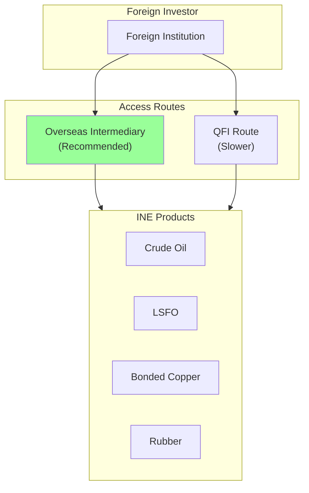
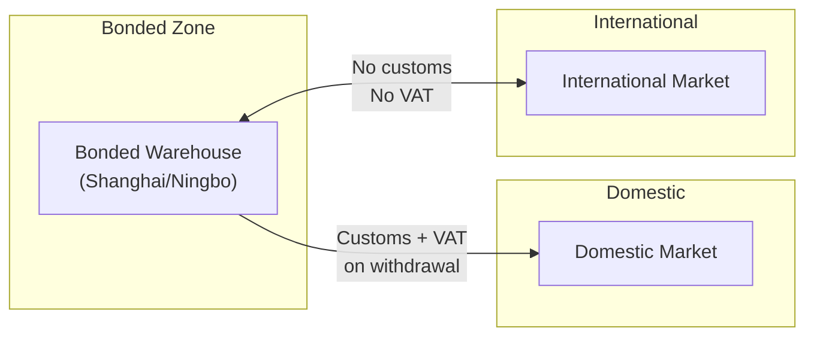

# INE - Shanghai International Energy Exchange (上海国际能源交易中心)

Internationalized products for foreign participation. SHFE subsidiary using same SFIT infrastructure. Assumes familiarity with `futures_china.md`.

## 1. Identity & Products

| Attribute | Value |
|-----------|-------|
| Timezone | **CST (UTC+8)** |
| Parent | **SHFE subsidiary** (same SFIT/CTP infrastructure) |
| Focus | Internationalized commodities |
| Foreign access | **Direct** (no QFII required for INE products) |
| Pricing | **Net-of-tax** (不含税价格) |
| Night session | Yes (varies by product) |
| Close position | Must specify CloseToday/CloseYesterday (same as SHFE) |
| Contract format | Lowercase + YYMM (e.g., `sc2501`) |

### Products

| Code | Product | Launch Date | Multiplier | Tick | Night End | Notes |
|------|---------|-------------|------------|------|-----------|-------|
| sc | Crude Oil (原油) | **2018-03-26** | 1000 bbl | 0.1 CNY | 02:30 | Launched with night session |
| nr | TSR 20 Rubber (20号胶) | **2019-08-12** | 10 t | 5 CNY | 23:00 | Launched with night session |
| lu | Low Sulfur Fuel Oil (低硫燃料油) | **2020-06-22** | 10 t | 1 CNY | 23:00 | Launched with night session |
| bc | Bonded Copper (国际铜) | **2020-11-19** | 5 t | 10 CNY | 01:00 | Launched with night session |
| ec | Shipping Index Europe (集运指数欧线) | **2023-08-18** | 50 CNY | 0.1 pt | None | First cash-settled commodity futures in China |

### Foreign Participation

**Overseas Intermediary advantages:** No QFII license required; USD/CNH funding; tax-free trading profits; guaranteed repatriation; setup 1-4 weeks.

### Cross-Product Relationships

| INE Product | International Benchmark | Spread Drivers |
|-------------|------------------------|----------------|
| SC | Brent, WTI | Freight, quality, FX |
| BC | LME Copper | Tariff, logistics |
| LU | Singapore LSFO | Shipping demand |

## 2. Data Characteristics

Same CTP interface as SHFE (both operated by SFIT). L2 feed identical to SHFE.

| Feature | Value |
|---------|-------|
| L1 update rate | 500ms (2/sec) via CTP TCP |
| L2 update rate | **250ms (4/sec) since Jan 2024** |
| L2 depth | 5 levels |
| L2 cost | **Free** at co-location (UDP multicast) |
| L2 access | CTP multicast: `bIsUsingUdp=true, bIsMulticast=true` |
| UpdateMillisec | **0 or 500 only** (same as SHFE) |
| AveragePrice | x Multiplier (must divide to get per-unit) |
| ActionDay | Correct (follows SHFE convention, not DCE) |
| TradingDay (night) | Next trading day (correct) |

## 3. Data Validation Checklist

Same validation rules as SHFE:

| Check | Rule |
|-------|------|
| UpdateMillisec | Must be 0 or 500; reject other values |
| AveragePrice | Divide by contract multiplier to get per-unit average |
| ActionDay | Should equal actual calendar date (correct on INE) |
| DBL_MAX sentinel | Filter fields containing `1.7976931348623157e+308` |
| Price range | Reject prices outside daily limit range |
| Volume monotonicity | Volume must be non-decreasing within session |

## 4. Order Book Mechanics

### Close Position Requirement

Same as SHFE — must specify:
- `'3'` (CloseToday 平今)
- `'4'` (CloseYesterday 平昨)

Generic Close (`'1'`) is **not supported**. Sending wrong direction causes rejection.

### Call Auction

| Session | Time | Notes |
|---------|------|-------|
| Night auction | **20:55-21:00** | Order entry 20:55-20:59, match at 21:00 |
| Day auction | **08:55-09:00** | Full day-session auction since **May 2023** |

Day-session auction for night-session products added May 2023 (same as SHFE, DCE, GFEX). Maximum Volume Principle (最大成交量原则) with tie-break to previous settlement. Market orders not supported in auction.

### Night Session Schedule

| Band | Products | Hours |
|------|----------|-------|
| 21:00-23:00 | lu, nr | 2h |
| 21:00-01:00 | bc | 4h |
| 21:00-02:30 | sc | 5.5h |

## 5. Transaction Costs

| Product | Fee Type | Open | Close | Close-Today | Notes |
|---------|----------|------|-------|-------------|-------|
| sc (Crude Oil) | Per-turnover | 万分之0.05 | 万分之0.05 | 万分之0.05 | Same rate all directions |
| bc (Bonded Copper) | Per-turnover | 万分之0.05 | 万分之0.05 | 万分之0.05 | Same rate all directions |
| nr (TSR 20 Rubber) | Per-lot | 3元/手 | 3元/手 | **0元** | Close-today free |
| lu (LSFO) | Per-lot | 5 CNY | 5 CNY | 5 CNY | |
| ec (Shipping Index) | Per-lot | Varies | Varies | Varies | Check exchange notices |

Fees are exchange-level minimums. Brokers add surcharges (typically 1-3x exchange rate). Exchange actively adjusts fees on specific contract months — check INE notices before backtesting.

## 6. Position Limits & Margin

### Position Limits

| Product | Speculative Limit | Notes |
|---------|-------------------|-------|
| sc (Crude Oil) | 500 (general month) | Tightens near delivery |
| bc (Bonded Copper) | 8,000 | Same structure as SHFE |
| lu (LSFO) | 5,000 | |
| nr (TSR 20 Rubber) | 5,000 | |

### Margin

| Product | Contract Min | Current Effective | Notes |
|---------|-------------|-------------------|-------|
| sc (Crude Oil) | 5-7% | **10-12%** | Elevated |
| bc (Bonded Copper) | 5% | 8-10% | Standard |
| lu (LSFO) | 5% | 7-10% | Standard |
| nr (TSR 20 Rubber) | 5% | 7-9% | Standard |

Margins escalate near delivery month (same SHFE pattern: 10% at D-1 month, 15% at delivery month, 20% near last trading day). Holiday surcharges apply (Spring Festival +5-10%).

## 7. Regulatory Framework

### Foreign Access Framework

INE designed specifically for international participation. Two access routes:

| Route | Overseas Intermediary | QFI |
|-------|----------------------|-----|
| License required | No | Yes (QFII/RQFII) |
| Funding | USD/CNH | CNY (onshore) |
| Tax on trading profits | Exempt | Subject to withholding |
| Repatriation | Guaranteed | Regulated |
| Setup time | 1-4 weeks | Months |

### Net-of-Tax Pricing

INE products priced **excluding VAT**:

| Aspect | Domestic (SHFE) | International (INE) |
|--------|-----------------|---------------------|
| Price basis | Tax-inclusive | **Net-of-tax** |
| VAT | Included in price | Exempt for bonded delivery |
| Arbitrage | Requires tax adjustment | Direct comparison to global |

### Bonded Delivery

Physical delivery in bonded zones enables international arbitrage without customs friction.

### Abnormal Trading Thresholds

Same as SHFE:

| Type | Threshold |
|------|-----------|
| Frequent cancels | >=500 cancels/contract/day |
| Large cancels | >=50 large cancels (>=300 lots each) |
| Self-trades | >=5/contract/day |

Market maker activity, FOK/FAK auto-cancellations, and hedging trades are exempt.

## 8. Regime Change Database

| Date | Event | Category | Impact |
|------|-------|----------|--------|
| **2018-03-26** | SC crude oil launches (first INE product) | product | China's first internationalized futures |
| **2019-08-12** | NR TSR 20 rubber launches | product | Second INE product |
| **2020-02-03** | Night sessions suspended (COVID-19) | session | All exchanges; restored ~May 6, 2020 |
| **2020-06-22** | LU low sulfur fuel oil launches | product | Third INE product |
| **2020-11-19** | BC bonded copper launches | product | Fourth INE product |
| **2023-05** | Day-session call auction added for night products | structure | Aligns with SHFE/DCE/GFEX change |
| **2023-08-18** | EC shipping index launches | product | First cash-settled commodity futures in China |
| **2024-01** | L2 upgraded to 250ms (with SHFE) | data | From 500ms; free at co-location |
| **2024-09-30** | State Council 国办发47号 | regulation | HFT fee rebates cancelled; programmatic trading reporting |

## 9. Failure Modes & Gotchas

| Issue | Description | Mitigation |
|-------|-------------|------------|
| CloseToday/CloseYesterday | Must specify direction; generic Close rejected | Track position vintage; always send `'3'` or `'4'` |
| SC-Brent arb pricing | INE SC is net-of-tax; direct comparison valid vs Brent but not vs tax-inclusive domestic products | No tax adjustment needed for international arb; adjust for domestic comparisons |
| Net-of-tax vs tax-inclusive | Comparing INE prices to SHFE prices requires VAT adjustment | Apply current VAT rate (13%) when crossing INE/SHFE |
| Night session hours vary | SC ends 02:30, bc 01:00, lu/nr 23:00 | Per-product session management required |
| EC is cash-settled | No physical delivery; different margin/settlement mechanics | Do not apply physical delivery assumptions |
| ActionDay correct | Unlike DCE, INE ActionDay = actual calendar date | Safe to use directly; no DCE-style workaround needed |
| Holiday night session closures | Night session before public holiday is cancelled | Monitor exchange calendar; no pre-holiday night session |

## 10. Market Maker Programs

Operates under SHFE framework (same rules published 2018/10, revised 2024/4).

| Attribute | Value |
|-----------|-------|
| Net asset requirement | >= RMB 50M |
| Futures MM products | sc, lu, EC |
| Options MM products | Crude oil options |
| Quoting mode | Continuous + response |
| Fee incentive | Discounted exchange fees |
| Position limit | Exemption from speculative limits |
| Cancel exemption | Exempt from abnormal trading designation for MM activity |

## 11. Empirical Parameters

Informed priors only — no rigorous Chinese futures microstructure calibrations exist.

| Parameter | sc (Crude Oil) | Confidence |
|-----------|---------------|------------|
| Tick size | 0.1 CNY/bbl | - |
| Typical price | ~550 CNY | - |
| Median spread | 1-2 ticks (~0.9-1.8 bps) | Medium |
| L1 queue depth | 10-50 lots | Medium |
| Trade frequency | 0.5-1.5 trades/sec | Medium |
| Queue half-life | 15-45 sec | Low |
| Weibull k (fill-time) | 0.80-0.90 | Low |

Night sessions: 30-60% lower volume, queue depths ~50-70% of daytime, spreads +10-30%.

## 12. Primary Sources

- INE Rules: https://www.ine.cn/bourseService/rules/
- INE Products: https://www.ine.cn/products/
- INE Notices: https://www.ine.cn/news/notice/
- Cross-product analysis: See `references/models/cross_product_analysis.md` [[futures/apac/china/references/models/cross_product_analysis.md|cross_product_analysis.md]] for arbitrage framework
