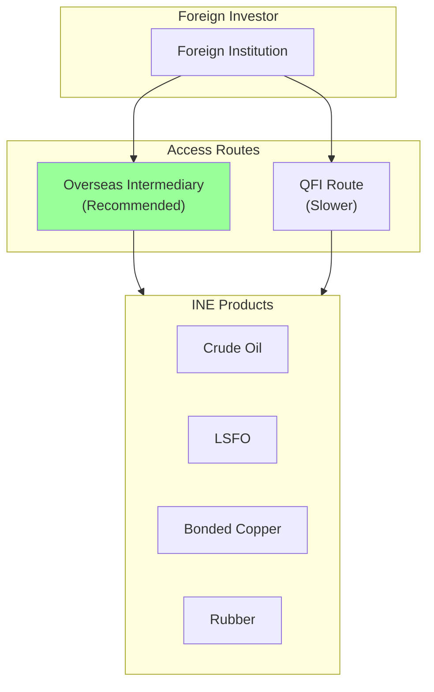
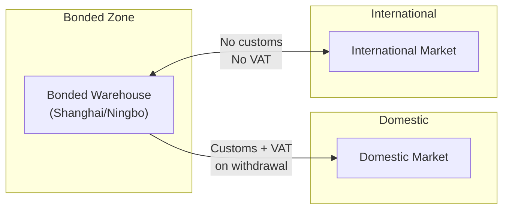

# INE - Shanghai International Energy Exchange (上海国际能源交易中心)

Internationalized products for foreign participation. Assumes familiarity with `futures_china.md`.

## Key Characteristics

| Attribute | Value |
|-----------|-------|
| Focus | Internationalized commodities |
| Foreign access | **Direct** (no QFII required) |
| Pricing | **Net-of-tax** (不含税价格) |
| Night session | Yes (varies by product) |
| Close position | Must specify CloseToday/CloseYesterday (like SHFE) |

## Products

| Code | Product | Multiplier | Tick | Night End |
|------|---------|------------|------|-----------|
| sc | Crude Oil | 1000 bbl | 0.1 CNY | 02:30 |
| lu | Low Sulfur Fuel Oil | 10 t | 1 CNY | 23:00 |
| bc | Bonded Copper | 5 t | 10 CNY | 01:00 |
| nr | TSR 20 Rubber | 10 t | 5 CNY | 23:00 |
| ec | Shipping Index | 50 CNY | 0.1 pt | None |

## Foreign Participation

**Overseas Intermediary advantages:**
- No QFII license required
- USD/CNH funding accepted
- Tax-free trading profits
- Guaranteed repatriation
- Setup: 1-4 weeks

## Net-of-Tax Pricing

INE products are priced **excluding VAT**:

| Aspect | Domestic (SHFE) | International (INE) |
|--------|-----------------|---------------------|
| Price basis | Tax-inclusive | **Net-of-tax** |
| VAT | Included in price | Exempt for bonded delivery |
| Arbitrage | Requires tax adjustment | Direct comparison to global |

**Implication for SC-Brent arb:** INE crude directly comparable to international benchmarks.

## Bonded Delivery

INE products use bonded warehouse delivery:

Physical delivery occurs in bonded zones, enabling international arbitrage without customs friction.

## Cross-Product Relationships

| INE Product | International Benchmark | Spread Drivers |
|-------------|------------------------|----------------|
| SC | Brent, WTI | Freight, quality, FX |
| BC | LME Copper | Tariff, logistics |
| LU | Singapore LSFO | Shipping demand |

See `references/models/cross_product_analysis.md` for arbitrage framework.

## Position Limits

| Product | Speculative | Notes |
|---------|-------------|-------|
| Crude Oil (SC) | 500 (general) | Tightens near delivery |
| Bonded Copper (BC) | 8,000 | Same structure as SHFE |
| LSFO (LU) | 5,000 | |

## Fee Structure

| Product | Open | Close |
|---------|------|-------|
| Crude Oil | 20 CNY | 20 CNY |
| LSFO | 5 CNY | 5 CNY |
| Bonded Copper | 0.5/10000 | 0.5/10000 |

## Close Position Requirement

Same as SHFE - must specify:
- `'3'` (CloseToday 平今)
- `'4'` (CloseYesterday 平昨)

## Night Session Schedule

```mermaid
gantt
    title INE Night Session
    dateFormat HH:mm
    axisFormat %H:%M

    section 23:00 End
    LSFO, Rubber :21:00, 2h

    section 01:00 End
    Bonded Copper :21:00, 4h

    section 02:30 End
    Crude Oil :21:00, 5h30m
```

## Data Quirks

| Field | Behavior |
|-------|----------|
| UpdateMillisec | 0 or 500 |
| AveragePrice | × Multiplier |
| ActionDay | Correct |
| Contract format | Lowercase + YYMM (e.g., `sc2501`) |

Same CTP interface as SHFE (both operated by SFIT).

## Primary Source

- Rules: https://www.ine.cn/bourseService/rules/
- Products: https://www.ine.cn/products/
