# Causal Analysis Framework for Chinese Futures Markets

**Gatekeeper document for mechanism validation. Reject correlation without mechanism.**

This document establishes identification requirements for causal claims in Chinese futures markets. The 500ms snapshot architecture, VWAP settlement, retail dominance, and forced liquidation mechanics create systematic threats to identification that require explicit treatment.

---

## 1. Aggregation Bias: The 500ms Problem

### What You Cannot Identify

The 500ms snapshot constraint makes these causal claims **fundamentally unidentifiable**:

| Claimed Mechanism | Why Unidentifiable | No Recovery |
|-------------------|-------------------|-------------|
| Individual trade impact | Multiple trades aggregate into single volume delta | True |
| Order-by-order queue dynamics | No message-level feed exists | True |
| Sub-500ms price discovery | Intermediate prices never observed | True |
| Trade direction causality | Direction inferred, not observed | Partially |
| Tick-by-tick adverse selection | Cannot observe individual trade sequences | True |

### The Aggregation DAG

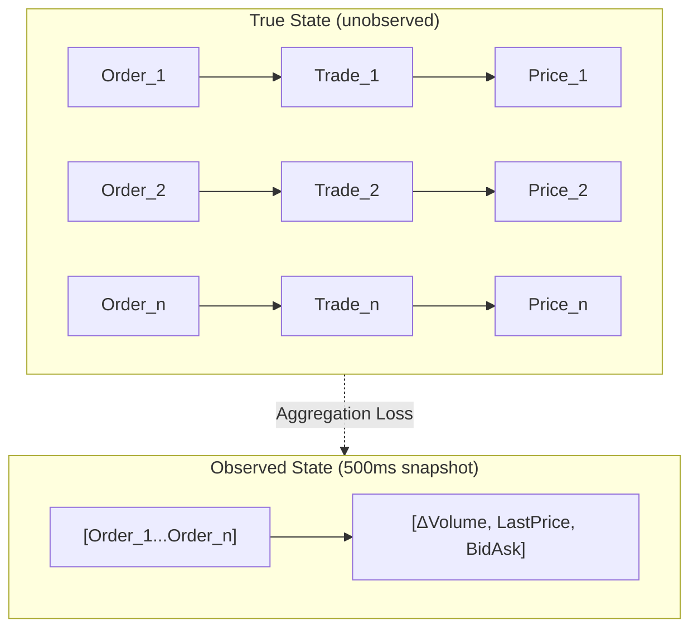

**Identification Failure**: You observe only the aggregate. You cannot identify individual order→price causal paths. Any claim about "how individual orders move prices" is **correlation dressed as causation**.

### What You CAN Identify (With Assumptions)

| Claim | Required Assumption | Testable? | Test |
|-------|---------------------|-----------|------|
| Aggregate order flow → price change | Contemporaneous flow is exogenous to unobserved news | No | Sensitivity analysis only |
| Volume shock → volatility | Shock timing is random w.r.t. volatility drivers | Partially | Pre-shock vs post-shock variance ratio |
| Depth change → spread change | Depth change is not caused by same factor causing spread change | No | Instrument required |

### Aggregation Sensitivity Analysis

For any claimed effect β from snapshot data:

1. **Construct worst-case aggregation scenarios**:
   - All trades occurred at snapshot start (maximum price impact time)
   - All trades occurred at snapshot end (minimum price impact time)
   - Trades uniformly distributed

2. **Compute effect bounds**:
   - β_max: Effect if all impact concentrated
   - β_min: Effect if impact spread uniformly
   - If sign(β_max) ≠ sign(β_min), **REJECT** the causal claim

3. **Report**: "Effect estimate ranges from [β_min, β_max] under aggregation uncertainty"

---

## 2. Settlement Price Mechanism: VWAP vs Close

### The Causal Structure

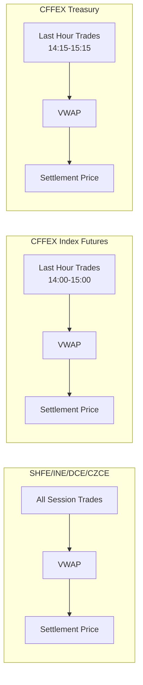

### Identification Implications

| Research Design | VWAP Settlement Impact | Mitigation |
|-----------------|----------------------|------------|
| Close-to-close returns | Close ≠ Settlement creates measurement error in margin P&L | Use settlement-to-settlement |
| EOD strategies | Settlement manipulation incentive creates endogeneity | Exclude last 30 min |
| Index arbitrage | CFFEX 1-hour VWAP creates mean-reversion opportunities | Model VWAP targeting explicitly |

### Confounding from Settlement Targeting

**Threat**: Large traders target settlement price for margin optimization. Their trades are NOT exogenous to price—they ARE the price.

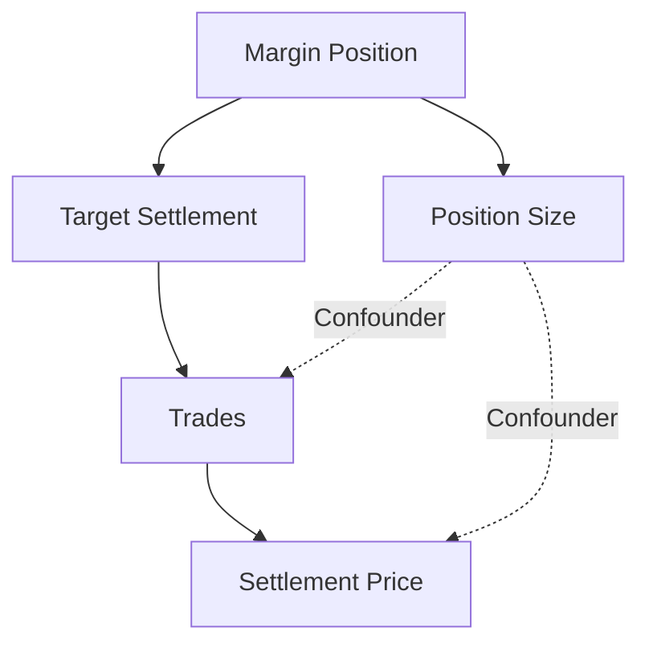

**Identification Strategy**: 
- IV: Use settlement price from correlated foreign contract (Brent for SC, LME Copper for CU) as instrument
- Assumption: Foreign settlement timing differs; foreign traders don't target Chinese settlement
- Test: First-stage F on instrument relevance; exclusion argument must establish no direct effect

### When Settlement-Based Analysis Fails

**REJECT** any analysis that:
1. Uses 14:00-15:00 CFFEX data without accounting for VWAP targeting
2. Claims "close price impact" when settlement ≠ close
3. Treats settlement price as exogenous to trading activity it measures

---

## 3. Forced Liquidation Cascades: When Independence Fails

### The Mechanism

Chinese futures enforce same-day margin calls with forced liquidation. The cascade structure:

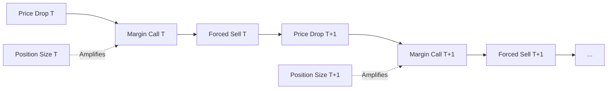

**Critical Violation**: Standard impact models assume trades are independent. During forced liquidation, Trade_T **causes** Trade_T+1 through the margin channel. Independence assumption fails.

### Identification Implications

| Standard Model Assumption | Violation During Cascade | Consequence |
|--------------------------|------------------------|-------------|
| E[Trade_t \| Trade_t-1] = 0 | Positive autocorrelation | Impact estimates biased upward |
| Price impact is transient | Cascade creates permanent impact | Obizhaeva-Wang model fails |
| Volume is exogenous | Volume is endogenous to price | Simultaneous equations bias |

### Testing for Cascade Presence

**Test 1: Margin Threshold Test**
```
Define: Near_Margin_T = 1 if Price within 3% of margin call trigger
H0: E[ΔVolume | Near_Margin_T = 1] = E[ΔVolume | Near_Margin_T = 0]
Reject H0 → Cascade mechanism active
```

**Test 2: Volume Autocorrelation Regime**
```
Regime 1 (Normal): AR(1) coefficient on volume ≈ 0
Regime 2 (Cascade): AR(1) coefficient on volume >> 0

If coefficient regime-switches based on price level → Cascade confirmed
```

**Test 3: Price Impact Nonlinearity**
```
Standard: Impact ∝ sqrt(Volume) [Bouchaud]
Cascade: Impact accelerates beyond sqrt when near margin levels

Plot residuals from sqrt-impact model against distance-to-margin
Systematic positive residuals near margin = cascade effect
```

### Sensitivity Analysis for Cascade Confounding

When cascade is present, bound causal estimates:

1. **Lower bound**: Estimate impact excluding cascade periods (price > 5% from margin)
2. **Upper bound**: Full sample estimate
3. **Difference**: Cascade amplification factor

Report: "Impact estimate is [X] in normal conditions, [Y] during potential cascade periods. Maximum cascade amplification: [Y/X]."

---

## 4. Identification Strategies: What CAN Be Identified

### Strategy 1: Regression Discontinuity at Price Limits

**Design**: Price limit creates sharp cutoff in trading ability

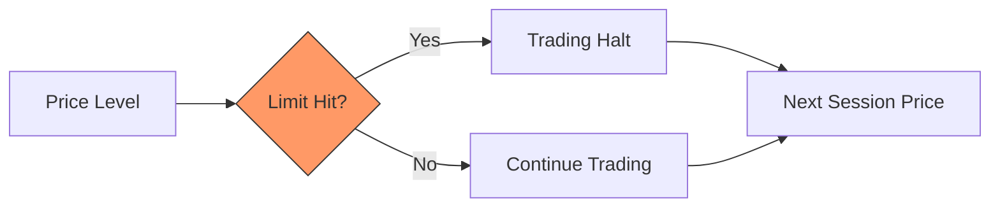

**Identification**: Continuity of potential outcomes at cutoff. Traders just above vs just below limit are comparable.

**Testable Assumptions**:
- McCrary density test: No manipulation of running variable
- Covariate balance: Order flow characteristics smooth at cutoff
- Bandwidth sensitivity: Results stable across bandwidth choices

**What This Identifies**: Effect of trading halt on price discovery, NOT effect of large price moves.

### Strategy 2: Night Session Introduction as Natural Experiment

**Design**: Staggered night session rollout (2013-2018) creates DiD opportunity

| Wave | Date | Products |
|------|------|----------|
| 1 | July 2013 | Gold, Silver |
| 2 | Dec 2013 | Base metals |
| 3 | July 2014 | DCE agricultural |
| 4 | Dec 2014 | CZCE products |
| 5 | March 2018 | Crude oil |

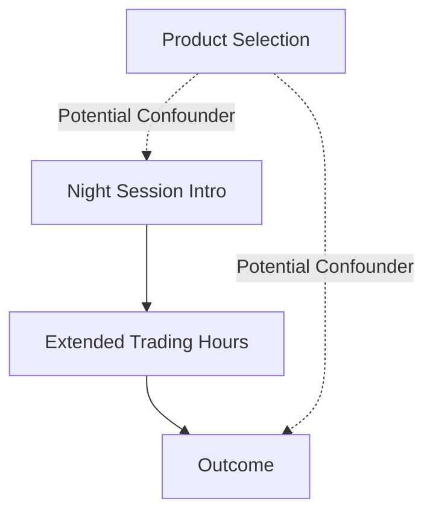

**Identification**: Parallel trends assumption. Treated and control products would have trended similarly absent treatment.

**Testable**:
- Pre-trend test: Regress outcome on Treatment × Time for pre-period
- Placebo treatment: Assign fake treatment dates, test for spurious effects
- Bacon decomposition: Which comparisons drive the estimate

**Threats**:
- Negative weighting in TWFE with staggered adoption → Use Callaway-Sant'Anna or Sun-Abraham
- Product selection is endogenous → Compare within-exchange, similar-sector products

### Strategy 3: Fee Changes as Instruments

**Design**: Exchange fee adjustments provide exogenous variation in trading costs

**Example**: Apple (AP) fee increase from 5 CNY to 20 CNY for intraday trades

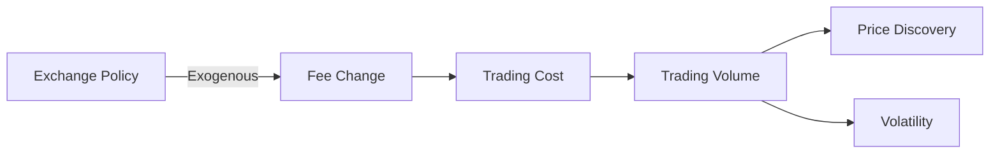

**Identification Requirements**:
1. **Relevance**: Fee changes affect volume (first-stage F > 10)
2. **Exclusion**: Fee change affects outcome ONLY through volume channel
3. **Monotonicity**: Fee increase never increases volume (plausible)

**Threats to Exclusion**:
- Fee change announced because of volatility concerns → Reverse causality
- Fee change accompanied by other rule changes → Multiple treatments

**Test**: Examine pre-announcement period for anticipation effects. No effect before announcement supports exogeneity.

### Strategy 4: Cross-Product Arbitrage Relationships

**Design**: SC-Brent, BC-LME Copper relationships provide natural instruments

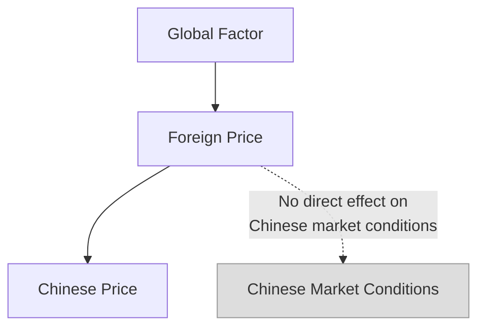

**Identification**: Foreign price changes affect Chinese prices through information/arbitrage channel only.

**Exclusion Argument**:
- Brent supply shock affects SC through price, not through Chinese inventory
- LME price move affects BC through arbitrageurs, not through Chinese smelter demand

**Testable**:
- Lead-lag structure: Foreign leads Chinese (confirms information flow direction)
- Foreign-specific shocks: Use foreign inventory surprises as IV

---

## 5. DAG Requirements: Key Confounders

### Universal Confounders in Chinese Markets

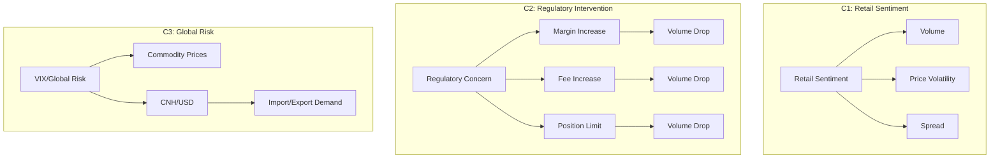

### Required DAG Elements for Any Causal Claim

Before accepting any mechanism, demand:

1. **Complete variable list**: All potential confounders explicitly named
2. **Arrow justification**: Why each causal arrow exists (or doesn't)
3. **Identification path**: Which arrows are you claiming to identify? How?
4. **Backdoor paths**: List all backdoor paths. Show how each is blocked.
5. **Instrument validity**: If using IV, defend exclusion restriction explicitly.

### DAG Template for Chinese Futures

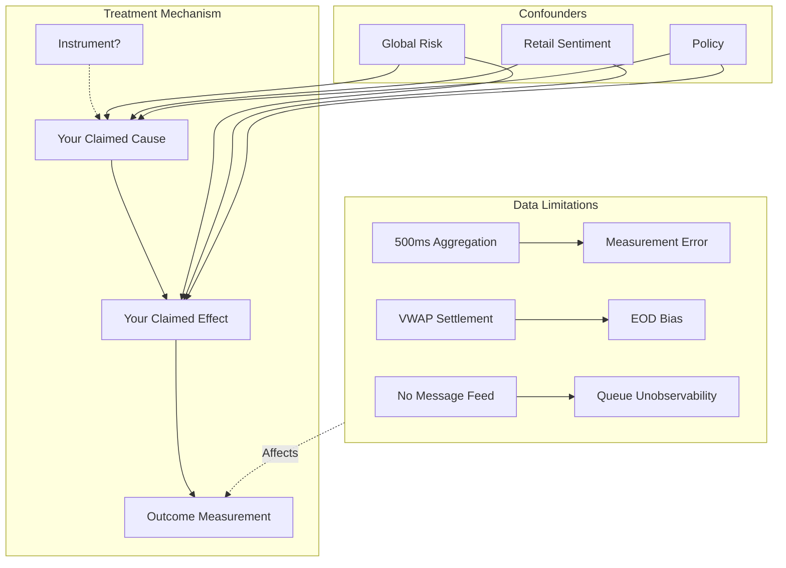

---

## 6. Sensitivity Analysis Requirements

### Minimum Robustness Checks

Every causal claim MUST include:

| Check | Method | Report |
|-------|--------|--------|
| Confounder sensitivity | Oster (2019) δ or E-value | "Result survives δ = [X]" |
| Functional form | Lin + Quadratic + Nonparametric | Coefficient stability |
| Sample selection | Drop first/last 30 min, drop limit days | Effect persistence |
| Time period | Rolling window estimates | Structural break detection |
| Measurement error | Bounds from aggregation uncertainty | [β_min, β_max] |

### Oster (2019) Coefficient Stability

For any regression Y = αX + βControls + ε:

1. Run restricted regression (no controls): Get β̃, R̃²
2. Run full regression (with controls): Get β*, R*²
3. Compute δ: The relative importance of unobservables vs observables needed to explain away β*

```
δ = (β* - 0) / (β̃ - β*) × (R_max - R*²) / (R*² - R̃²)
```

**Interpretation**:
- δ > 1: Unobservables would need to be more important than observables to explain result
- δ < 1: Moderate unobservables could explain result
- δ < 0: Selection on unobservables likely opposite to observables (strengthens result)

**Report**: "For the result to be explained by unobserved confounding, unobservables would need to be [δ] times as important as observed controls in explaining variation in [treatment]."

### E-Value for Treatment Effect Bounds

For any estimated effect RR (risk ratio or transformed coefficient):

```
E-value = RR + sqrt(RR × (RR - 1))
```

**Interpretation**: An unmeasured confounder would need to be associated with both treatment and outcome by a factor of at least E-value to explain away the observed effect.

**Report**: "An unmeasured confounder would need RR ≥ [E-value] with both [treatment] and [outcome] to reduce the effect to null."

### Aggregation-Specific Sensitivity

For 500ms data, compute:

1. **Impact Timing Bounds**:
   - Assume all volume occurs at t=0ms: Maximum impact estimate
   - Assume all volume occurs at t=500ms: Minimum impact estimate
   - True effect ∈ [min, max]

2. **Direction Misclassification Bounds**:
   - Lee-Ready accuracy typically ~85%
   - Compute effect under 15% random misclassification
   - Use Manski partial identification bounds

3. **Snapshot Miss Rate**:
   - If true events arrive at rate λ, probability of missing event in 500ms = P(N > 1 | λ × 0.5)
   - For λ = 10 events/second: P(miss) ≈ 40%
   - Bound: True effect could be up to 1/(1-miss_rate) × observed effect

---

## 7. Verdict Framework

### PASS Criteria

A mechanism claim PASSES causal review if:

1. ☐ DAG is complete and approved
2. ☐ All backdoor paths are blocked by design or control
3. ☐ Identification assumptions are stated explicitly
4. ☐ Testable assumptions pass their tests
5. ☐ Sensitivity analysis shows result survives reasonable confounding
6. ☐ Aggregation bounds do not change sign

### REJECT Criteria

REJECT if ANY of:

1. ☒ No DAG provided or DAG incomplete
2. ☒ Unblocked backdoor path exists
3. ☒ Identification assumption is implausible
4. ☒ Testable assumption fails (first-stage F < 10, parallel trends violated)
5. ☒ Sensitivity analysis shows low robustness (δ < 1, narrow E-value)
6. ☒ Aggregation bounds span zero

### INSUFFICIENT EVIDENCE

Return for more work if:

1. ⚠ DAG plausible but untested assumptions dominate
2. ⚠ Tests inconclusive (borderline F, ambiguous pre-trends)
3. ⚠ Sensitivity shows moderate robustness but not strong
4. ⚠ Data limitations prevent definitive conclusion

---

## 8. Common Rejected Claims

### Claim: "Order flow imbalance predicts returns"

**Rejection Reason**: Simultaneity. Order flow and returns are jointly determined by information arrival. Without instrument for order flow, this is correlation, not causation.

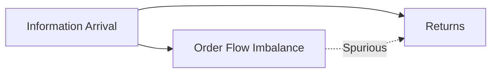

**What Would Change Verdict**: 
- IV for order flow that is plausibly exogenous to information
- Natural experiment that shifts order flow without affecting expectations

### Claim: "High-frequency trading improves price discovery"

**Rejection Reason**: Selection. HFT enters when prices are most informative. Confounded by information availability.

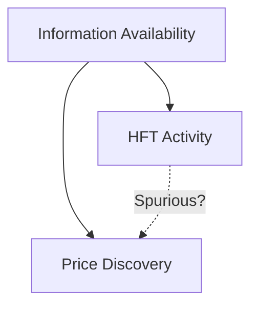

**What Would Change Verdict**:
- Exogenous shock to HFT presence (technology failure, regulatory change)
- RDD at speed threshold

### Claim: "Large orders have permanent price impact"

**Rejection Reason**: Aggregation + Information. In 500ms data:
1. "Large order" is sum of many orders (aggregation masks mechanism)
2. Large orders correlate with information (confounded)
3. Cannot distinguish permanent impact from information arrival

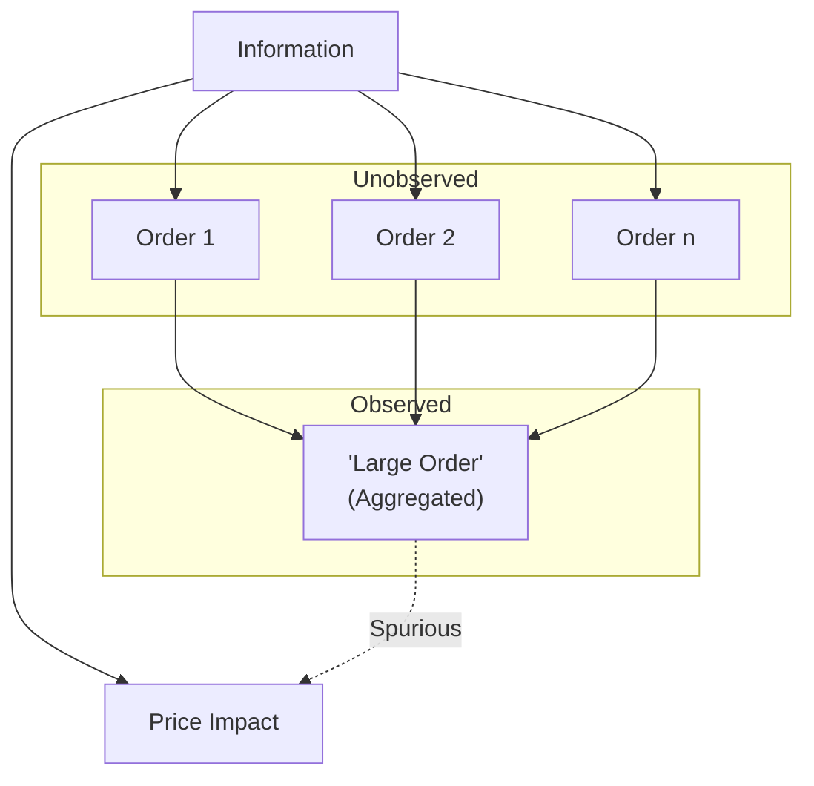

**What Would Change Verdict**:
- Message-level data (does not exist in China)
- Exogenous large order (e.g., forced liquidation at random threshold)

### Claim: "Queue position affects fill probability"

**Rejection Reason**: Cannot observe queue position with snapshot data. Any claim is model-dependent, not identified from data.

**What Would Change Verdict**:
- Order-by-order data (does not exist in China)
- Natural experiment that randomizes queue position (implausible)

---

## Appendix: Reference DAGs for Common Analyses

### A. Price Impact Analysis

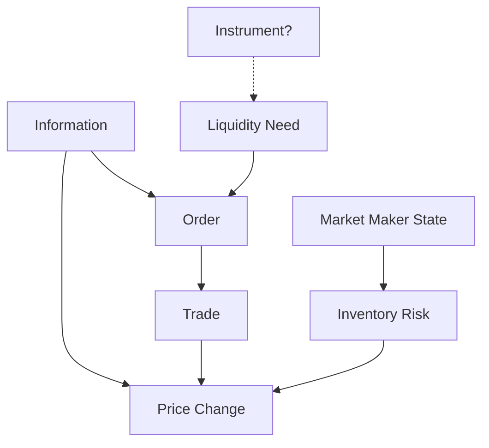

**Identification Problem**: Information affects both Order and Price_Change. Without instrument for Order, impact is not identified.

### B. Volatility Clustering Analysis

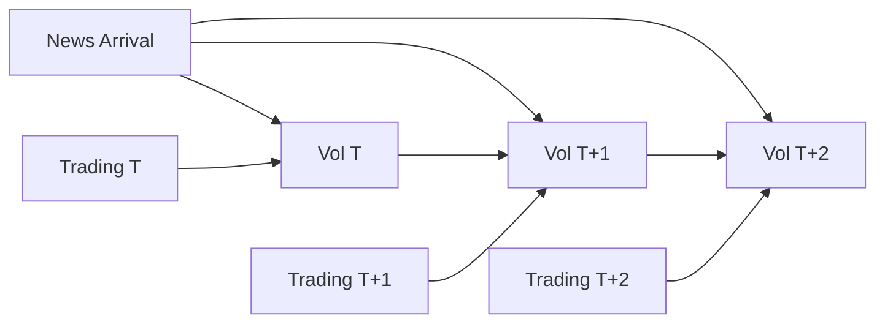

**Identification Problem**: GARCH captures correlation structure, not causal structure. "Volatility causes future volatility" is not identified—could be persistent news arrival.

### C. Cross-Product Arbitrage

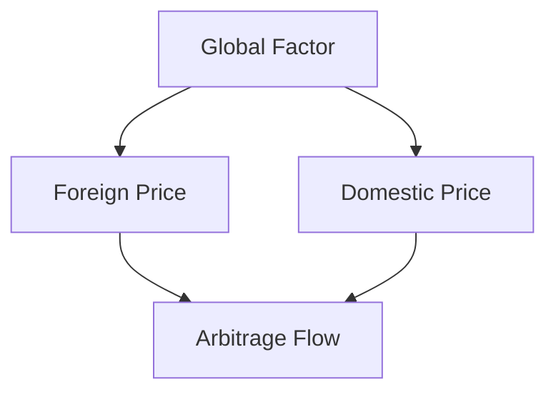

**Identification Approach**: Foreign price can instrument for domestic price if exclusion holds (foreign doesn't directly affect domestic market conditions beyond price).

---

**Last Updated**: 2026-01-26

**Maintained By**: Causal Analyst

**Review Required**: Before any mechanism claim is accepted into production strategy
