# Chinese Futures Crisis/Failure Mode Catalog

Comprehensive failure mode documentation for CTP-based Chinese futures trading systems. Assume everything failed until proven otherwise.

---

## 1. Connection-Level Failures

### 1.1 CTP Front Server Disconnect

**Symptom**: OnFrontDisconnected callback received

**nReason codes**:
| Code (Hex) | Meaning | Root Cause |
|------------|---------|------------|
| 0x1001 | Network read failure | Physical network, firewall, ISP |
| 0x1002 | Network write failure | Physical network, buffer overflow |
| 0x2001 | Heartbeat timeout | Network latency spike, server load |
| 0x2002 | Heartbeat send failure | Local network congestion |
| 0x2003 | Invalid message | API version mismatch, packet corruption |

**Diagnostic steps**:
```bash
# Check network connectivity to front server
ping <front_ip>
traceroute <front_ip>

# Check local process state
netstat -an | grep <front_port>

# Check CTP log for error details
tail -100 /path/to/ctp/log/
```

**Recovery**:
1. CTP auto-reconnects to next registered front address
2. **Critical**: Subscriptions NOT preserved - must re-subscribe all instruments after OnRspUserLogin
3. Track subscribed instruments in client state for re-subscription

**Prevention**:
- Register multiple front addresses before Init()
- Implement exponential backoff (CTP rate limit: ~20 sessions/sec/IP)
- Monitor subscription heartbeat per instrument

---

### 1.2 看穿式监管 Authentication Failure

**Symptom**: OnRspAuthenticate returns ErrorID != 0

**Error codes**:
| ErrorID | Meaning | Root Cause |
|---------|---------|------------|
| 63 | AUTH_FAILED | Invalid AppID/AuthCode combination |
| 15 | Invalid broker ID | Wrong BrokerID for front server |
| 3 | Invalid user | UserID/InvestorID mismatch |

**Diagnostic steps**:
```
1. Verify AppID format: vendor_softwarename_version
2. Verify AuthCode: 16-character string from broker
3. Confirm CTP version >= 6.3.15
4. Check if AuthCode expired (typically 12-month validity)
5. Verify physical machine (VM/cloud cannot generate valid ClientSystemInfo)
```

**Recovery**:
- Contact broker for AuthCode reissuance (7-15 business days)
- **No workaround** - authentication is mandatory since June 14, 2019

**Prevention**:
- Track AuthCode expiration dates
- Maintain backup physical machines
- Store ClientSystemInfo hash to detect hardware changes

**Cascading impact**: **Total trading halt** - this is a single point of failure

---

### 1.3 Front Server Crash / Overload

**Symptom**: Connection succeeds but OnRspUserLogin never arrives, or frequent rapid disconnects

**Diagnostic steps**:
```
1. Check time - market open/night open have peak load
2. Try alternative front addresses
3. Compare with SimNow (if SimNow works, broker front issue)
4. Check VNPY/TqSdk forums for reports from same broker
```

**Recovery**:
1. Cycle through registered front addresses
2. Reduce connection frequency (rate limit: 20/sec)
3. Contact broker if all fronts fail

**Prevention**:
- Register 3+ front addresses from broker
- Implement front server health scoring based on latency/success rate

---

### 1.4 Settlement Not Confirmed

**Symptom**: ErrorID 53 on any trading operation

**Meaning**: Previous day settlement requires explicit confirmation

**Recovery**:
```cpp
// Must call after OnRspUserLogin
CThostFtdcSettlementInfoConfirmField req = {0};
strcpy(req.BrokerID, m_brokerID);
strcpy(req.InvestorID, m_investorID);
m_traderApi->ReqSettlementInfoConfirm(&req, ++m_requestID);
```

**Prevention**: Always call ReqSettlementInfoConfirm in login sequence

---

## 2. Data-Level Failures

### 2.1 Stale Data Without Notification

**Symptom**: Market moving but OnRtnDepthMarketData timestamps not advancing

**Detection**:
```python
def detect_stale_data(tick, wall_clock):
    tick_time = parse_time(tick.UpdateTime, tick.UpdateMillisec)
    delta = wall_clock - tick_time
    
    # Expected: <1 second during active session
    # Warning: >3 seconds
    # Critical: >30 seconds
    
    if delta > timedelta(seconds=30):
        return "CRITICAL_STALE"
    elif delta > timedelta(seconds=3):
        return "WARNING_STALE"
    return "OK"
```

**Root causes**:
1. Partial subscription loss (exchange still sending, CTP not forwarding)
2. CTP callback queue backup (long-running callback blocking)
3. Network partition to specific exchange
4. Exchange-side snapshot generator failure (rare)

**Diagnostic steps**:
```
1. Compare affected vs unaffected instruments
2. Check if all instruments from one exchange affected (exchange issue)
3. Monitor callback processing latency
4. Check if subscriptions still active via separate diagnostic connection
```

**Recovery**:
1. Re-subscribe affected instruments
2. If pervasive, reconnect entirely
3. Switch to backup data source (TqSdk, different broker)

**Prevention**:
- Monitor per-instrument update frequency (expect ~2 ticks/sec during active session)
- Alert if no update for >5 seconds during trading hours
- Cross-validate with independent data source

---

### 2.2 Reconnection Gap (No Replay)

**Symptom**: Disconnect followed by reconnect, missed data permanently lost

**Critical understanding**: CTP has **no replay mechanism**. Unlike ITCH, there is no sequence number and no way to request missed data.

**Detection**:
```python
def detect_gap(prev_tick, curr_tick):
    # Volume should be monotonically increasing within session
    if curr_tick.Volume < prev_tick.Volume:
        return "SESSION_ROLLOVER"  # Expected at 21:00
    
    # Time gap detection
    prev_time = parse_time(prev_tick.UpdateTime, prev_tick.UpdateMillisec)
    curr_time = parse_time(curr_tick.UpdateTime, curr_tick.UpdateMillisec)
    delta = curr_time - prev_time
    
    if delta > timedelta(milliseconds=1500):  # Expected 500ms, allow 3x
        return f"GAP_DETECTED: {delta.total_seconds()}s"
    return "OK"
```

**Recovery**:
- **Gap cannot be filled from CTP**
- Options:
  1. Mark gap in data, continue with caveat
  2. Fetch from TqSdk historical API (if available for timeframe)
  3. Interpolate from adjacent data (for non-critical use)
  4. Accept data loss for that window

**Prevention**:
- Multi-front redundancy (connect to multiple brokers)
- Run parallel capture processes
- Use TqSdk as backup data stream

---

### 2.3 Broker Synthetic Ticks

**Symptom**: Tick interval distribution does not match expected 500ms pattern

**Detection**:
```python
def detect_synthetic_ticks(tick_timestamps):
    intervals = np.diff(tick_timestamps)
    
    # Expected: bimodal at 500ms with jitter (300-800ms typical)
    # Synthetic: more uniform distribution or different patterns
    
    median_interval = np.median(intervals)
    if median_interval < 400 or median_interval > 600:
        return "SUSPICIOUS_INTERVAL_DISTRIBUTION"
    
    # Check for impossible precision (too regular)
    std_interval = np.std(intervals)
    if std_interval < 50:  # Too consistent
        return "SYNTHETIC_SUSPECTED"
    
    return "OK"
```

**Root causes**:
- Broker interpolating/smoothing data
- Broker data infrastructure issues
- Third-party data provider in chain

**Recovery**:
- Switch to direct CTP connection (not through broker middleware)
- Compare with independent source (TqSdk, other broker)

**Prevention**:
- Baseline tick distribution during known-good period
- Alert on distribution drift

---

### 2.4 Night Session Replay on Day Connection

**Symptom**: Connecting at 09:00 day session, receiving ticks with timestamps from previous night (21:00-02:30)

**Detection**:
```python
def is_replay_tick(tick, connection_time):
    tick_time = parse_time(tick.UpdateTime)
    
    # If connected during day session (09:00-15:00)
    # but receiving night session timestamps (21:00-02:30)
    if connection_time.hour >= 9 and connection_time.hour < 15:
        if tick_time.hour >= 21 or tick_time.hour < 3:
            return True
    return False
```

**Recovery**:
- Filter out replay ticks by comparing UpdateTime to wall clock
- Use 3-minute threshold for acceptable staleness
- Deduplicate using key: (InstrumentID, UpdateTime, UpdateMillisec, Volume)

**Prevention**:
- Always implement deduplication layer
- Log replay detection for monitoring

---

### 2.5 CZCE UpdateMillisec Always Zero

**Symptom**: Multiple ticks per second have identical timestamps (CZCE only)

**Root cause**: CZCE exchange does not populate UpdateMillisec field

**Recovery** (VNPY approach):
```python
def interpolate_czce_millisec(tick, same_second_count):
    # 0, 500, 750, 875ms for same-second ticks
    if same_second_count == 1:
        return 0
    elif same_second_count == 2:
        return 500
    elif same_second_count == 3:
        return 750
    else:
        return 875  # Diminishing returns
```

**Prevention**: Exchange-aware tick processing pipeline

---

### 2.6 DBL_MAX Invalid Values

**Symptom**: Prices appear as 1.7976931348623157e+308

**Fields commonly returning DBL_MAX**:
- SettlementPrice, ClosePrice (until post-settlement ~17:00)
- PreDelta, CurrDelta (non-options contracts)
- OpenPrice, HighestPrice, LowestPrice (before first trade)
- BidPrice2-5, AskPrice2-5 (Level-1 feed or thin market)

**Detection and handling**:
```python
def is_valid_price(price):
    return price < 1e308 and not math.isnan(price) and not math.isinf(price)

def sanitize_tick(tick):
    for field in ['LastPrice', 'BidPrice1', 'AskPrice1']:
        if not is_valid_price(getattr(tick, field)):
            setattr(tick, field, None)  # or NaN
```

**Prevention**: Validate all prices before use in calculations

---

### 2.7 Partial Subscription Loss

**Symptom**: Some instruments stop updating while others continue normally

**Detection**:
```python
class SubscriptionMonitor:
    def __init__(self, instruments):
        self.last_update = {i: None for i in instruments}
        self.expected_instruments = set(instruments)
    
    def on_tick(self, instrument_id, timestamp):
        self.last_update[instrument_id] = timestamp
    
    def check_health(self, current_time, max_silence_sec=60):
        silent = []
        for inst, last in self.last_update.items():
            if last is None or (current_time - last).seconds > max_silence_sec:
                silent.append(inst)
        return silent
```

**Root causes**:
- Subscription dropped during reconnection
- Exchange-side issue for specific contracts
- CTP internal buffer overflow

**Recovery**:
- Re-subscribe silent instruments
- Verify subscription via ReqSubMarketData response

**Prevention**:
- Track OnRspSubMarketData success/failure per instrument
- Periodic subscription audit

---

## 3. Market-Level Failures

### 3.1 Limit-Locked Market (涨跌停)

**Symptom**: Price at UpperLimitPrice or LowerLimitPrice, one-sided order book

**Detection**:
```python
def detect_limit_lock(tick):
    if is_valid_price(tick.LastPrice):
        if tick.LastPrice >= tick.UpperLimitPrice:
            return "LIMIT_UP_LOCKED"
        if tick.LastPrice <= tick.LowerLimitPrice:
            return "LIMIT_DOWN_LOCKED"
    
    # Also check order book
    if not is_valid_price(tick.AskPrice1):  # No offers
        return "NO_OFFERS_LIMIT_UP"
    if not is_valid_price(tick.BidPrice1):  # No bids
        return "NO_BIDS_LIMIT_DOWN"
    
    return "NORMAL"
```

**Trading implications**:
- Cannot exit positions on wrong side of limit
- Orders at limit price queue (potentially very long queue)
- No price discovery until next session

**Recovery options**:
1. Wait for limit release
2. Use options for delta hedge (if available)
3. Accept overnight gap risk

---

### 3.2 Consecutive Limit Days - Margin Escalation

**Trigger**: Contract settles at limit price (单边市)

**Escalation sequence**:
| Day | Price Limit | Margin |
|-----|-------------|--------|
| D | normal | Normal |
| D+1 | +(X+3)% | (new limit + 2%) |
| D+2 | +(X+6)% | Further increase |
| D+3 | Exchange intervention possible |

**Detection**:
```python
def track_consecutive_limits(contract_id, settlement_price, limit_price):
    if abs(settlement_price - limit_price) < tick_size:
        consecutive_limit_days[contract_id] += 1
    else:
        consecutive_limit_days[contract_id] = 0
    
    if consecutive_limit_days[contract_id] >= 2:
        return "MARGIN_ESCALATION_ALERT"
```

**Forced liquidation (强制减仓) algorithm**:
- **Not fully documented by exchanges**
- General priority:
  1. Speculative positions before hedging
  2. Futures before options
  3. Contracts by OI (descending) - most liquid first
  4. Positions by loss (descending)

**Prevention**:
- Monitor consecutive limit settlements
- Pre-emptively reduce position before D+3
- Maintain excess margin buffer (30%+ recommended during volatile periods)

---

### 3.3 Trading Halt / Suspension

**Symptom**: OnRtnInstrumentStatus shows non-trading status

**Instrument status codes**:
| Status | Meaning |
|--------|---------|
| 0 | Before trading |
| 1 | No trading |
| 2 | Continuous trading |
| 3 | Auction ordering |
| 4 | Auction balance |
| 5 | Auction match |
| 6 | Close |

**Detection**:
```cpp
void OnRtnInstrumentStatus(CThostFtdcInstrumentStatusField *pField) {
    if (pField->InstrumentStatus != THOST_FTDC_IS_Continous) {
        log_warning("Instrument %s status: %d", 
                    pField->InstrumentID, 
                    pField->InstrumentStatus);
    }
}
```

**Recovery**: Wait for status change callback

---

### 3.4 Natural Person Delivery Month Restriction

**Symptom**: Order rejected in delivery month

**Rule**: Natural persons cannot hold positions in delivery month

**Deadlines** (must close by):
| Exchange | Deadline |
|----------|----------|
| SHFE/INE | Last trading day of month before delivery |
| DCE | Last trading day of month before delivery |
| INE (SC) | 8th trading day before last trading day |

**Detection**:
```python
def check_delivery_restriction(instrument_id, account_type, trading_day):
    if account_type != "NATURAL_PERSON":
        return "OK"
    
    delivery_month = extract_delivery_month(instrument_id)
    if is_in_delivery_month(trading_day, delivery_month):
        return "DELIVERY_MONTH_RESTRICTED"
    return "OK"
```

**Prevention**: Calendar-based position unwinding alerts

---

### 3.5 Abnormal Trading Threshold Breach

**Symptom**: Phone call from exchange, potential trading restriction

**Thresholds**:
| Behavior | Limit | Consequence |
|----------|-------|-------------|
| Cancellations | 500/day/contract | Review |
| Large cancels | 50/day + each >80% max order | Review |
| Self-trades | 5/day/contract | Review |
| HFT classification | 300 orders+cancels/sec | Higher fees, reporting |

**Detection**:
```python
class AbnormalTradingMonitor:
    def __init__(self):
        self.cancels = defaultdict(int)  # per contract
        self.self_trades = defaultdict(int)
    
    def on_cancel(self, contract):
        self.cancels[contract] += 1
        if self.cancels[contract] >= 400:  # 80% of limit
            return "CANCEL_LIMIT_WARNING"
    
    def on_trade(self, contract, buy_order_id, sell_order_id):
        if is_same_client(buy_order_id, sell_order_id):
            self.self_trades[contract] += 1
            if self.self_trades[contract] >= 4:
                return "SELF_TRADE_WARNING"
```

**Recovery**:
- Reduce trading activity immediately
- Document legitimate reasons for activity
- Prepare for exchange inquiry

**Prevention**:
- Implement self-trade prevention in order management
- Track cancel rates in real-time
- Alert at 80% of thresholds

---

## 4. Cascading Failure Chains

### 4.1 Network Spike -> Stale Detection Failure -> Bad Trade

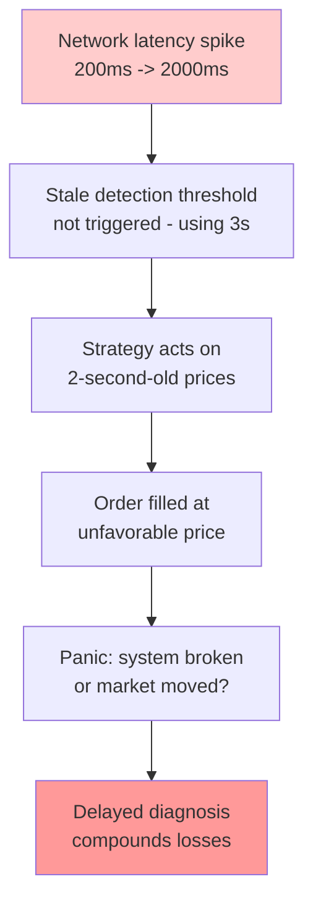

**Prevention**:
- Adaptive stale detection based on market volatility
- Absolute latency circuit breaker (pause if any tick >1s old)
- Position limits during degraded conditions

---

### 4.2 Reconnect -> High Volume Re-subscribe -> Subscription Drop

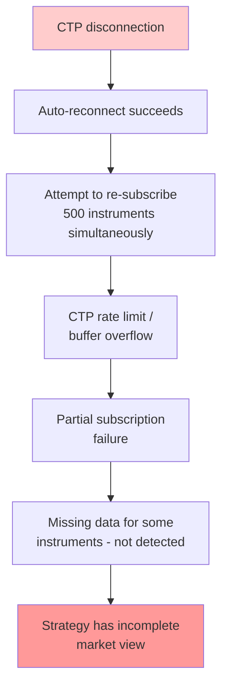

**Prevention**:
- Batch re-subscriptions (50 instruments per batch, 100ms delay)
- Verify subscription count matches expected count
- Per-instrument heartbeat monitoring

---

### 4.3 Limit Lock -> Cannot Liquidate -> Margin Call -> Forced Liquidation Failure

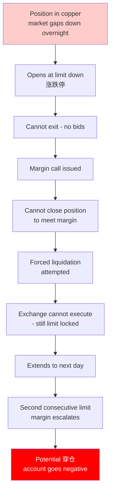

**Prevention**:
- Maintain 50%+ excess margin for overnight positions
- Avoid concentrated positions in illiquid contracts
- Use options for tail risk hedge where available

---

### 4.4 Auth Failure -> Total Trading Halt

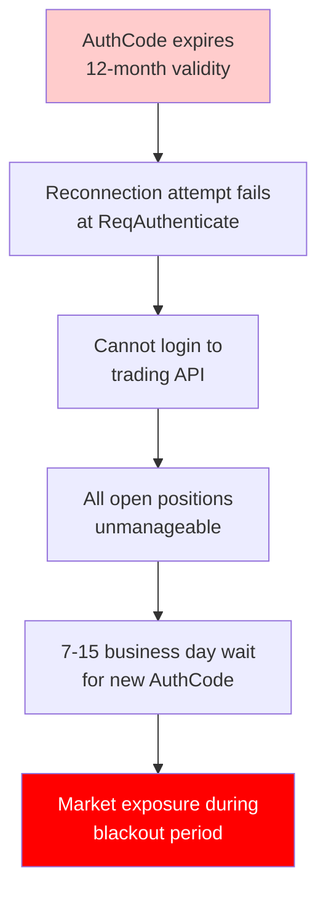

**Prevention**:
- Track AuthCode expiration, renew 30 days early
- Maintain backup account with different broker
- Document manual liquidation procedure via broker

---

### 4.5 Holiday Margin Increase -> Unexpected Margin Call

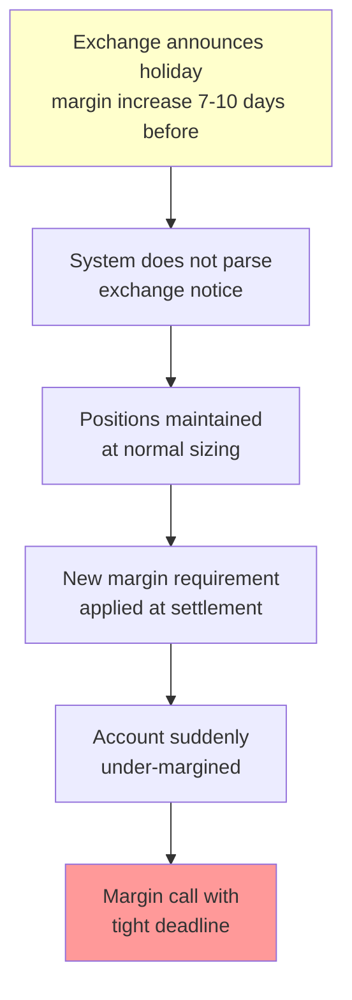

**Prevention**:
- Subscribe to exchange notification feeds
- Manual review of margin changes before major holidays
- Default to conservative margin assumptions (1.5x exchange minimum)

---

## 5. Detection Methods

### 5.1 Health Check Matrix

| Check | Frequency | Threshold | Action |
|-------|-----------|-----------|--------|
| Tick freshness | Per tick | >3s stale | Alert |
| Tick freshness | Per tick | >30s stale | Pause trading |
| Subscription count | 60s | <expected | Re-subscribe |
| Per-instrument update | 60s | No tick in 60s (active hours) | Alert |
| Connection state | Continuous | Disconnected | Log, wait for reconnect |
| Order response latency | Per order | >5s | Alert |
| Margin utilization | 60s | >80% | Alert |
| Margin utilization | 60s | >95% | Reduce position |
| Cancel rate | Per cancel | >400/day/contract | Alert |
| Self-trade count | Per trade | >4/day/contract | Alert |

### 5.2 Monitoring Dashboard Metrics

```
Essential real-time metrics:
- ticks_per_second by exchange
- tick_latency_p99_ms
- subscription_count vs expected_count
- connection_state (0/1) per front
- order_fill_latency_p99_ms
- cancel_rate_today per contract
- margin_utilization_pct
- position_vs_limit_pct per contract
- consecutive_limit_days per contract
```

### 5.3 Log Patterns to Alert On

```bash
# CTP errors
grep -E "OnRsp.*(Error|error)" ctp.log
grep -E "OnFrontDisconnected" ctp.log
grep -E "ErrorID=([1-9]|[1-9][0-9])" ctp.log

# Authentication
grep -E "AUTH_FAILED|ErrorID=63" ctp.log

# Rate limits
grep -E "ORDER_FREQ_LIMIT|ErrorID=116" ctp.log

# Margin issues
grep -E "INSUFFICIENT_MONEY|ErrorID=31" ctp.log
```

---

## 6. Recovery Procedures

### 6.1 Connection Loss Recovery

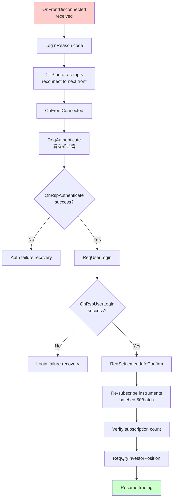

### 6.2 Stale Data Recovery

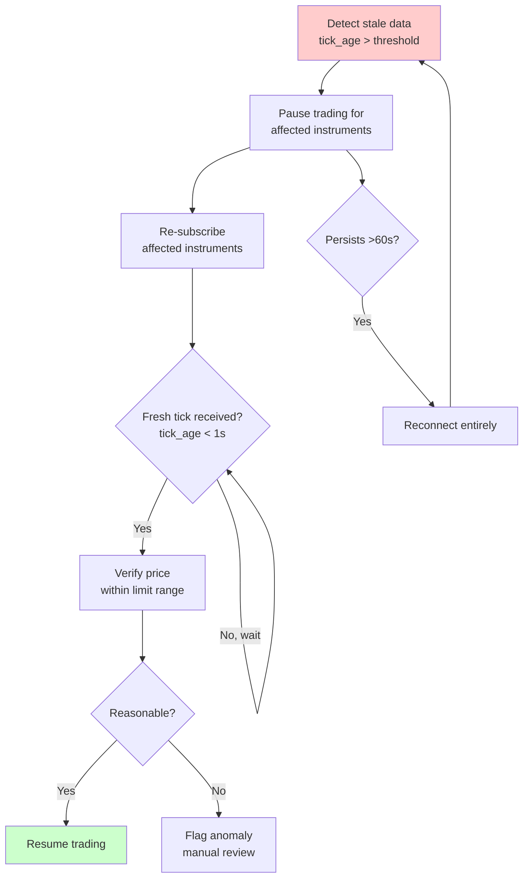

### 6.3 Margin Call Response

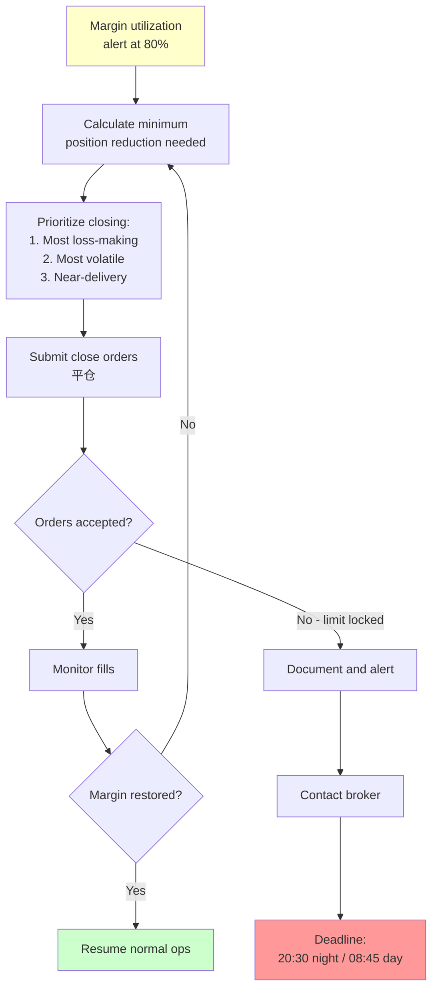

### 6.4 Authentication Failure Recovery

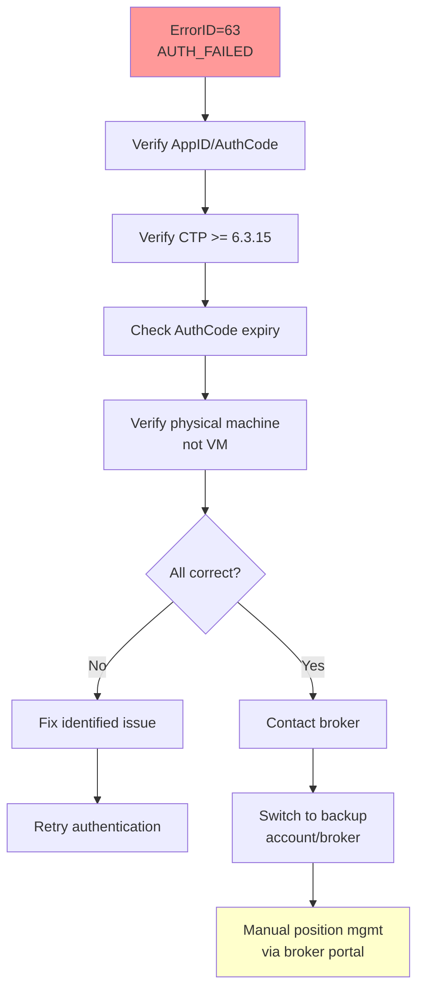

### 6.5 Limit-Locked Position Recovery

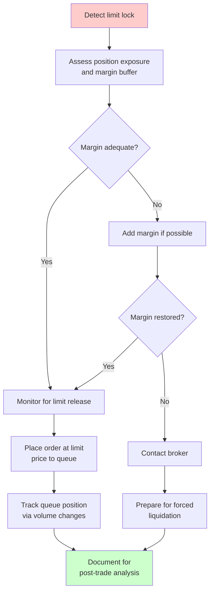

---

## 7. Monitoring Checklist

### Pre-Session (by 20:30 for night, 08:30 for day)

- [ ] CTP connection established
- [ ] Authentication successful
- [ ] Settlement confirmed
- [ ] All instruments subscribed
- [ ] Position reconciliation complete
- [ ] Margin adequate (>30% buffer)
- [ ] No contracts entering delivery month without plan
- [ ] AuthCode expiration >30 days away

### During Session (continuous)

- [ ] Tick freshness <3s for all subscribed
- [ ] No instruments with 60s+ silence
- [ ] Connection state = connected
- [ ] Order latency <5s P99
- [ ] Cancel count <400/day/contract (80% of 500 limit)
- [ ] Self-trade count <4/day/contract (80% of 5 limit)
- [ ] Margin utilization <80%
- [ ] No consecutive limit days >1

### Post-Session (by 17:00)

- [ ] All orders filled or cancelled
- [ ] Position reconciliation with broker
- [ ] P&L matches expected (using settlement price)
- [ ] No margin calls pending
- [ ] No regulatory flags from exchange
- [ ] Data gaps documented
- [ ] Auth/subscription state logged

### Weekly

- [ ] AuthCode expiration check (>30 days remaining)
- [ ] Review cancel rate trends
- [ ] Review data quality metrics
- [ ] Backup system test
- [ ] Front server latency comparison
- [ ] Exchange notice review (margin changes, rule changes)

### Monthly

- [ ] Full disaster recovery test
- [ ] Backup broker connectivity test
- [ ] Position limit compliance audit
- [ ] Abnormal trading pattern review

---

## 8. System Architecture for Resilience

### 8.1 Recommended Data Flow

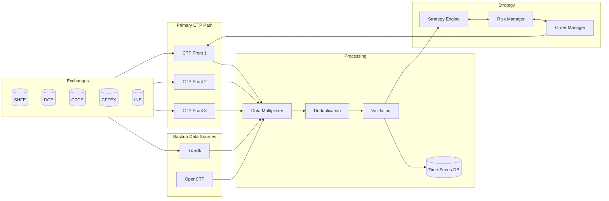

### 8.2 Failure Detection Points

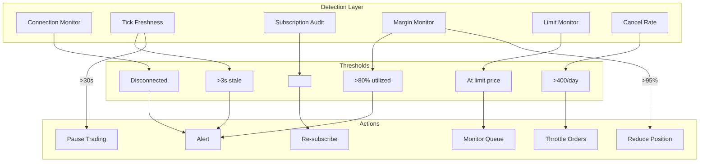

---

## Appendix A: CTP Error Code Quick Reference

| ErrorID | Constant | Meaning | Severity |
|---------|----------|---------|----------|
| 0 | SUCCESS | No error | Info |
| 3 | INVALID_USER | User ID invalid | Critical |
| 15 | INVALID_BROKER | Broker ID invalid | Critical |
| 22 | DUPLICATE_ORDER_REF | Duplicate order reference | High |
| 25 | ORDER_NOT_FOUND | Cancel target not found | Medium |
| 26 | INSUITABLE_ORDER_STATUS | Already filled/cancelled | Medium |
| 30 | OVER_CLOSE_POSITION | Close exceeds position | High |
| 31 | INSUFFICIENT_MONEY | Insufficient margin | High |
| 53 | SETTLEMENT_NOT_CONFIRMED | Must confirm settlement | High |
| 63 | AUTH_FAILED | Authentication failed | Critical |
| 116 | ORDER_FREQ_LIMIT | Order frequency exceeded | High |

---

## Appendix B: Exchange-Specific Quirks

### SHFE/INE
- Requires explicit 平今 (close today) vs 平昨 (close yesterday)
- Night session products: 21:00-01:00 or 21:00-02:30
- Level-2 free via 2nd-gen platform (colo required)

### DCE
- ActionDay may equal TradingDay during night session (wrong)
- Only exchange with native stop orders
- FIFO close by default

### CZCE
- UpdateMillisec always 0 - requires interpolation
- 3-digit year codes (CF501 not CF2501)
- TradingDay = same calendar date (different from others)
- Cancellation window 08:55-08:59 for night orders

### CFFEX
- No night session
- Last hour VWAP for settlement (not full day)
- 15x intraday fee premium on stock index futures
- Self-trade prevention available (since Jan 2024)

---

## Appendix C: Trading Day Boundary

```mermaid
gantt
    title Trading Day Boundary (TradingDay = Monday)
    dateFormat HH:mm
    axisFormat %H:%M
    
    section Friday Night
    Night Session Start (T-1): milestone, 21:00, 0m
    Night Trading: active, 21:00, 330m
    
    section Saturday
    Night End (varies): milestone, 02:30, 0m
    
    section Monday
    Pre-market: 08:55, 5m
    Call Auction: 08:59, 1m
    AM-1: active, 09:00, 75m
    Break: 10:15, 15m
    AM-2: active, 10:30, 60m
    Lunch: 11:30, 120m
    PM: active, 13:30, 90m
    Day Close: milestone, 15:00, 0m
```

**TradingDay resets at 21:00 Shanghai time (13:00 UTC)**

Example (Friday):
- Friday 21:00 -> Monday 02:30: TradingDay = Monday
- Monday 09:00 -> Monday 15:00: TradingDay = Monday

This affects:
- Position limit aggregation
- Cancel rate counting
- Settlement assignment
- Fee calculation

---

## Appendix D: Incident Response Decision Tree

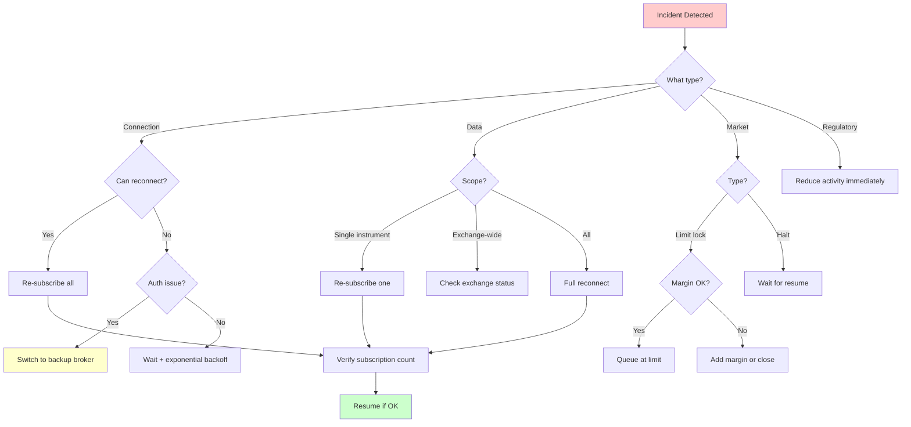

---

**Document Version**: 1.0
**Last Updated**: 2026-01-26
**Based on**: CTP API v6.3.15+, 2022 Futures and Derivatives Law, Exchange rulebooks (SHFE/DCE/CZCE/CFFEX/INE)
