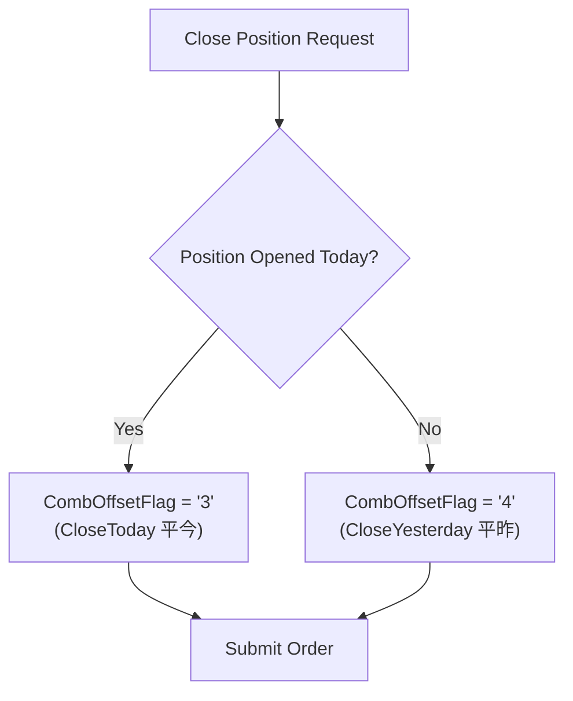

# SHFE - Shanghai Futures Exchange (上海期货交易所)

Base metals, precious metals, energy, rubber. Assumes familiarity with `futures_china.md`.

## 1. Identity & Products

| Attribute | Value |
|-----------|-------|
| Timezone | **CST (UTC+8)** |
| Focus | Metals, energy, rubber |
| Night session | Yes (varies by product) |
| L2 data | Free via UDP multicast (colocation) |
| Close position | **Must specify CloseToday/CloseYesterday** |
| Night trading since | **2013-07-05** (au/ag first) |

### Products

| Code | Product | Multiplier | Tick | Night End | Night Start Date |
|------|---------|------------|------|-----------|------------------|
| cu | Copper | 5 t | 10 CNY | 01:00 | 2013-12-30 |
| al | Aluminum | 5 t | 5 CNY | 01:00 | 2013-12-30 |
| zn | Zinc | 5 t | 5 CNY | 01:00 | 2013-12-30 |
| pb | Lead | 5 t | 5 CNY | 01:00 | 2013-12-30 |
| ni | Nickel | 1 t | 10 CNY | 01:00 | 2015-03-27 |
| sn | Tin | 1 t | 10 CNY | 01:00 | 2015-03-27 |
| au | Gold | 1000 g | 0.02 CNY | 02:30 | 2013-07-05 |
| ag | Silver | 15 kg | 1 CNY | 02:30 | 2013-07-05 |
| rb | Rebar | 10 t | 1 CNY | 23:00 | 2014-12-26 |
| hc | Hot Coil | 10 t | 1 CNY | 23:00 | 2014-12-26 |
| ru | Rubber | 10 t | 5 CNY | 23:00 | 2014-12-26 |
| bu | Bitumen | 10 t | 1 CNY | 23:00 | 2014-12-26 |
| fu | Fuel Oil | 10 t | 1 CNY | 23:00 | 2018-07-16 |
| sp | Pulp | 10 t | 2 CNY | 23:00 | 2018-11-27 |
| ss | Stainless | 5 t | 5 CNY | 01:00 | 2019-09-25 |
| AO | Alumina | 20 t | 1 CNY | 01:00 | 2023-06-19 |
| BR | Butadiene Rubber | 5 t | 5 CNY | 23:00 | 2023-07-28 |
| wr | Wire Rod | 10 t | 1 CNY | None | — |

## 2. Data Characteristics

| Field | Behavior |
|-------|----------|
| UpdateMillisec | **0 or 500 only** (binary, exchange-generated) |
| AveragePrice | Stored as price × multiplier (divide to get true VWAP) |
| ActionDay | Correct actual calendar day (unlike DCE) |
| Contract format | Lowercase + YYMM (e.g., `cu2501`) |
| DBL_MAX sentinel | Fields not yet populated use `DBL_MAX` (~1.7976e+308) |

### Level-2 Data Access

SHFE provides free L2 via UDP multicast to colocated clients. Upgraded from 500ms to **250ms in January 2024**.

| Feature | L1 (CTP) | L2 (UDP Multicast) |
|---------|----------|-------------------|
| Depth levels | 1 | 5 |
| Update rate | 500ms | **250ms** (since Jan 2024) |
| Access | Any CTP client | Colocation only |
| Cost | Included | Free (colo fee only) |
| CTP config | Default | `bIsUsingUdp=true, bIsMulticast=true` |

For DCE/CZCE L2, developers must use exchange-proprietary APIs (飞创/易盛). SHFE L2 is the only free 250ms feed among Chinese commodity exchanges.

## 3. Data Validation Checklist

| Check | Rule | Failure indicates |
|-------|------|-------------------|
| UpdateMillisec | Must be exactly 0 or 500 | Corrupted/non-SHFE data |
| AveragePrice | Divide by contract multiplier before use | Raw field is price × multiplier |
| ActionDay | Should equal actual calendar date (not TradingDay at night) | Data pipeline error |
| DBL_MAX sentinel | Filter fields ≈ 1.7976e+308 | Field not yet populated for session |
| Contract code | Lowercase letters + 4-digit YYMM | Wrong exchange or format error |
| Price vs tick | `(price - basePrice) % tickSize == 0` | Off-tick price, data corruption |

## 4. Order Book Mechanics

### Close Position Requirement

**Critical:** SHFE requires explicit specification:

Wrong flag → Order rejected (ErrorID 31: "CTP:平今仓位不足" or "CTP:平昨仓位不足")

### Call Auction Schedule

| Session | Time | Behavior |
|---------|------|----------|
| Night opening (night products) | **20:55-21:00** | Full call auction |
| Day opening (day-only products) | **08:55-09:00** | Full call auction |
| Day opening (night products) | **08:55-09:00** | Full call auction (since **May 2023**) |
| Closing auction | **None** | SHFE has no closing call auction |

Pre-May 2023, night-session products had no day-session auction — only cancel-only window. Since May 2023, SHFE (along with DCE, INE, GFEX) added full day-session auctions for night products. CZCE remains cancel-only.

Market orders are **not supported** in SHFE call auctions.

### Order Types

All orders are limit orders. SHFE supports FOK (Fill-or-Kill) and FAK (Fill-and-Kill / IOC). No native order modification — every change requires cancel + re-insert.

## 5. Transaction Costs

### Fee Structure

| Code | Product | Fee Type | Open/Close | Close-Today | Notes |
|------|---------|----------|-----------|-------------|-------|
| au | Gold | Per-lot | 10-20 CNY | **Free** | Active months 20 CNY |
| ag | Silver | Per-turnover | 万分之0.5 | 万分之0.5-2.5 | Active months close-today **5x** |
| cu | Copper | Per-turnover | 万分之0.5 | 万分之0.5 | — |
| al | Aluminum | Per-lot | 3 CNY | **Free** | Close-today free |
| zn | Zinc | Per-lot | 3 CNY | **Free** | Close-today free |
| rb | Rebar | Per-turnover | 万分之1 | 万分之1 | Non-active months 万分之0.2 |
| ni | Nickel | Per-lot | 3 CNY | Varies | Historically elevated surcharges |
| ru | Rubber | Per-lot | 3 CNY | **Free** | Close-today free |

### Fee Regime Details

**Non-active month discounts**: rb at 万分之0.2 in non-active months (vs 万分之1 active). Exchanges actively adjust fees on specific contracts to discourage speculation.

**Close-today free products**: al, zn, ru, au — designed to encourage intraday liquidity without penalizing day-trading.

**Fee type split**: Base metals mostly per-lot; precious metals and ferrous products mostly per-turnover. Per-turnover fees scale with price level, creating higher absolute costs during rallies.

## 6. Position Limits & Margin

### Position Limits (Representative)

| Product | General | Near-Delivery | Delivery Month |
|---------|---------|---------------|----------------|
| Copper | 8,000 (or 10% OI if OI>=80K) | 3,000 | 1,000 |
| Gold | OI-dependent | 9,000 (client) | 900 |
| Rebar | 90,000 (or 10% OI if OI>=900K) | 4,500 | 900 |
| Rubber | 500 | 150 | 50 |

### Current Effective Exchange Margins

| Product | Contract Min | Current Effective | Note |
|---------|-------------|-------------------|------|
| rb | 5% | 7-8% | Standard |
| cu | 5% | 8% | Standard |
| au | 4% | **12-14%** | Elevated due to 2024-25 gold volatility |
| ag | 4% | ~8-10% | — |
| ni | 5% | **12%** | Elevated since 2022 nickel crisis |
| al | 5% | ~7% | Standard |

Typical broker margins add **3-5%** above exchange rates.

### Delivery Month Margin Escalation (SHFE Standard Pattern)

| Period | Margin Rate |
|--------|------------|
| Listing to delivery month -1 month | Contract minimum (4-8%) |
| Delivery month -1 month, 1st trading day | 10% |
| Delivery month, 1st trading day | 15% |
| Last trading day -2 days | 20% |

### Holiday Margin Escalation

All exchanges raise margins before major holidays. Spring Festival sees largest increases (typically +5-10% across the board). January 2025: SHFE gold raised to 21%, silver to 22% before Spring Festival. Margins revert after first post-holiday trading day with no limit moves.

### 2024 Daily Opening Trading Limits

SHFE imposed **daily opening trading limits** (交易限额) on gold and copper in **April 2024** during price surges. These are distinct from position limits — they cap how many lots a single account can open per day, similar to GFEX's aggressive daily limit mechanism.

## 7. Regulatory Framework

### Abnormal Trading Thresholds

| Metric | Threshold |
|--------|-----------|
| Frequent cancels | **>=500 cancels/contract/day** |
| Large cancels | **>=50 large cancels (>=300 lots each)/day** |
| Self-trades | **>=5/contract/day** |

**Exemptions**: FOK and FAK auto-cancellations do **not** count toward thresholds. Market maker activity, hedging trades, and spread orders also exempt.

### Enforcement Escalation

1. First violation: phone warning to FCM Chief Risk Officer
2. Second: priority monitoring list
3. Third: position-opening restrictions >= 1 month

### Programme Trading (effective Oct 9, 2025)

CSRC definition: >=5 instances of placing >=5 orders within 1 second on the same trading day. Mandatory registration and reporting required. HFT fee rebates cancelled per State Council 国办发47号 (Sep 30, 2024).

## 8. Regime Change Database

### Night Session Rollout (SHFE)

| Date | Products Added |
|------|---------------|
| **2013-07-05** | au, ag (first Chinese night session) |
| **2013-12-30** | cu, al, zn, pb |
| **2014-12-26** | rb, hc, bu, ru |
| **2015-03-27** | ni, sn |
| **2018-07-16** | fu |
| **2018-11-27** | sp |
| **2019-09-25** | ss |

rb/hc/bu launched at 21:00-01:00, later shortened to 21:00-23:00.

### Key Structural Changes

| Date | Event | Impact |
|------|-------|--------|
| 2013-07-05 | Night session launch (au/ag) | First Chinese night trading |
| 2020-02-03 to 2020-05-06 | COVID-19 night session suspension | All night sessions halted |
| 2023-05-xx | Day-session auction added for night products | Full 08:55-09:00 auction |
| **2023-06-19** | Alumina (AO) futures launch | Night 21:00-01:00; became highly volatile in 2024 (+77%) |
| **2023-07-28** | Butadiene Rubber (BR) futures + options launch | Night 21:00-23:00 |
| **2024-04** | Daily opening trading limits on gold/copper | New intraday position-opening caps |
| 2024-09-02 | Lead, Nickel, Tin, Alumina options launch | Completes non-ferrous options coverage |
| 2024-09-30 | State Council 国办发47号 | HFT fee rebates cancelled; programmatic trading reporting mandatory |
| 2024-01 | L2 data upgrade to 250ms | Free UDP multicast doubled in frequency |

## 9. Failure Modes & Gotchas

### Night Session Schedule

```mermaid
gantt
    title SHFE Night Session End Times
    dateFormat HH:mm
    axisFormat %H:%M

    section 23:00
    Rubber, Rebar, HotCoil, Bitumen :21:00, 2h

    section 01:00
    Base Metals (Cu,Al,Zn,Pb,Ni,Sn) :21:00, 4h

    section 02:30
    Precious Metals (Au,Ag) :21:00, 5h30m
```

### CloseToday/CloseYesterday Wrong Flag

Most common SHFE-specific error. Wrong CombOffsetFlag produces immediate reject:
- ErrorID 31: `CTP:平今仓位不足` (insufficient close-today position)
- ErrorID 31: `CTP:平昨仓位不足` (insufficient close-yesterday position)

Systems must track intraday vs historical position separately. Other exchanges (DCE, CZCE, CFFEX, GFEX) accept generic Close flag.

### Other Gotchas

| Issue | Detail |
|-------|--------|
| AveragePrice scaling | Raw value is price x multiplier — forgetting to divide gives absurd VWAP |
| DBL_MAX fields | Uninitialized fields appear as ~1.7976e+308; must filter before calculations |
| Night session date logic | TradingDay = next business day; ActionDay = actual calendar date |
| rb/hc night hours changed | Originally 21:00-01:00 at launch (2014-12-26), later shortened to 23:00 |
| No order modification | Every change = cancel + reinsert, inflating cancel counts toward 500/day threshold |
| Contract code case | Always lowercase (cu2501, not CU2501) |

## 10. Market Maker Programs

SHFE market maker rules published **October 2018**, revised **April 2024**.

| Dimension | Requirement |
|-----------|-------------|
| Net asset | >= RMB 50M |
| Futures MM products | ~12 (ni, au, ag, sn, ss, rb, hc, bu, ru, sp, fu, BR) |
| Options MM products | ~9 (cu, al, zn, ni, sn, au, ru, BR, rb) |
| Quoting mode | Continuous + response quoting |

### Market Maker Benefits

| Benefit | Detail |
|---------|--------|
| Fee discounts | Reduced or waived exchange fees on MM activity |
| Position limit exemptions | Higher limits for designated products |
| Cancel threshold exemptions | Frequent quote/cancel not counted as abnormal trading |
| Tiered management | Performance-based tier assignment |

Programs credited with improving non-main-month liquidity and supporting "active contract continuity" (活跃合约连续化) policy. INE products (sc, lu, EC) operate under the same SHFE framework with identical net asset requirements.

## 11. Empirical Parameters

### Median Half-Spread Estimates

| Product | Tick Size | Typical Price (CNY) | Median Spread (ticks) | Half-Spread (bps) | Confidence | Source |
|---------|-----------|--------------------|-----------------------|-------------------|------------|--------|
| cu | 10 CNY/ton | 75,000 | 1 | ~0.7 | High | Indriawan et al. 2019 |
| rb | 1 CNY/ton | 3,500 | 1 | ~1.4 | High | Indriawan et al. 2019 |
| al | 5 CNY/ton | 20,500 | 1 | ~1.2 | High | Indriawan et al. 2019 |
| au | 0.02 CNY/g | 620 | 1-2 | ~0.2-0.3 | Medium | Liu et al. 2016 |
| ag | 1 CNY/kg | 7,800 | 1 | ~0.6 | Medium | Estimate |
| ni | 10 CNY/ton | 130,000 | 1-2 | ~0.4-0.8 | Low | Estimate |

Most liquid products sit at 1-tick spread during peak sessions — "large-tick" regime where queue priority dominates.

### L1 Queue Depth Estimates

| Product | Typical L1 Queue (lots) | Trade Frequency (trades/sec) | Est. Queue Half-Life (sec) |
|---------|------------------------|-----------------------------|-----------------------------|
| rb | 100-500 | 2-6 | 5-15 |
| cu | 20-80 | 0.5-2 | 10-30 |

### Session Effects

Night sessions show spreads approximately **10-30% wider** than daytime due to lower participation. L-shaped intraday pattern: widest at open (2-3x normal in first 15-30 min), narrow rapidly, tight through mid-session, slight widening near close. 21:00-21:15 opening window shows largest night-session spreads.

Night session volume is **30-60% lower** than day session; queue depths approximately **50-70% of daytime levels**.

## 12. Primary Sources

- Rules: https://www.shfe.com.cn/regulation/
- Products: https://www.shfe.com.cn/products/
- Fee schedules: https://www.shfe.com.cn/bourseService/businessdata/summaryinquiry/
- Market maker rules: SHFE Notice [2018] (rev. 2024/4)
- Abnormal trading management: SHFE Abnormal Trading Monitoring Guidelines
- Indriawan, Liu & Tse (2019) — spread estimates for cu, rb, al
- Liu, Hua & An (2016) — intraday spread patterns for SHFE metals
