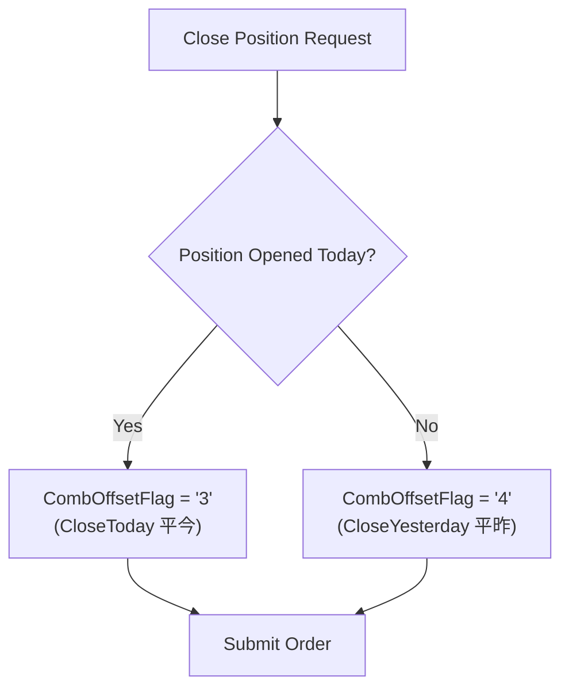

# SHFE - Shanghai Futures Exchange (上海期货交易所)

Base metals, precious metals, energy, rubber. Assumes familiarity with `futures_china.md`.

## Key Characteristics

| Attribute | Value |
|-----------|-------|
| Timezone | **CST (UTC+8)** |
| Focus | Metals, energy, rubber |
| Night session | Yes (varies by product) |
| L2 data | Free via UDP multicast (colocation) |
| Close position | **Must specify CloseToday/CloseYesterday** |

## Products

| Code | Product | Multiplier | Tick | Night End |
|------|---------|------------|------|-----------|
| cu | Copper | 5 t | 10 CNY | 01:00 |
| al | Aluminum | 5 t | 5 CNY | 01:00 |
| zn | Zinc | 5 t | 5 CNY | 01:00 |
| pb | Lead | 5 t | 5 CNY | 01:00 |
| ni | Nickel | 1 t | 10 CNY | 01:00 |
| sn | Tin | 1 t | 10 CNY | 01:00 |
| au | Gold | 1000 g | 0.02 CNY | 02:30 |
| ag | Silver | 15 kg | 1 CNY | 02:30 |
| rb | Rebar | 10 t | 1 CNY | 23:00 |
| hc | Hot Coil | 10 t | 1 CNY | 23:00 |
| ru | Rubber | 10 t | 5 CNY | 23:00 |
| bu | Bitumen | 10 t | 1 CNY | 23:00 |
| fu | Fuel Oil | 10 t | 1 CNY | 23:00 |
| sp | Pulp | 10 t | 2 CNY | 23:00 |
| ss | Stainless | 5 t | 5 CNY | 01:00 |
| wr | Wire Rod | 10 t | 1 CNY | None |

## Night Session Schedule

```mermaid
gantt
    title SHFE Night Session End Times
    dateFormat HH:mm
    axisFormat %H:%M

    section 23:00
    Rubber, Rebar, HotCoil, Bitumen :21:00, 2h

    section 01:00
    Base Metals (Cu,Al,Zn,Pb,Ni,Sn) :21:00, 4h

    section 02:30
    Precious Metals (Au,Ag) :21:00, 5h30m
```

## Close Position Requirement

**Critical:** SHFE requires explicit specification:

Wrong flag → Order rejected (ErrorID 31: "CTP:平今仓位不足" or "CTP:平昨仓位不足")

## Level-2 Data Access

SHFE provides free L2 via UDP multicast to colocated clients:

| Feature | L1 (CTP) | L2 (UDP Multicast) |
|---------|----------|-------------------|
| Depth levels | 5 | 5 |
| Update rate | 500ms | 250ms |
| Access | Any CTP client | Colocation only |
| Cost | Included | Free (colo fee) |

## Position Limits (Representative)

| Product | General | Near-Delivery | Delivery Month |
|---------|---------|---------------|----------------|
| Copper | 8,000 (or 10% OI if OI≥80K) | 3,000 | 1,000 |
| Gold | 9,000 | 2,700 | 900 |
| Rebar | 90,000 (or 10% OI if OI≥900K) | 4,500 | 900 |
| Rubber | 500 | 150 | 50 |

## Fee Structure

| Product | Open | Close Today | Close Yesterday |
|---------|------|-------------|-----------------|
| Gold | 10 CNY | **Free** | 10 CNY |
| Silver | 0.5/10000 | **1/10000** | 0.5/10000 |
| Copper | 0.5/10000 | varies | 0.5/10000 |
| Rebar | 1/10000 | 1/10000 | 1/10000 |

## Data Quirks

| Field | Behavior |
|-------|----------|
| UpdateMillisec | 0 or 500 (binary) |
| AveragePrice | × Multiplier (divide to get true VWAP) |
| ActionDay | Correct (actual calendar day) |
| Contract format | Lowercase + YYMM (e.g., `cu2501`) |

## Primary Source

- Rules: https://www.shfe.com.cn/regulation/
- Products: https://www.shfe.com.cn/products/
